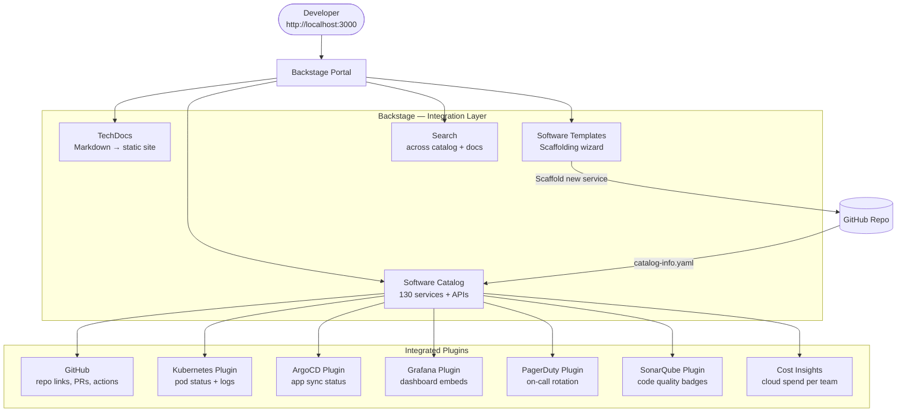

# Developer Portal — Backstage (ShopOS)

ShopOS uses [Backstage](https://backstage.io/) as its internal developer portal — a single
pane of glass for service discovery, documentation, CI/CD status, Kubernetes health,
infrastructure costs, and on-call ownership across all 130 microservices and 12 business domains.

---

## Directory Structure

```
backstage/
├── app-config.yaml                 ← Main Backstage configuration
├── app-config.production.yaml      ← Production overrides
├── packages/
│   ├── app/                        ← Frontend React application
│   │   └── src/
│   │       ├── App.tsx
│   │       └── components/
│   └── backend/                    ← Backstage Node.js backend
│       └── src/
│           └── index.ts
├── catalog/
│   ├── all-services.yaml           ← Catalog import list (all 130 services)
│   └── domains/
│       ├── platform.yaml
│       ├── identity.yaml
│       ├── catalog.yaml
│       ├── commerce.yaml
│       └── ...
└── plugins/                        ← Custom plugin configurations
    ├── kubernetes.yaml
    ├── argocd.yaml
    └── grafana.yaml
```

---

## Backstage Integrations



---

## Software Catalog

Every ShopOS service registers itself via a `catalog-info.yaml` file in its repository root.
Backstage discovers entities by scanning GitHub for these files.

**Example `catalog-info.yaml` for `order-service`:**

```yaml
apiVersion: backstage.io/v1alpha1
kind: Component
metadata:
  name: order-service
  description: Manages order lifecycle for commerce domain
  annotations:
    github.com/project-slug: shopos-org/enterprise-platform
    backstage.io/techdocs-ref: dir:.
    kubernetes.io/label-selector: "app.kubernetes.io/name=order-service"
    argocd/app-name: shopos-commerce-order-service
    grafana/dashboard-selector: "title='Commerce — Order Flow'"
    pagerduty.com/integration-key: ${PAGERDUTY_INTEGRATION_KEY}
  tags:
    - kotlin
    - grpc
    - postgres
    - commerce
spec:
  type: service
  lifecycle: production
  owner: team-commerce
  system: shopos
  dependsOn:
    - component:checkout-service
    - component:payment-service
    - component:inventory-service
  providesApis:
    - api:order-api
```

---

## TechDocs

TechDocs renders Markdown documentation from each service's `docs/` directory into a
searchable, versioned static site hosted within Backstage. Every service in ShopOS has:

- `docs/index.md` — overview, architecture context
- `docs/api.md` — gRPC/REST endpoint reference
- `docs/runbook.md` — operational runbook (alerts, common issues, scaling)
- `mkdocs.yml` — MkDocs config pointing to the docs directory

```bash
# Generate TechDocs locally for a service
npx @techdocs/cli generate --source-dir src/commerce/order-service --output-dir /tmp/techdocs
npx @techdocs/cli serve --source-dir src/commerce/order-service
```

---

## Software Templates (Scaffolding)

Backstage Software Templates allow engineers to bootstrap a new ShopOS service in minutes.
Available templates:

| Template | Language | Scaffolds |
|---|---|---|
| `go-grpc-service` | Go | `main.go`, `go.mod`, `Dockerfile`, Helm chart, `catalog-info.yaml` |
| `java-spring-service` | Java | Maven project, Spring Boot skeleton, Dockerfile, Helm chart |
| `kotlin-spring-service` | Kotlin | Gradle project, Spring Boot skeleton, Dockerfile, Helm chart |
| `python-fastapi-service` | Python | `main.py`, `requirements.txt`, Dockerfile, Helm chart |
| `node-express-service` | Node.js | `index.js`, `package.json`, Dockerfile, Helm chart |

---

## Local Development

```bash
# Prerequisites: Node.js 18+, Yarn

# Clone and install
cd backstage
yarn install

# Start in development mode
yarn dev
# Frontend: http://localhost:3000
# Backend:  http://localhost:7007

# Build for production
yarn build
yarn build:backend
```

### Environment Variables

```bash
# backstage/.env (never committed — see .env.example)
GITHUB_TOKEN=ghp_...
ARGOCD_AUTH_TOKEN=...
GRAFANA_TOKEN=...
PAGERDUTY_TOKEN=...
SONARQUBE_TOKEN=...
POSTGRES_HOST=localhost
POSTGRES_PORT=5432
POSTGRES_USER=backstage
POSTGRES_PASSWORD=...
POSTGRES_DB=backstage
```

---

## Production Deployment

Backstage is deployed into the `shopos-infra` namespace via its Helm chart:

```bash
helm install backstage helm/charts/backstage \
  --namespace shopos-infra \
  -f helm/charts/backstage/values-prod.yaml

# Access
kubectl port-forward svc/backstage 3000:80 -n shopos-infra
# http://localhost:3000
```

---

## Plugins Enabled

| Plugin | Purpose |
|---|---|
| `@backstage/plugin-kubernetes` | Live pod status, deployments, HPA metrics |
| `@backstage/plugin-techdocs` | Docs-as-code rendered docs |
| `@roadiehq/backstage-plugin-argo-cd` | ArgoCD sync status + health |
| `@roadiehq/backstage-plugin-grafana` | Embed Grafana dashboards per service |
| `@pagerduty/backstage-plugin` | On-call rotation + incident status |
| `@backstage/plugin-sonarqube` | Code coverage + quality gate badge |
| `@backstage/plugin-cost-insights` | Cloud cost per team / service |
| `@backstage/plugin-github-actions` | CI pipeline run status |

---

## References

- [Backstage Documentation](https://backstage.io/docs/)
- [Backstage Software Catalog](https://backstage.io/docs/features/software-catalog/)
- [TechDocs](https://backstage.io/docs/features/techdocs/)
- [Software Templates](https://backstage.io/docs/features/software-templates/)
- [ShopOS GitOps / ArgoCD](../gitops/README.md)
- [ShopOS Observability](../observability/README.md)
