# ShopOS — Architecture Diagrams

> 230 services · 19 domains · 13 languages · full open-source stack

---

## 1. System Architecture Overview

```mermaid
graph TB
    classDef user      fill:#4A90D9,stroke:#2C5F8A,color:#fff
    classDef edge      fill:#E8724A,stroke:#B54A22,color:#fff
    classDef frontend  fill:#7B68EE,stroke:#4B38BE,color:#fff
    classDef gateway   fill:#F5A623,stroke:#C07800,color:#fff
    classDef domain    fill:#50C878,stroke:#2A8A4A,color:#fff
    classDef platform  fill:#20B2AA,stroke:#008080,color:#fff
    classDef messaging fill:#FF69B4,stroke:#C0396A,color:#fff
    classDef data      fill:#778899,stroke:#455A64,color:#fff
    classDef security  fill:#DC143C,stroke:#8B0000,color:#fff
    classDef obs       fill:#9370DB,stroke:#5B20AB,color:#fff
    classDef cicd      fill:#32CD32,stroke:#006400,color:#fff
    classDef infra     fill:#DAA520,stroke:#8B6914,color:#fff

    %% ── USER CHANNELS ─────────────────────────────────────────
    subgraph USERS["👥  User Channels"]
        direction LR
        U1["🌐 Browser"]:::user
        U2["📱 Mobile"]:::user
        U3["🤝 B2B Partner"]:::user
        U4["👨‍💻 Developer"]:::user
        U5["⚙️ Admin"]:::user
        U6["🏪 Seller"]:::user
    end

    %% ── EDGE ──────────────────────────────────────────────────
    subgraph EDGE["🛡️  Edge Layer"]
        direction LR
        WAF["Coraza WAF\n(OWASP CRS)"]:::edge
        TR["Traefik v3.1\nEdge Router"]:::edge
        CM["cert-manager\nTLS Automation"]:::edge
    end

    %% ── FRONTENDS ─────────────────────────────────────────────
    subgraph FE["🖥️  Frontend Applications  (6 apps)"]
        direction LR
        FE1["Next.js 14\nStorefront\n:3000"]:::frontend
        FE2["React + Vite\nAdmin Dashboard\n:3001"]:::frontend
        FE3["Vue.js 3\nSeller Portal\n:3002"]:::frontend
        FE4["Angular 18\nPartner Portal\n:3003"]:::frontend
        FE5["React Native\nMobile App"]:::frontend
        FE6["React + Vite\nDev Portal\n:3004"]:::frontend
    end

    %% ── API GATEWAY LAYER ─────────────────────────────────────
    subgraph GW["🔀  API Gateway Layer"]
        direction LR
        AGW["API Gateway\nGo · :8080\nJWT · Routing · RateLimit"]:::gateway
        WBFF["Web BFF\nGo · :8081"]:::gateway
        MBFF["Mobile BFF\nNode.js · :8082"]:::gateway
        PBFF["Partner BFF\nGo · :8083"]:::gateway
        GQL["GraphQL Gateway\nGo · :8086"]:::gateway
    end

    %% ── PLATFORM SERVICES ─────────────────────────────────────
    subgraph PLAT["⚙️  Platform Services  (27)"]
        direction LR
        P1["Saga Orchestrator\nGo · Kafka"]:::platform
        P2["Event Store\nGo · Postgres"]:::platform
        P3["Scheduler\nGo · Postgres"]:::platform
        P4["Audit Service\nJava · Kafka"]:::platform
        P5["Webhook Service\nGo · HTTP/Kafka"]:::platform
        P6["Tenant Service\nGo · Postgres"]:::platform
        P7["+ 21 more\nplatform services"]:::platform
    end

    %% ── BUSINESS DOMAINS ──────────────────────────────────────
    subgraph DOM["🏢  Business Domain Services  (197 services across 18 domains)"]
        direction TB

        subgraph D1["🔐 Identity (11)"]
            direction LR
            D1A["auth-service\nRust · :50060"]:::domain
            D1B["user-service\nJava · :50061"]:::domain
            D1C["session-service\nGo · Redis"]:::domain
            D1D["mfa · gdpr · sso\npermission · api-key\n+ 4 more"]:::domain
        end

        subgraph D2["📦 Catalog (15)"]
            direction LR
            D2A["product-catalog\nGo · MongoDB"]:::domain
            D2B["pricing-service\nJava · Postgres"]:::domain
            D2C["search-service\nPython · ES"]:::domain
            D2D["inventory · category\nbrand · bundle\n+ 9 more"]:::domain
        end

        subgraph D3["🛒 Commerce (28)"]
            direction LR
            D3A["cart-service\nC# · Redis"]:::domain
            D3B["order-service\nKotlin · Postgres"]:::domain
            D3C["payment-service\nJava · Postgres"]:::domain
            D3D["shipping-service\nRust · Postgres"]:::domain
            D3E["checkout · promotions\nfraud-detection · loyalty\n+ 24 more"]:::domain
        end

        subgraph D4["🚚 Supply Chain (17)"]
            direction LR
            D4A["vendor-service\nJava · Postgres"]:::domain
            D4B["warehouse-service\nGo · Postgres"]:::domain
            D4C["fulfillment · tracking\ncarrier · customs\n+ 13 more"]:::domain
        end

        subgraph D5["💰 Financial (15)"]
            direction LR
            D5A["invoice-service\nJava · Postgres"]:::domain
            D5B["payout-service\nJava · Postgres"]:::domain
            D5C["accounting · kyc-aml\nreconciliation · tax\n+ 11 more"]:::domain
        end

        subgraph D6["🎯 Customer Experience (17)"]
            direction LR
            D6A["review-service\nNode.js · MongoDB"]:::domain
            D6B["support-tickets\nJava · Postgres"]:::domain
            D6C["wishlist · compare\nsurvey · consent\n+ 13 more"]:::domain
        end

        subgraph D7["📨 Communications (12)"]
            direction LR
            D7A["email-service\nPython · Kafka"]:::domain
            D7B["sms · push · whatsapp\ntelegram · chatbot\n+ 7 more"]:::domain
        end

        subgraph D8["🖼️ Content (9)"]
            direction LR
            D8A["media-asset\nGo · MinIO"]:::domain
            D8B["cms-service\nNode.js · MongoDB"]:::domain
            D8C["video · document\ni18n · sitemap\n+ 5 more"]:::domain
        end

        subgraph D9["🤖 Analytics & AI (13)"]
            direction LR
            D9A["recommendation\nPython · gRPC"]:::domain
            D9B["ml-feature-store\nPython · Postgres"]:::domain
            D9C["personalization · analytics\nsentiment · clv\n+ 9 more"]:::domain
        end

        subgraph D10["🏭 B2B (10)"]
            direction LR
            D10A["org-service\nJava · Postgres"]:::domain
            D10B["contract · quote-rfq\nedi · approval\n+ 6 more"]:::domain
        end

        subgraph D11["🔌 Integrations (14)"]
            direction LR
            D11A["erp-integration\nJava · gRPC"]:::domain
            D11B["crm · payment-gw\nmarketplace-conn\n+ 11 more"]:::domain
        end

        subgraph D12["Other Domains (30)"]
            direction LR
            D12A["🤝 Affiliate (6)"]:::domain
            D12B["🛍️ Marketplace (8)"]:::domain
            D12C["🎮 Gamification (6)"]:::domain
            D12D["🔧 Dev Platform (6)"]:::domain
            D12E["📋 Compliance (5)"]:::domain
            D12F["🌱 Sustainability (5)"]:::domain
        end
    end

    %% ── MESSAGING ─────────────────────────────────────────────
    subgraph MSG["📨  Messaging & Streaming"]
        direction LR
        KA["Apache Kafka 7.7\nDomain Events\nAvro + Schema Registry"]:::messaging
        RMQ["RabbitMQ 3.13\nTask Queues\nDelayed Jobs"]:::messaging
        NATS["NATS JetStream 2.10\nReal-time Pub/Sub\nChat & Notifications"]:::messaging
        DBZ["Debezium 2.7\nChange Data Capture\nPostgres + MongoDB"]:::messaging
        FL["Apache Flink 1.20\nStream Processing\nFraud & Analytics"]:::messaging
    end

    %% ── DATA STORES ───────────────────────────────────────────
    subgraph DS["🗄️  Data Stores  (13 engines)"]
        direction LR
        PG["PostgreSQL 16\nPatroni HA\n3-node cluster"]:::data
        MG["MongoDB 8.0\nCatalog · CMS\nReviews"]:::data
        RD["Redis 7\n+ Dragonfly\nCache · Sessions"]:::data
        EL["Elasticsearch 8\nFull-text Search\nFaceted Filtering"]:::data
        CA["Cassandra 5\nAnalytics Events"]:::data
        MI["MinIO\nObject Storage\nImages · Videos"]:::data
        NJ["Neo4j 5\nGraph DB\nRecommendations"]:::data
        WV["Weaviate 1.26\nVector DB\nSemantic Search"]:::data
        CH["ClickHouse 24\nOLAP Analytics\nRevenue Reports"]:::data
        TS["TimescaleDB\nTime-series\nMetrics · Inventory"]:::data
        ET["etcd 3.5\nDistributed Config\nFeature Flags"]:::data
        MS["Meilisearch\nProduct Search\nTypo-tolerant"]:::data
    end

    %% ── CONNECTIONS ───────────────────────────────────────────
    USERS  -->|"HTTPS / WSS"| EDGE
    EDGE   -->|"Routed"| FE
    FE     -->|"REST /api proxy"| GW
    GW     -->|"gRPC / REST"| PLAT
    GW     -->|"gRPC / REST"| DOM
    PLAT   <-->|"Kafka events"| MSG
    DOM    <-->|"Kafka events"| MSG
    DOM    -->|"Read / Write"| DS
    PLAT   -->|"Read / Write"| DS
    MSG    -->|"CDC / Stream"| DS
```

---

## 2. Security & Service Mesh

```mermaid
graph LR
    classDef sec   fill:#DC143C,stroke:#8B0000,color:#fff
    classDef mesh  fill:#FF8C00,stroke:#8B4500,color:#fff
    classDef vault fill:#2E8B57,stroke:#145A32,color:#fff
    classDef scan  fill:#4169E1,stroke:#00008B,color:#fff
    classDef rt    fill:#8B008B,stroke:#4B0082,color:#fff

    subgraph IAM["🔑  Identity & Access"]
        KC["Keycloak 25\nSSO · OIDC · SAML"]:::sec
        DEX["Dex\nOIDC Federation"]:::sec
        SPIRE["SPIFFE/SPIRE\nWorkload Identity\nmTLS Certs"]:::sec
        OFG["OpenFGA\nRelationship Auth\n(ReBAC)"]:::sec
    end

    subgraph SECRETS["🔐  Secrets Management"]
        VLT["HashiCorp Vault\nDynamic Secrets\nPKI · Encryption"]:::vault
        ESO["External Secrets\nOperator"]:::vault
        SOPS["SOPS\nEncrypted GitOps"]:::vault
        SS["Sealed Secrets\nK8s native"]:::vault
    end

    subgraph MESH["🕸️  Service Mesh"]
        ISTIO["Istio\nmTLS everywhere\nTraffic policies"]:::mesh
        CILIUM["Cilium eBPF\nCNI · NetworkPolicy\nL3/L4/L7"]:::mesh
        CONSUL["Consul 1.19\nService Discovery\nHealth checks"]:::mesh
    end

    subgraph POLICY["📜  Policy & Admission"]
        OPA["OPA / Gatekeeper\nRego policies\nK8s admission"]:::sec
        KYV["Kyverno\nK8s policies\nAuto-remediation"]:::sec
        KW["Kubewarden\nWasm policies"]:::sec
    end

    subgraph SCANNING["🔍  Scanning & SBOM"]
        TRIVY["Trivy\nContainer CVEs"]:::scan
        SEMG["Semgrep\nSAST custom rules"]:::scan
        SYFT["Syft + CycloneDX\nSBOM generation"]:::scan
        COSIGN["Cosign + Rekor\nImage signing\nSigstore"]:::scan
        ZAP["OWASP ZAP\nDAST scanning"]:::scan
        SONAR["SonarQube 10\nCode quality"]:::scan
    end

    subgraph RUNTIME["âš¡  Runtime Security"]
        FALCO["Falco\nThreat detection\nSyscall rules"]:::rt
        TETRA["Tetragon\neBPF enforcement"]:::rt
        TRACEE["Tracee\neBPF events"]:::rt
        WAF2["Coraza WAF\nModSecurity\nOWASP CRS"]:::rt
    end

    IAM     --> MESH
    SECRETS --> MESH
    MESH    --> POLICY
    POLICY  --> SCANNING
    SCANNING --> RUNTIME
```

---

## 3. Observability Stack

```mermaid
graph TB
    classDef inst   fill:#4A90D9,stroke:#2C5F8A,color:#fff
    classDef metric fill:#E8724A,stroke:#B54A22,color:#fff
    classDef log    fill:#50C878,stroke:#2A8A4A,color:#fff
    classDef trace  fill:#9370DB,stroke:#5B20AB,color:#fff
    classDef dash   fill:#F5A623,stroke:#C07800,color:#fff
    classDef err    fill:#DC143C,stroke:#8B0000,color:#fff
    classDef slo    fill:#20B2AA,stroke:#008080,color:#fff

    subgraph INST["📡  Instrumentation"]
        direction LR
        OTEL["OpenTelemetry SDK\nAll 13 languages\nAuto-instrumentation"]:::inst
        RUM["OTel RUM\nWeb Vitals\nBrowser errors"]:::inst
        PYRO["Grafana Pyroscope\nContinuous Profiling\nFlame graphs"]:::inst
    end

    subgraph COLLECT["🔄  Collection & Aggregation"]
        OTCOL["OTel Collector\nProcessor · Exporter"]:::inst
        FLUENT["Fluent Bit\n+ Fluentd\nLog shipping"]:::log
    end

    subgraph METRICS["📈  Metrics"]
        PROM["Prometheus\nScrape · Alert"]:::metric
        THANOS["Thanos\nLong-term storage\nGlobal query"]:::metric
        VM["VictoriaMetrics\nHigh-cardinality\nalternative"]:::metric
        AM["Alertmanager\nAlert routing\nPagerDuty · Slack"]:::metric
    end

    subgraph LOGS["📋  Logs"]
        LOKI["Grafana Loki\nLog aggregation\nLabel-based index"]:::log
        OS["OpenSearch 2.17\n+ Dashboards"]:::log
        ELK["Elasticsearch +\nKibana + Logstash"]:::log
    end

    subgraph TRACING["🔍  Distributed Tracing"]
        JAEGER["Jaeger\nFull-fidelity traces\nDependency graph"]:::trace
        TEMPO["Grafana Tempo\nTrace storage"]:::trace
        ZIPKIN["Zipkin 3.4\nLightweight tracing"]:::trace
    end

    subgraph DASH["📊  Dashboards & Alerting"]
        GRAF["Grafana\nUnified dashboards\n100+ panels"]:::dash
        KIBANA["Kibana\nLog analytics"]:::dash
        PLAUS["Plausible\nWeb analytics\n(GDPR · no cookies)"]:::dash
        OPENRP["OpenReplay\nSession replay\nSelf-hosted"]:::dash
        UKUMA["Uptime Kuma\nStatus pages"]:::slo
    end

    subgraph ERRORS["🐛  Error Tracking"]
        SENTRY["Sentry OSS\nException tracking\nSource maps"]:::err
        GLITCH["GlitchTip\nSentry-compatible\nalternative"]:::err
    end

    subgraph SLO["🎯  SLO Management"]
        PYRRA["Pyrra\nSLO dashboard\nError budget"]:::slo
        SLOTH["Sloth\nSLO generator\nPrometheus rules"]:::slo
    end

    INST    --> COLLECT
    COLLECT --> METRICS
    COLLECT --> LOGS
    COLLECT --> TRACING
    METRICS --> DASH
    LOGS    --> DASH
    TRACING --> DASH
    DASH    --> ERRORS
    DASH    --> SLO
```

---

## 4. CI/CD & GitOps Pipeline

```mermaid
graph LR
    classDef vcs    fill:#4A90D9,stroke:#2C5F8A,color:#fff
    classDef ci     fill:#E8724A,stroke:#B54A22,color:#fff
    classDef scan   fill:#DC143C,stroke:#8B0000,color:#fff
    classDef reg    fill:#50C878,stroke:#2A8A4A,color:#fff
    classDef gitops fill:#9370DB,stroke:#5B20AB,color:#fff
    classDef deploy fill:#F5A623,stroke:#C07800,color:#fff
    classDef k8s    fill:#20B2AA,stroke:#008080,color:#fff

    subgraph VCS["📁  Source Control"]
        GH["GitHub\nMain repo"]:::vcs
        GITEA["Gitea 1.22\nSelf-hosted mirror\nGitOps source"]:::vcs
    end

    subgraph CI["🔧  CI Platforms  (15)"]
        direction TB
        JEN["Jenkins\nPrimary · 12 pipelines"]:::ci
        GHA["GitHub Actions\n12 workflows"]:::ci
        GL["GitLab CI · Drone\nWoodpecker · Dagger\nTekton · Concourse\nCircleCI · GoCD\nTravis · Harness\nAzure DevOps\nAWS CodePipeline\nGCP Cloud Build"]:::ci
    end

    subgraph QUALITY["🔍  Quality Gates"]
        SONAR["SonarQube 10\nCode quality"]:::scan
        SEMG["Semgrep SAST\nCustom rules"]:::scan
        TRIVY["Trivy\nContainer scan"]:::scan
        OW["OWASP Dep-Check\nSCA"]:::scan
        SYFT["Syft SBOM\n+ CycloneDX"]:::scan
        COSIGN["Cosign\nImage signing\nSigstore"]:::scan
    end

    subgraph REG["📦  Artifact Registry"]
        HARBOR["Harbor\nContainer images"]:::reg
        NEXUS["Nexus 3.71\nMaven · npm · PyPI"]:::reg
        CHART["ChartMuseum\nHelm charts"]:::reg
        ZOT["Zot\nOCI registry"]:::reg
    end

    subgraph GITOPS["🔄  GitOps Controllers"]
        ARGO["ArgoCD\nApp-of-Apps\n230 applications"]:::gitops
        FLUX["Flux CD\n230 HelmReleases"]:::gitops
        AE["Argo Events\nGitHub · Kafka\nWebhook triggers"]:::gitops
        AW["Argo Workflows\nCI build · ML train\nDB migration\nSecurity scan"]:::gitops
    end

    subgraph DEPLOY["🚀  Progressive Delivery"]
        ROLLOUT["Argo Rollouts\nCanary deploys\nAll 19 domains"]:::deploy
        FLAGGER["Flagger\nBlue-green\nA/B testing"]:::deploy
    end

    subgraph K8S["☸️  Kubernetes Targets"]
        EKS["AWS EKS\nAuto Mode"]:::k8s
        GKE["Google GKE"]:::k8s
        AKS["Azure AKS"]:::k8s
    end

    VCS     -->|"push / PR"| CI
    CI      -->|"scan"| QUALITY
    QUALITY -->|"push image"| REG
    REG     -->|"update manifests"| GITOPS
    GITOPS  -->|"sync"| DEPLOY
    DEPLOY  -->|"rollout"| K8S
```

---

## 5. Data Architecture

```mermaid
graph TB
    classDef oltp   fill:#4A90D9,stroke:#2C5F8A,color:#fff
    classDef doc    fill:#E8724A,stroke:#B54A22,color:#fff
    classDef cache  fill:#DC143C,stroke:#8B0000,color:#fff
    classDef search fill:#50C878,stroke:#2A8A4A,color:#fff
    classDef olap   fill:#9370DB,stroke:#5B20AB,color:#fff
    classDef obj    fill:#F5A623,stroke:#C07800,color:#fff
    classDef graphdb  fill:#20B2AA,stroke:#008080,color:#fff
    classDef stream fill:#FF69B4,stroke:#C0396A,color:#fff
    classDef ml     fill:#32CD32,stroke:#006400,color:#fff

    subgraph OLTP["🔷  Transactional (OLTP)"]
        PG["PostgreSQL 16\nPatroni 3-node HA\nPgBouncer pool\nidentity · commerce\nfinancial · platform"]:::oltp
        TS["TimescaleDB\nTime-series extension\nmetrics · inventory\npage views"]:::oltp
    end

    subgraph DOC["🟠  Document Stores"]
        MONGO["MongoDB 8.0\nproduct catalog\ncms · reviews · tracking"]:::doc
    end

    subgraph CACHE["🔴  Cache & Session"]
        REDIS["Redis 7\nsessions · cart\nrate limits · pub/sub"]:::cache
        DRAG["Dragonfly\nRedis-compatible\n4× throughput"]:::cache
        MEM["Memcached 1.6\nSimple high-throughput\ncaching"]:::cache
    end

    subgraph SEARCH["🟢  Search Engines"]
        ES["Elasticsearch 8\nproduct search\nfull-text · facets"]:::search
        OS["OpenSearch 2.17\nlog analytics\naudit trails"]:::search
        MEILI["Meilisearch\nTypo-tolerant\nproduct search"]:::search
    end

    subgraph OLAP["🟣  Analytics (OLAP)"]
        CH["ClickHouse 24\norder analytics\nrevenue reports\nMaterialized views"]:::olap
        CASS["Cassandra 5\nanalytics events\npage views · clicks"]:::olap
        TSDB["TimescaleDB 2.15\nservice metrics\ninventory events"]:::olap
    end

    subgraph OBJ["🟡  Object Storage"]
        MINIO["MinIO\nproduct images\nvideos · PDFs\nexports"]:::obj
    end

    subgraph GRAPH["🔵  Specialized"]
        NEO["Neo4j 5\nGraph DB\nproduct recommendations\ncollaborative filtering"]:::graphdb
        WEAV["Weaviate 1.26\nVector DB\nsemantic search\nAI embeddings"]:::ml
    end

    subgraph STREAM["🔄  Streaming & CDC"]
        DBZ["Debezium 2.7\nCaptures changes from\nPostgres + MongoDB"]:::stream
        FLINK["Apache Flink 1.20\nReal-time processing\nFraud detection\nOrder analytics"]:::stream
        KAFKA["Kafka\nEvent backbone\n20+ topics"]:::stream
    end

    subgraph ANALYTICS["📊  Analytics Stack"]
        DBT["dbt\nData transforms\nStaging · Commerce\nCatalog models"]:::ml
        AIRFLOW["Apache Airflow\nDaily ETL · Fraud\nRetrain DAGs"]:::ml
        SPARK["Apache Spark\nBatch processing\nRFM segmentation"]:::ml
        MLFLOW["MLflow 2.16\nExperiment tracking\nModel registry"]:::ml
    end

    OLTP  -->|"CDC"| DBZ
    DOC   -->|"CDC"| DBZ
    DBZ   --> KAFKA
    KAFKA --> FLINK
    KAFKA --> OLAP
    FLINK --> OLAP
    OLTP  --> DBT
    DBT   --> AIRFLOW
    AIRFLOW --> SPARK
    SPARK --> OLAP
```

---

## 6. Infrastructure & Platform

```mermaid
graph TB
    classDef k8s   fill:#326CE5,stroke:#1A4DB5,color:#fff
    classDef iac   fill:#7B42BC,stroke:#4B1292,color:#fff
    classDef net   fill:#E8724A,stroke:#B54A22,color:#fff
    classDef dev   fill:#50C878,stroke:#2A8A4A,color:#fff
    classDef chaos fill:#DC143C,stroke:#8B0000,color:#fff
    classDef ml    fill:#F5A623,stroke:#C07800,color:#fff

    subgraph K8S["☸️  Kubernetes Layer"]
        direction LR
        NS["19 Namespaces\n(one per domain)"]:::k8s
        RBAC["RBAC\nClusterRoles · Bindings\nService Accounts"]:::k8s
        RQ["Resource Quotas\n+ LimitRanges\nper namespace"]:::k8s
        PDB["Pod Disruption\nBudgets\ncritical services"]:::k8s
        KEDA["KEDA\nKafka + Redis\nautoscaling"]:::k8s
        VELERO["Velero\nDaily backups\nMinIO / S3"]:::k8s
        NETPOL["NetworkPolicies\nDefault-deny\nExplicit allow"]:::k8s
    end

    subgraph IAC["🏗️  Infrastructure as Code"]
        TF["Terraform\nEKS · GKE · AKS\nJenkins VM"]:::iac
        OTF["OpenTofu\nAWS · GCP · Azure\nalternative"]:::iac
        CP["Crossplane\nK8s-native IaC\nCompositions"]:::iac
        ANS["Ansible\nK8s node roles\nBootstrapping"]:::iac
    end

    subgraph NETWORKING["🌐  Networking"]
        TRAEFIK["Traefik 3.1\nEdge Router\nService Discovery"]:::net
        ISTIO["Istio\nService Mesh\nmTLS + Telemetry"]:::net
        CILIUM["Cilium eBPF\nCNI · L3/L4/L7\nNetworkPolicy"]:::net
        CONSUL["Consul 1.19\nService Discovery\nHealth checks K/V"]:::net
        KONG["Kong\nAPI Management"]:::net
        NGINX["NGINX\nReverse proxy"]:::net
        LINKERD["Linkerd\nLightweight mesh"]:::net
    end

    subgraph DEVTOOLS["🛠️  Developer Experience"]
        SKAFFOLD["Skaffold\nHot-reload\nLocal dev"]:::dev
        TILT["Tiltfile\nLocal K8s\nHot-reload"]:::dev
        DEVCON["Devcontainer\nVS Code / Codespaces\nfull stack in container"]:::dev
        BACK["Backstage\nDeveloper Portal\nService catalog"]:::dev
        TEMPORAL["Temporal 1.24\nDurable workflows\nSaga orchestration"]:::dev
    end

    subgraph CHAOS["💥  Chaos Engineering"]
        CMESH["Chaos Mesh\n13 experiments\n2 workflows\nGame-day schedule"]:::chaos
        LITMUS["LitmusChaos\n5 experiments\nArgo Workflows"]:::chaos
    end

    subgraph LOAD["📊  Load Testing"]
        K6["k6\nsmoke · spike · soak\nbrowse · checkout"]:::ml
        LOCUST["Locust\n4 task sets\n3 user classes"]:::ml
        GATLING["Gatling\nCommerce + Search\nsimulations"]:::ml
    end

    K8S --> IAC
    IAC --> NETWORKING
    NETWORKING --> DEVTOOLS
    DEVTOOLS --> CHAOS
    CHAOS --> LOAD
```

---

## Summary Stats

| Layer | Count |
|---|---|
| Frontend Apps | 6 |
| Microservices | 224 |
| Business Domains | 19 |
| Programming Languages | 13 |
| Database Engines | 13 |
| CI/CD Platforms | 15 |
| Security Tools | 50+ |
| Observability Tools | 35 |
| Total Services (incl. frontends) | 230 |

### Language Distribution

| Language | Services | Domains |
|---|---|---|
| Go | ~120 | All |
| Java / Spring Boot | ~30 | identity, catalog, commerce, financial, b2b, supply-chain |
| Kotlin / Spring Boot | ~10 | commerce, financial, supply-chain, b2b |
| Node.js | ~25 | catalog, communications, customer-experience, content |
| Python | ~20 | analytics-ai, communications, supply-chain |
| Rust | 2 | identity (auth), commerce (shipping) |
| C# / .NET | 2 | commerce (cart, return-refund) |
| Scala | 1 | analytics-ai (reporting) |
| TypeScript / Next.js | 1 | web/storefront |
| TypeScript / React+Vite | 2 | web/admin-dashboard, web/developer-portal-ui |
| TypeScript / Vue.js 3 | 1 | web/seller-portal |
| TypeScript / Angular 18 | 1 | web/partner-portal |
| TypeScript / React Native | 1 | web/mobile-app |
