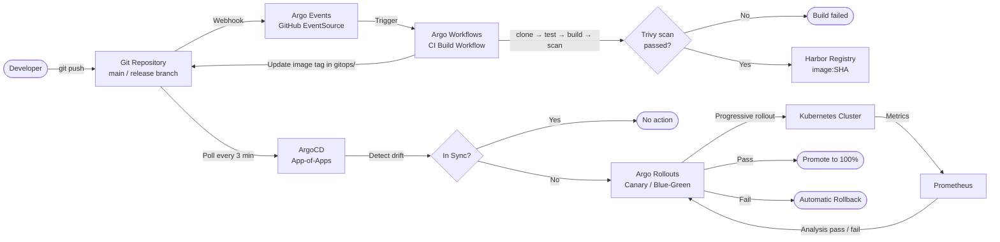

# GitOps — ShopOS

ShopOS follows the GitOps operating model: Git is the single source of truth for both
application config and infrastructure state. All deployments are driven by reconciliation
loops rather than imperative scripts. The GitOps toolchain is built entirely on the Argo
project and Flux CD.

---

## Directory Structure

```
gitops/
├── charts/                             ← Standalone Helm charts to install GitOps tools
│   ├── argocd/                         ← ArgoCD chart (quay.io/argoproj/argocd:v2.12.0)
│   ├── argo-rollouts/                  ← Argo Rollouts chart
│   ├── argo-workflows/                 ← Argo Workflows chart
│   ├── argo-events/                    ← Argo Events chart
│   ├── argocd-image-updater/           ← ArgoCD Image Updater chart
│   ├── fluxcd/                         ← Flux CD chart
│   ├── flagger/                        ← Flagger progressive delivery chart
│   ├── weave-gitops/                   ← Weave GitOps dashboard chart
│   ├── sealed-secrets/                 ← Sealed Secrets controller chart
│   ├── external-secrets/               ← External Secrets Operator chart
│   ├── vcluster/                       ← vCluster virtual K8s chart
│   └── gimlet/                         ← Gimlet developer platform chart
│
├── argocd/
│   ├── app-of-apps.yaml                ← Root ArgoCD Application (bootstraps everything)
│   ├── applicationsets/
│   │   └── all-services.yaml           ← ApplicationSet covering all 154 services
│   └── projects/                       ← AppProject per domain (13 total)
│       ├── platform-project.yaml
│       ├── identity-project.yaml
│       ├── catalog-project.yaml
│       ├── commerce-project.yaml
│       ├── supply-chain-project.yaml
│       ├── financial-project.yaml
│       ├── customer-experience-project.yaml
│       ├── communications-project.yaml
│       ├── content-project.yaml
│       ├── analytics-ai-project.yaml
│       ├── b2b-project.yaml
│       ├── integrations-project.yaml
│       └── affiliate-project.yaml
│
├── flux/
│   ├── base/                           ← Shared Flux resources (GitRepository + HelmReleases)
│   │   ├── kustomization.yaml
│   │   ├── gitrepository.yaml
│   │   └── helm-releases.yaml          ← HelmRelease objects for all key services
│   └── clusters/
│       ├── production/                 ← Production overlay (replica=3, higher resources)
│       │   ├── kustomization.yaml
│       │   └── namespaces.yaml
│       └── staging/                    ← Staging overlay (replica=1, lower resources)
│           ├── kustomization.yaml
│           └── namespaces.yaml
│
├── argo-rollouts/
│   ├── canary-template.yaml            ← Canary rollout template (10→25→50→100%)
│   └── bluegreen-template.yaml         ← Blue-green rollout template
│
├── argo-events/
│   └── github-eventsource.yaml         ← GitHub webhook EventSource + Sensor → Tekton
│
└── argo-workflows/
    ├── ci-build-workflow.yaml          ← CI pipeline (clone→test→build→scan→push→gitops update)
    └── ml-training-workflow.yaml       ← ML model training workflow
```

---

## Installing GitOps Tools

Use `ci/jenkins/gitops.Jenkinsfile` to install any of the 12 GitOps tools onto the cluster.
Select `ACTION=INSTALL`, check the tools you want, and run. Each tool is installed from
`gitops/charts/<tool>/` using Helm. After install the tool URL and credentials are written
to `infra.env`.

| Tool | Namespace | Port | Credentials |
|---|---|---|---|
| ArgoCD | `argocd` | 8080 | admin / read from `argocd-initial-admin-secret` |
| Argo Rollouts | `argo-rollouts` | 3100 | — |
| Argo Workflows | `argo-workflows` | 2746 | admin / admin |
| Argo Events | `argo-events` | 7777 | — |
| ArgoCD Image Updater | `argocd` | 8080 | — |
| Flux CD | `flux-system` | 9292 | — |
| Flagger | `flagger` | 10080 | — |
| Weave GitOps | `weave-gitops` | 9001 | admin / admin |
| Sealed Secrets | `sealed-secrets` | 8080 | — |
| External Secrets | `external-secrets` | 8080 | — |
| vCluster | `vcluster` | 8443 | — |
| Gimlet | `gimlet` | 9000 | admin / gimlet |

---

## GitOps Deployment Pipeline



---

## ArgoCD — App-of-Apps Pattern

ArgoCD continuously reconciles the desired state in Git with the live state in Kubernetes.
ShopOS uses the **App-of-Apps** pattern: a single root `Application` (`app-of-apps.yaml`)
points at `gitops/argocd/applicationsets/` which contains an `ApplicationSet` that
generates one ArgoCD `Application` per service (154 total).

- **Sync policy**: `automated` with `selfHeal: true` and `prune: true`
- **Projects**: one `AppProject` per domain — scopes each team to their own namespace
- **ApplicationSet**: list generator covering all 154 services across 13 domains

```bash
# Bootstrap the app-of-apps (ArgoCD must already be installed)
kubectl apply -f gitops/argocd/app-of-apps.yaml -n argocd

# Port-forward ArgoCD UI
kubectl port-forward svc/argocd-server -n argocd 8080:80

# CLI — sync a specific application
argocd app sync order-service

# Force hard refresh
argocd app get order-service --hard-refresh

# Manual rollback to previous version
argocd app rollback order-service
```

---

## Flux CD — Base / Overlay Pattern

Flux CD manages HelmReleases for all key services using a base/overlay pattern.
`flux/base/` holds the shared HelmRelease definitions; `clusters/production/` and
`clusters/staging/` patch replica counts and resource limits via Kustomize.

```bash
# Bootstrap Flux on a cluster
flux bootstrap github \
  --owner=your-org \
  --repository=shopos \
  --path=gitops/flux/clusters/production \
  --personal

# Check reconciliation status
flux get all -A

# Force a manual reconciliation
flux reconcile source git shopos
flux reconcile kustomization flux-system
```

---

## Argo Rollouts — Progressive Delivery

Argo Rollouts replaces standard `Deployment` objects with `Rollout` CRDs supporting
canary and blue-green strategies with automated Prometheus analysis at each step.

- **Canary** (default): 10% → 25% → 50% → 75% → 100% with pause between each step
- **Blue-green**: instant cutover with pre-promotion analysis gate
- **Auto-rollback**: triggered when error rate exceeds 1% or p99 latency breaches SLO

```bash
# Watch a rollout
kubectl argo rollouts get rollout order-service -n shopos-commerce --watch

# Manually promote a canary
kubectl argo rollouts promote order-service -n shopos-commerce

# Abort and roll back
kubectl argo rollouts abort order-service -n shopos-commerce
```

---

## Argo Events

Argo Events drives event-based automation. The GitHub EventSource listens for push
and pull_request events on the ShopOS repo and fires a Sensor that creates a Tekton
`PipelineRun` to trigger the CI build.

Key event sources:
- `github` — push/PR on `shopos` repo → triggers CI pipeline
- `kafka` — `analytics.*` topic messages → triggers data pipeline workflows
- `calendar` — nightly trigger for scheduled reconciliation jobs

---

## Argo Workflows — CI Pipeline

`argo-workflows/ci-build-workflow.yaml` is a `WorkflowTemplate` that runs a full
CI pipeline as a DAG:

| Step | Tool | Description |
|---|---|---|
| clone | alpine/git | Shallow clone at the target revision |
| test | language runtime | Run unit tests for the service |
| build | Kaniko | Build Docker image (no Docker socket needed) |
| scan | Trivy | Scan image for HIGH/CRITICAL CVEs |
| push | Kaniko | Push image to Harbor registry |
| update-image | alpine/git | Update image tag in `helm/charts/<service>/values.yaml` |

---

## Deployment Environments

| Environment | GitOps Engine | Strategy | Auto-Sync |
|---|---|---|---|
| `staging` | Flux + ArgoCD | Canary (2 steps), replica=1 | Yes |
| `production` | ArgoCD + Argo Rollouts | Canary (4 steps) with Prometheus analysis | Manual promote after 25% |

---

## References

- [ArgoCD Documentation](https://argo-cd.readthedocs.io/)
- [Flux CD Documentation](https://fluxcd.io/docs/)
- [Argo Rollouts Documentation](https://argoproj.github.io/argo-rollouts/)
- [Argo Events Documentation](https://argoproj.github.io/argo-events/)
- [Argo Workflows Documentation](https://argoproj.github.io/argo-workflows/)
- [ShopOS CI Pipelines](../ci/README.md)
- [ShopOS Helm Charts](../helm/README.md)
