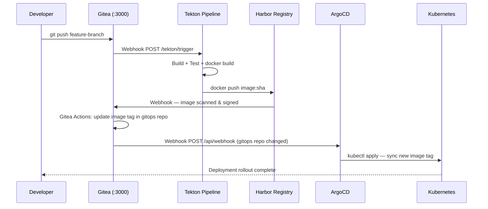

# Gitea — Self-Hosted Git Service

## Role in ShopOS

Gitea is the self-hosted Git platform for ShopOS. It provides source code hosting, code review
(pull requests), issue tracking, and native CI/CD via Gitea Actions — all without any dependency
on GitHub, GitLab, or other external SaaS. In a fully air-gapped or on-premises deployment, Gitea
is the single source of truth for all source code and GitOps manifests.

Key capabilities used in ShopOS:
- Git repository hosting for all 130 service source trees
- Pull request workflow with required reviews before merge
- Gitea Actions — GitHub Actions-compatible CI syntax, runs on self-hosted runners
- Webhook triggers to Tekton Pipelines and ArgoCD on push / merge events
- Organization and team RBAC — each domain team owns their service repositories
- Gitea Packages — alternative to Nexus for npm/Docker/PyPI packages (lightweight)
- Mirror mode — can mirror from GitHub upstream for open-source dependencies

---

## GitOps Flow: Git Push → Gitea → ArgoCD → Kubernetes



---

## Repository Organization

Gitea organizations mirror the ShopOS domain structure:

| Gitea Organization | Repositories |
|---|---|
| `shopos-platform` | api-gateway, web-bff, mobile-bff, saga-orchestrator, … |
| `shopos-identity` | auth-service, user-service, session-service, … |
| `shopos-catalog` | product-catalog-service, pricing-service, search-service, … |
| `shopos-commerce` | cart-service, order-service, payment-service, … |
| `shopos-gitops` | argocd apps, helm values, kubernetes manifests |
| `shopos-infra` | terraform, crossplane, ansible |
| `shopos-proto` | shared .proto definitions |

---

## Gitea Actions CI Example

Gitea Actions uses GitHub Actions-compatible YAML syntax. Runners are self-hosted and registered
per domain namespace.

```yaml
# .gitea/workflows/build.yml (in each service repo)
name: Build and Push

on:
  push:
    branches: [main]

jobs:
  build:
    runs-on: ubuntu-latest
    steps:
      - uses: actions/checkout@v3

      - name: Build Docker image
        run: docker build -t harbor.shopos.internal:5000/commerce/order-service:${{ github.sha }} .

      - name: Trivy scan
        uses: aquasecurity/trivy-action@master
        with:
          image-ref: harbor.shopos.internal:5000/commerce/order-service:${{ github.sha }}
          exit-code: '1'
          severity: 'CRITICAL'

      - name: Push to Harbor
        run: docker push harbor.shopos.internal:5000/commerce/order-service:${{ github.sha }}

      - name: Update GitOps manifest
        run: |
          git clone http://gitea:3000/shopos-gitops/argocd-apps.git
          cd argocd-apps
          sed -i "s|order-service:.*|order-service:${{ github.sha }}|" \
            apps/commerce/order-service/values.yaml
          git commit -am "ci: update order-service to ${{ github.sha }}"
          git push
```

---

## ArgoCD Integration

ArgoCD watches the `shopos-gitops` organization repositories. When Gitea pushes a commit updating
an image tag in the GitOps repo, ArgoCD's webhook receiver triggers an immediate sync rather than
waiting for the default 3-minute polling interval.

```yaml
# ArgoCD webhook configuration (in argocd-cm ConfigMap)
# Add Gitea as a webhook source:
# Settings → Webhooks → http://argocd-server/api/webhook
# Secret: stored in Vault secret/gitops/argocd-webhook
```

---

## Tekton Integration

Gitea webhooks are configured to POST to Tekton EventListeners on every push:

```
Gitea Webhook URL: http://tekton-el.tekton-pipelines:8080
Events: push, pull_request.merged
Content-Type: application/json
Secret: stored in Kubernetes Secret tekton-gitea-webhook
```

---

## Connection Details

| Parameter | Value |
|---|---|
| HTTP Port | 3000 (internal) / 3001 (external via docker-compose) |
| SSH Port | 22 |
| Database | PostgreSQL (`gitea` database) |
| Data Path | `/data/gitea/repositories` |
| Admin Setup | First-run installer at http://localhost:3001 |
| Secret Key | Set `SECRET_KEY` to a cryptographically random string in production |
