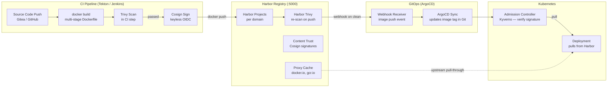

# Harbor — Private OCI Container Registry

## Role in ShopOS

Harbor is the private container image registry for ShopOS. It stores all Docker images built
from the 130 microservices, enforces vulnerability scanning with Trivy before images can be deployed,
signs images with Cosign for supply chain integrity, and provides project-level RBAC to restrict
who can push and pull images per domain team.

Key capabilities used in ShopOS:
- OCI image storage for all 130 service images
- Integrated Trivy scanning — images with critical CVEs are automatically quarantined
- Cosign content trust — Kubernetes admission controller rejects unsigned images (Phase 3)
- Project-level RBAC: each domain team (platform, identity, catalog, …) has its own Harbor project
- Proxy cache — caches Docker Hub, GCR, and GHCR images locally to avoid rate limits
- Webhook notifications to ArgoCD on successful image push

---

## CI Pipeline → Harbor → Kubernetes



---

## Project Structure in Harbor

| Harbor Project | Domain | Repositories |
|---|---|---|
| `platform` | platform | api-gateway, web-bff, mobile-bff, saga-orchestrator, … |
| `identity` | identity | auth-service, user-service, session-service, … |
| `catalog` | catalog | product-catalog-service, pricing-service, search-service, … |
| `commerce` | commerce | cart-service, order-service, payment-service, … |
| `supply-chain` | supply-chain | warehouse-service, fulfillment-service, tracking-service, … |
| `financial` | financial | invoice-service, payout-service, reconciliation-service, … |
| `cx` | customer-experience | review-rating-service, support-ticket-service, … |
| `analytics-ai` | analytics-ai | recommendation-service, fraud-detection-service, … |
| `proxy-cache` | — | docker.io, gcr.io, ghcr.io pull-through |

---

## Setup Instructions

### 1. Install Harbor (Docker Compose)

```bash
# Download Harbor installer
wget https://github.com/goharbor/harbor/releases/latest/download/harbor-online-installer.tgz
tar xzf harbor-online-installer.tgz
cd harbor

# Copy and edit config
cp harbor.yml.tmpl harbor.yml
# Edit hostname, admin password, database password

# Run installer
./install.sh --with-trivy
```

### 2. Configure Docker Daemon (dev)

```json
// /etc/docker/daemon.json
{
  "insecure-registries": ["harbor.shopos.internal:5000"]
}
```

### 3. Login and Push

```bash
docker login harbor.shopos.internal:5000 -u admin -p Harbor12345
docker tag order-service:latest harbor.shopos.internal:5000/commerce/order-service:v1.0.0
docker push harbor.shopos.internal:5000/commerce/order-service:v1.0.0
```

### 4. Create Robot Accounts (for CI)

Create a robot account per CI pipeline with push access scoped to the relevant Harbor project.
Robot account credentials are stored in Vault (`secret/ci/harbor/robot-account`).

---

## Trivy Scanning Policy

| Severity | Policy |
|---|---|
| `CRITICAL` | Block push — image quarantined |
| `HIGH` | Allow push, alert via webhook to Slack |
| `MEDIUM` | Allow push, log to audit |
| `LOW` / `NEGLIGIBLE` | Allow, visible in Harbor UI |

`ignore_unfixed: false` means vulnerabilities with no available fix are still reported and counted
against policy.

---

## Connection Details

| Parameter | Value |
|---|---|
| HTTP Port | 5000 |
| Admin User | `admin` |
| Admin Password | Set in `harbor.yml` — rotate immediately in production |
| Data Volume | `/data` |
| Database | PostgreSQL (bundled or external) |
