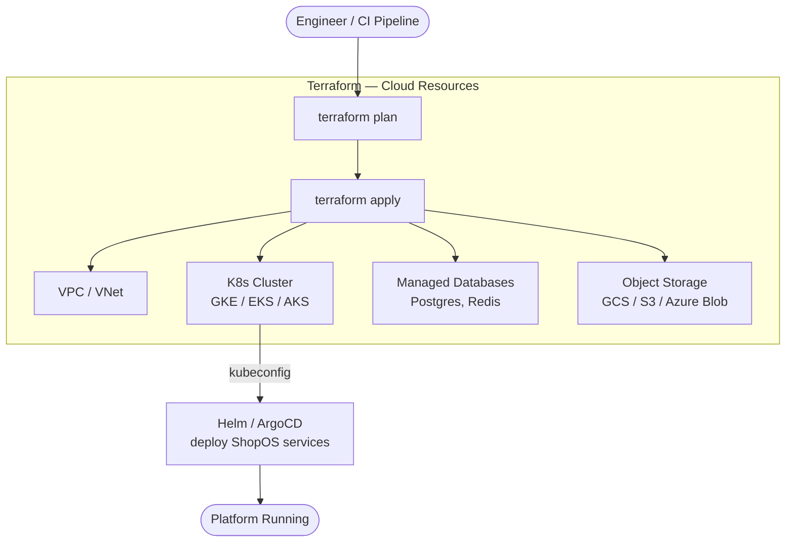

# Infrastructure as Code — ShopOS

All cloud infrastructure for ShopOS is provisioned and managed with **Terraform**.
It covers Kubernetes clusters, managed databases, networking, and object storage
across AWS, GCP, and Azure from a single, consistent module interface.

---

## Directory Structure

```
infra/
└── terraform/
    ├── modules/
    │   ├── gke/                    ← Google Kubernetes Engine cluster
    │   ├── eks/                    ← Amazon EKS cluster
    │   ├── aks/                    ← Azure AKS cluster
    │   ├── vpc/                    ← VPC / VNet networking (per cloud)
    │   ├── postgres/               ← Managed PostgreSQL (Cloud SQL / RDS / Azure DB)
    │   ├── redis/                  ← Managed Redis (Memorystore / ElastiCache)
    │   └── storage/                ← Object storage buckets (GCS / S3 / Azure Blob)
    ├── aws/
    │   ├── jenkins/                ← Jenkins CI server on EC2
    │   └── eks/                    ← EKS Auto Mode cluster
    ├── gcp/
    │   ├── jenkins/                ← Jenkins CI server on Compute Engine
    │   └── gke/                    ← GKE Autopilot cluster
    ├── azure/
    │   ├── jenkins/                ← Jenkins CI server on Azure VM
    │   └── aks/                    ← AKS with Node Auto Provisioning
    └── backend.tf                  ← Remote state (GCS / S3)
```

---

## Provisioning Flow



---

## Kubernetes Clusters

All three providers create a production-grade, private cluster with:
- Multi-AZ (3 availability zones)
- Private nodes with NAT egress
- Managed control plane
- Latest stable Kubernetes version
- Workload Identity / OIDC enabled

| Cloud | Service | Mode | Terraform path |
|---|---|---|---|
| AWS | EKS | Auto Mode (fully managed nodes) | `terraform/aws/eks/` |
| GCP | GKE | Autopilot (fully managed nodes) | `terraform/gcp/gke/` |
| Azure | AKS | Node Auto Provisioning | `terraform/azure/aks/` |

### AWS — EKS Auto Mode

```bash
cd infra/terraform/aws/eks
cp terraform.tfvars.example terraform.tfvars
# Edit: region, cluster_name, vpc_cidr, availability_zones

terraform init
terraform apply
aws eks update-kubeconfig --region us-east-1 --name shopos-eks
kubectl get nodes
```

### GCP — GKE Autopilot

```bash
cd infra/terraform/gcp/gke
cp terraform.tfvars.example terraform.tfvars
# Edit: project_id, region, cluster_name

terraform init
terraform apply
gcloud container clusters get-credentials shopos-gke \
  --region us-central1 --project YOUR_PROJECT_ID
kubectl get nodes
```

### Azure — AKS Node Auto Provisioning

```bash
cd infra/terraform/azure/aks
cp terraform.tfvars.example terraform.tfvars
# Edit: subscription_id, location, cluster_name

terraform init
terraform apply
az aks get-credentials \
  --resource-group shopos-aks-rg --name shopos-aks --overwrite-existing
kubectl get nodes
```

### Destroy

```bash
terraform destroy    # in the relevant terraform/{aws|gcp|azure}/{eks|gke|aks}/ directory
```

---

## Jenkins CI Server

Jenkins can be provisioned on any cloud using Terraform. It is fully configured on first
boot via `scripts/bash/jenkins-install.sh` — no manual steps required.

| Cloud | Terraform path | Instance type | OS |
|---|---|---|---|
| AWS | `terraform/aws/jenkins/` | t3.xlarge (4 vCPU / 16 GB) | Ubuntu 24.04 |
| GCP | `terraform/gcp/jenkins/` | n2-standard-4 (4 vCPU / 16 GB) | Ubuntu 24.04 |
| Azure | `terraform/azure/jenkins/` | Standard_D4s_v3 (4 vCPU / 16 GB) | Ubuntu 24.04 |

```bash
# Example: Jenkins on AWS
cd infra/terraform/aws/jenkins
cp terraform.tfvars.example terraform.tfvars
# Edit: key_name, private_key_path

terraform init
terraform apply          # ~8–12 min including Jenkins install
terraform output jenkins_url
```

**Default credentials:** username `admin`, password `admin`.  
Change after first login: top-right username → **Configure** → **Password** → **Save**.

---

## Module Usage

```hcl
# Example: GKE cluster
module "gke" {
  source       = "../../modules/gke"
  project_id   = var.project_id
  region       = "us-central1"
  cluster_name = "shopos-staging"
  node_pools = [
    { name = "general", machine_type = "n2-standard-4", min_count = 3, max_count = 10 },
    { name = "compute", machine_type = "c2-standard-8",  min_count = 0, max_count = 5 }
  ]
}

# Example: Managed PostgreSQL
module "postgres" {
  source       = "../../modules/postgres"
  project_id   = var.project_id
  region       = "us-central1"
  tier         = "db-n1-standard-4"
  database     = "shopos"
}
```

---

## Environment Parity

| Config | dev | staging | prod |
|---|---|---|---|
| Node pool size | 3 nodes | 6 nodes | 12–30 nodes (autoscaled) |
| Postgres instance | `db-f1-micro` / `db.t3.small` | `db-n1-standard-2` | `db-n1-standard-8` HA |
| Redis | Single node | Single node | Cluster, 3 replicas |
| Multi-AZ | No | No | Yes |
| Remote state | `shopos-tf-dev` bucket | `shopos-tf-staging` bucket | `shopos-tf-prod` bucket |

---

## References

- [Terraform Documentation](https://developer.hashicorp.com/terraform/docs)
- [EKS Auto Mode](https://docs.aws.amazon.com/eks/latest/userguide/automode.html)
- [GKE Autopilot](https://cloud.google.com/kubernetes-engine/docs/concepts/autopilot-overview)
- [AKS Node Auto Provisioning](https://learn.microsoft.com/en-us/azure/aks/node-autoprovision)
- [ShopOS Helm Charts](../helm/README.md)
- [ShopOS GitOps](../gitops/README.md)
