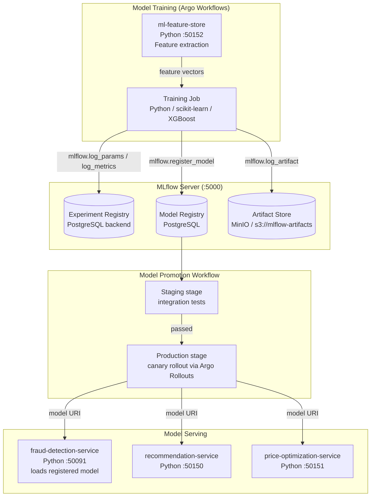

# MLflow — ML Experiment Tracking & Model Registry

## Role in ShopOS

MLflow is the ML lifecycle management platform for ShopOS. It provides experiment tracking,
model versioning, artifact storage, and model serving integration for all machine learning workloads
in the `analytics-ai` domain. Every model training run — whether for fraud detection, price
optimization, or recommendations — logs its parameters, metrics, and artifacts to MLflow, enabling
reproducibility, A/B comparisons, and controlled model promotion.

Integrated services:
- `fraud-detection-service` (Python :50091) — gradient boosting classifier
- `recommendation-service` (Python :50150) — collaborative filtering model
- `price-optimization-service` (Python :50151) — regression / RL model
- `personalization-service` (Python :50153) — ranking model
- `sentiment-analysis-service` (Python) — NLP classifier
- `ml-feature-store` (Python :50152) — feature engineering pipelines

---

## ML Workflow: Train → Track → Register → Serve



---

## Artifact Storage: MinIO Backend

MLflow artifacts (serialized models, confusion matrices, feature importance plots, training data
samples) are stored in MinIO — the open-source S3-compatible object store already deployed in
ShopOS for media assets. The `MLFLOW_S3_ENDPOINT_URL` environment variable redirects the AWS SDK
to the MinIO endpoint instead of AWS S3.

```
Artifact path: s3://mlflow-artifacts/{experiment_id}/{run_id}/artifacts/
MinIO bucket:  mlflow-artifacts
MinIO endpoint: http://minio:9000
```

---

## Experiment Definitions

| Experiment | Service | Framework | Model Type |
|---|---|---|---|
| `fraud-detection` | fraud-detection-service | scikit-learn | GradientBoostingClassifier |
| `product-recommendations` | recommendation-service | implicit / LightFM | Collaborative Filtering |
| `price-optimization` | price-optimization-service | XGBoost | Regression |
| `sentiment-analysis` | sentiment-analysis-service | HuggingFace | BERT fine-tune |
| `personalization-ranking` | personalization-service | LightGBM | LambdaRank |

---

## Model Lifecycle Stages

MLflow's built-in model registry uses four stages:

| Stage | Description | Who Promotes |
|---|---|---|
| `None` | Freshly registered, not yet evaluated | Automated (CI) |
| `Staging` | Under evaluation — integration tests running | ML Engineer |
| `Production` | Actively serving live traffic | Lead / Argo Rollout |
| `Archived` | Replaced by newer version | Automated cleanup job |

Services load their model at startup using the `Production` alias:
```python
import mlflow.sklearn
model = mlflow.sklearn.load_model("models:/fraud-detection/Production")
```

---

## Integration Example (fraud-detection-service)

```python
import mlflow
import mlflow.sklearn
from sklearn.ensemble import GradientBoostingClassifier

mlflow.set_tracking_uri("http://mlflow:5000")
mlflow.set_experiment("fraud-detection")

with mlflow.start_run():
    mlflow.log_param("n_estimators", 200)
    mlflow.log_param("max_depth", 5)
    mlflow.log_param("learning_rate", 0.05)

    model = GradientBoostingClassifier(n_estimators=200, max_depth=5, learning_rate=0.05)
    model.fit(X_train, y_train)

    precision = precision_score(y_test, model.predict(X_test))
    recall = recall_score(y_test, model.predict(X_test))
    mlflow.log_metric("precision", precision)
    mlflow.log_metric("recall", recall)
    mlflow.log_metric("f1", f1_score(y_test, model.predict(X_test)))

    mlflow.sklearn.log_model(model, "fraud-model", registered_model_name="fraud-detection")
```

---

## Connection Details

| Parameter | Value |
|---|---|
| MLflow UI Port | 5000 |
| Backend Store | PostgreSQL (`mlflow` database) |
| Artifact Store | MinIO `s3://mlflow-artifacts` |
| MinIO Endpoint | `http://minio:9000` |
