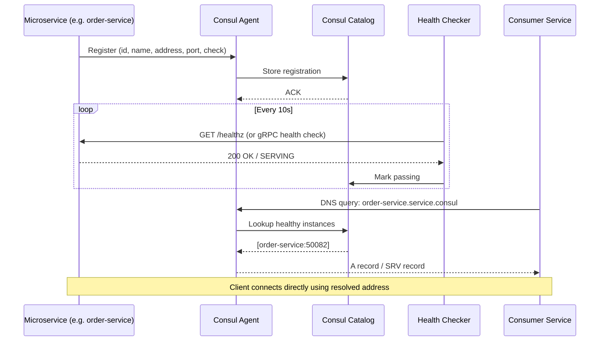

# Consul Service Discovery

HashiCorp Consul provides service discovery, health checking, distributed key/value configuration storage, and service mesh capabilities (via Consul Connect) for the ShopOS platform.

## Role in ShopOS

- Service registry — all 130 microservices register themselves at startup with their address, port, and health check endpoint; other services resolve peers by name without hardcoded IPs
- Health checking — Consul actively polls HTTP `/healthz` endpoints (for REST/HTTP services) and gRPC health protocol endpoints (for gRPC services) on configurable intervals, marking failing instances as critical and removing them from DNS/API responses automatically
- K/V config store — a lightweight alternative to etcd for storing non-secret runtime configuration; the `config-service` (port 50051) wraps Consul K/V with a gRPC API for other services
- Service mesh with Connect — mutual TLS between registered services using automatically rotated certificates; integrates with Envoy sidecars for fine-grained traffic policies without a full Istio installation
- Telemetry — emits Prometheus metrics (retention 60s) via the `telemetry` block, scraped by Prometheus at `:8500/v1/agent/metrics?format=prometheus`

## Service Registration and Discovery Flow



## Key Endpoints

| Endpoint | Purpose |
|---|---|
| `http://consul:8500/ui` | Web UI — service catalog, health status, K/V browser |
| `http://consul:8500/v1/catalog/services` | List all registered services (JSON API) |
| `http://consul:8500/v1/health/service/{name}` | Health status for a specific service |
| `http://consul:8500/v1/kv/{key}` | Read/write key-value config |
| `http://consul:8500/v1/agent/metrics` | Prometheus metrics |

## DNS Interface

Services resolve peers using Consul DNS (port 8600):

```
# HTTP service
curl http://api-gateway.service.consul:8080/healthz

# gRPC service (returns SRV record with port)
dig @consul SRV order-service.service.consul
```

## Integration with Traefik

Traefik can use Consul as a provider (alternative to Docker labels) by adding to `traefik.yml`:

```yaml
providers:
  consulCatalog:
    endpoint:
      address: http://consul:8500
    exposedByDefault: false
    prefix: traefik
```

Services then register Traefik tags via Consul registration tags (see `service-registrations/platform.json` — note `traefik.enable=true` tag on `api-gateway`).

## Files

| File | Purpose |
|---|---|
| `consul.hcl` | Server configuration — datacenter, Connect, telemetry |
| `service-registrations/platform.json` | Example service registration payloads for the platform domain |
