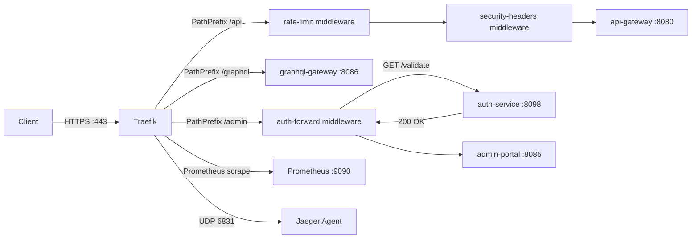

# Traefik Edge Router

Traefik serves as the primary edge router and ingress controller for ShopOS, replacing traditional static reverse proxies with a cloud-native, dynamic routing solution.

## Role in ShopOS

- Automatic service discovery via Docker labels — services opt-in by setting `traefik.enable=true` on their container, no manual route registration required
- TLS termination — handles HTTPS at the edge; all internal service-to-service traffic travels over the `shopos` Docker network
- Middleware chain — rate limiting, security headers, and forward auth are composed as reusable middleware and attached to routers declaratively
- Metrics — exposes Prometheus metrics at `:8082/metrics` with per-entrypoint and per-service labels, feeding into the observability stack
- Tracing — sends spans to Jaeger via the agent UDP port, correlating edge request traces with downstream service traces

## Request Flow



## Configuration Files

| File | Purpose |
|---|---|
| `traefik.yml` | Static config — entrypoints, providers, metrics, tracing, log level |
| `dynamic.yml` | Dynamic routing config — routers, services, middlewares (hot-reloaded) |

## Comparison: Traefik vs Nginx vs Kong

| Feature | Traefik | Nginx | Kong |
|---|---|---|---|
| Auto service discovery | Native (Docker, K8s, Consul) | Manual config reload | Via plugins |
| Dynamic config reload | Yes, zero downtime | Requires `nginx -s reload` | Yes (via Admin API) |
| Middleware/plugins | Built-in + CRDs | Limited (OpenResty/Lua) | Rich plugin ecosystem |
| Dashboard | Built-in UI | Third-party only | Manager UI (Enterprise) |
| Kubernetes native | IngressRoute CRD | Ingress annotations | Ingress + CRDs |
| Prometheus metrics | Native | Stub status module | Native |
| Open source | Yes (Apache 2.0) | Yes (BSD) | Yes (Apache 2.0) |
| Learning curve | Low | Medium | Medium-High |

Why Traefik for ShopOS: Zero-config service discovery aligns with the dynamic microservice topology (130 services). New services automatically appear in routing when deployed with the correct Docker/K8s labels, without touching any router configuration.

## Adding a New Service

Add labels to your `docker-compose.yml` service definition:

```yaml
labels:
  - "traefik.enable=true"
  - "traefik.http.routers.my-service.rule=PathPrefix(`/my-path`)"
  - "traefik.http.routers.my-service.entrypoints=websecure"
  - "traefik.http.routers.my-service.tls=true"
  - "traefik.http.services.my-service.loadbalancer.server.port=8080"
```

## Local Dashboard

When running locally: http://localhost:8080/dashboard/
