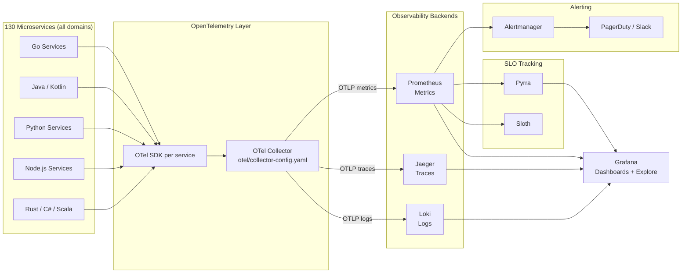

# Observability Stack — ShopOS

ShopOS implements the three pillars of observability — **metrics**, **traces**, and **logs** —
plus formal **SLO tracking**, using a fully open-source toolchain. All 130 services emit
telemetry through the OpenTelemetry SDK, which feeds a unified collector before data is routed
to specialised backends and visualised in Grafana.

---

## Directory Structure

```
observability/
├── otel/
│   ├── collector-config.yaml          ← OTel Collector pipeline definition
│   └── instrumentation/               ← Per-language SDK bootstrap configs
├── prometheus/
│   ├── prometheus.yaml                ← Scrape configs and global settings
│   └── rules/                         ← Recording rules and alert rules
├── alertmanager/
│   ├── alertmanager.yaml              ← Routing tree and receivers
│   └── templates/                     ← Notification message templates
├── grafana/
│   ├── dashboards/                    ← Provisioned dashboard JSON files
│   └── datasources/                   ← Datasource provisioning configs
├── loki/
│   ├── loki-config.yaml               ← Loki storage and ingestion config
│   └── promtail-config.yaml           ← Log scraping agent config
├── jaeger/
│   └── jaeger-config.yaml             ← Jaeger all-in-one / distributed config
└── slo/
    ├── pyrra/                         ← Pyrra SLO manifests
    └── sloth/                         ← Sloth SLO spec files
```

---

## Observability Pipeline



---

## The Three Pillars

### Metrics — Prometheus

Prometheus scrapes `/metrics` (Prometheus exposition format) from every ShopOS service.

- **Scrape interval**: 15 s
- **Retention**: 15 days in-cluster; long-term via Thanos (Phase 4 extension)
- **Key metric families exported by every service**:
  - `http_requests_total` / `grpc_server_handled_total`
  - `http_request_duration_seconds` (histogram)
  - `go_goroutines`, `process_cpu_seconds_total` (runtime)
  - Domain-specific counters (e.g., `orders_created_total`, `payments_processed_total`)

```bash
# Port-forward Prometheus UI
kubectl port-forward svc/prometheus 9090:9090 -n shopos-infra

# Query example — order service error rate
rate(grpc_server_handled_total{grpc_service="commerce.OrderService",grpc_code!="OK"}[5m])
  / rate(grpc_server_handled_total{grpc_service="commerce.OrderService"}[5m])
```

### Traces — Jaeger

All inter-service calls are instrumented with OpenTelemetry spans. The OTel Collector exports
traces to Jaeger via OTLP/gRPC.

- **Sampling**: 100 % in dev/staging; head-based 10 % + tail-based error sampling in prod
- **Propagation format**: W3C TraceContext + Baggage
- **Retention**: 7 days

```bash
# Port-forward Jaeger UI
kubectl port-forward svc/jaeger-query 16686:16686 -n shopos-infra
# Open http://localhost:16686
```

### Logs — Grafana Loki

Promtail agents run as DaemonSets and scrape pod stdout/stderr logs, attaching Kubernetes
metadata labels (`namespace`, `pod`, `container`).

- **Log format**: structured JSON from all services
- **Labels**: `{namespace, service, level, trace_id}`
- **Correlation**: `trace_id` field in every log line enables log↔trace linking in Grafana

```bash
# Query logs for payment-service errors (LogQL)
{namespace="shopos-commerce", service="payment-service"} |= "level=error"
```

### SLOs — Pyrra & Sloth

SLO manifests are defined in `slo/pyrra/` and `slo/sloth/`. Each service that carries a user-
facing SLA has a corresponding SLO document defining:

- **Objective**: e.g., 99.9 % availability over a 30-day window
- **Error budget**: multi-burn-rate alerts at 1 h and 6 h windows
- **Dashboards**: Pyrra auto-generates Grafana dashboards per SLO

---

## Alertmanager

Alerts are defined as Prometheus alerting rules in `prometheus/rules/`. Alertmanager routes
them based on severity and domain:

| Severity | Channel | Response Time |
|---|---|---|
| `critical` | PagerDuty (on-call) | Immediate |
| `warning` | Slack `#shopos-alerts` | 30 min |
| `info` | Slack `#shopos-ops` | Next business day |

---

## Grafana Dashboards

| Dashboard | Description |
|---|---|
| `Platform Overview` | API Gateway RPS, error rates, latency percentiles |
| `Commerce — Order Flow` | Order funnel, payment success rate, cart abandonment |
| `Infrastructure — K8s` | Node CPU/memory, pod restart counts, PVC usage |
| `SLO Overview` | Error budget burn rates for all SLO-tracked services |
| `Chaos Engineering` | Real-time metrics during chaos experiments |

```bash
# Port-forward Grafana
kubectl port-forward svc/grafana 3000:3000 -n shopos-infra
# Open http://localhost:3000  (default: admin / admin — change on first login)
```

---

## Quick Start

```bash
# Deploy full observability stack via Helm umbrella chart
helm upgrade --install shopos-observability helm/charts/observability \
  --namespace shopos-infra \
  --create-namespace \
  -f helm/charts/observability/values-prod.yaml

# Verify all pods are running
kubectl get pods -n shopos-infra

# Apply SLO manifests
kubectl apply -f observability/slo/pyrra/
kubectl apply -f observability/slo/sloth/
```

---

## References

- [OpenTelemetry Documentation](https://opentelemetry.io/docs/)
- [Prometheus Operator](https://prometheus-operator.dev/)
- [Grafana Loki](https://grafana.com/docs/loki/)
- [Jaeger Tracing](https://www.jaegertracing.io/docs/)
- [Pyrra SLO](https://github.com/pyrra-dev/pyrra)
- [Sloth SLO](https://sloth.dev/)
- [ShopOS Chaos Engineering](../chaos/README.md)
