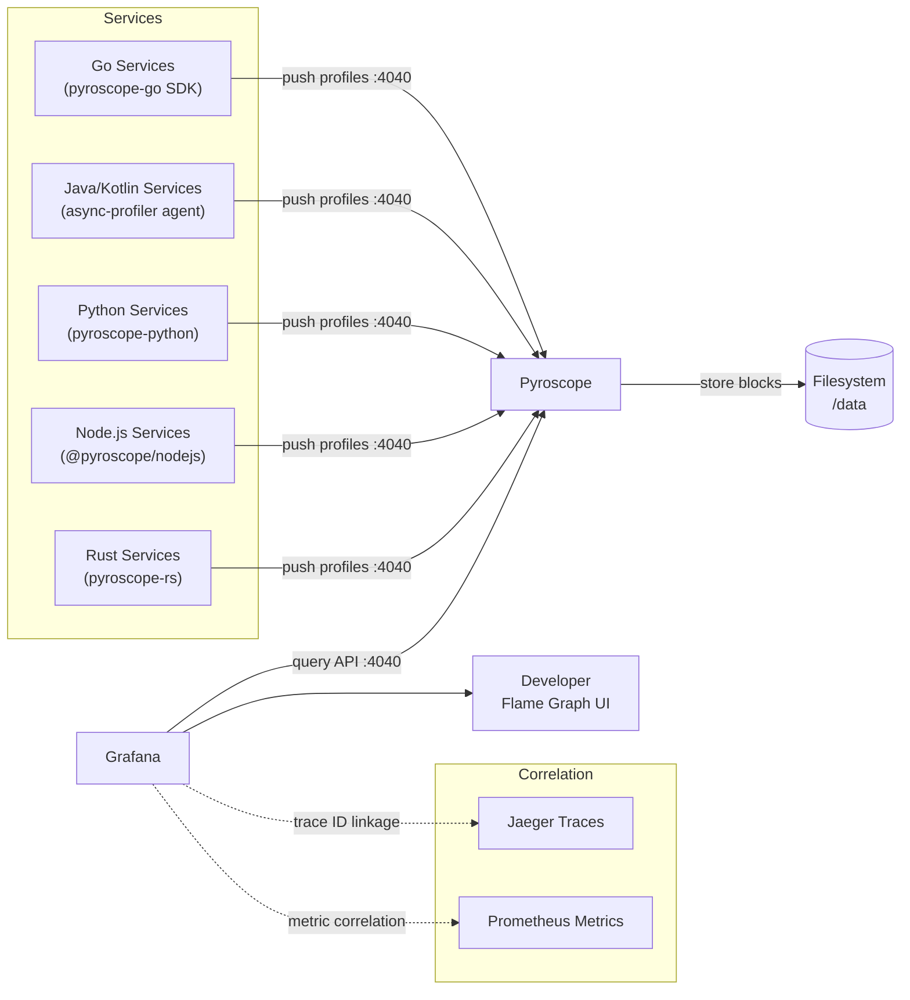

# Grafana Pyroscope — Continuous Profiling

Grafana Pyroscope provides always-on continuous profiling for all 130 ShopOS services, capturing CPU usage, memory allocations, goroutine/thread counts, and lock contention as flame graphs — without requiring manual profiling sessions.

## Role in ShopOS

- Continuous profiling — profiling data is collected 24/7 in production with low overhead (typically <1% CPU), unlike on-demand profilers that require reproduction of an issue
- Flame graph analysis — identifies hot code paths across services; correlates with traces (Jaeger/Zipkin) and metrics (Prometheus) for full observability context in Grafana
- Performance regression detection — Pyroscope stores historical profiles, enabling before/after comparisons across deploys to catch performance regressions before they reach production
- Multi-tenant — profiles are tagged with `service.name`, `environment`, and `version` labels, allowing filtering across all 130 services in a single Pyroscope instance
- Diff profiles — compare two time ranges or two service versions side-by-side to isolate the exact functions responsible for a slowdown

## Supported Languages in ShopOS

| Language | SDK | Push/Pull | Notes |
|---|---|---|---|
| Go | `pyroscope-go` | Push | Auto-instrumented via `runtime/pprof`; covers api-gateway, checkout-service, warehouse-service, etc. |
| Java / Kotlin | `pyroscope-java` (async-profiler) | Push | JVM services: pricing-service, order-service, auth-service wrapper |
| Python | `pyroscope-otel` / `pyroscope-python` | Push | ML services: fraud-detection, recommendation, analytics |
| Node.js | `@pyroscope/nodejs` | Push | BFF services: mobile-bff, cms-service, review-rating-service |
| Rust | `pyroscope-rs` | Push | auth-service (Rust), shipping-service |

## Profiling Pipeline



## Go Service Instrumentation Example

```go
import "github.com/grafana/pyroscope-go"

func main() {
    pyroscope.Start(pyroscope.Config{
        ApplicationName: "order-service",
        ServerAddress:   "http://pyroscope:4040",
        Logger:          pyroscope.StandardLogger,
        Tags:            map[string]string{"environment": "production"},
        ProfileTypes: []pyroscope.ProfileType{
            pyroscope.ProfileCPU,
            pyroscope.ProfileAllocObjects,
            pyroscope.ProfileAllocSpace,
            pyroscope.ProfileInuseObjects,
            pyroscope.ProfileInuseSpace,
        },
    })
    // ... rest of main()
}
```

## Grafana Integration

Pyroscope is added as a data source in Grafana (`http://pyroscope:4040`). The Explore > Profiles view lets engineers:

1. Select a service from the dropdown
2. Choose profile type (CPU, memory, goroutines)
3. Select a time range
4. Drill into flame graphs interactively
5. Link directly from a Jaeger trace span to the profile captured at that exact timestamp

## Configuration Notes

- Storage backend: filesystem (`/data`) — suitable for single-node dev/staging. For production, use object storage (S3/GCS/MinIO) by changing `storage.backend`.
- Retention: controlled by `max_block_duration: 1h` and Pyroscope's compaction. Default retention is ~7 days on filesystem.
- Ingestion limits: set to 4 MB/s per tenant with 8 MB burst — adjust if high-cardinality services (e.g., analytics pipeline) exceed limits.
