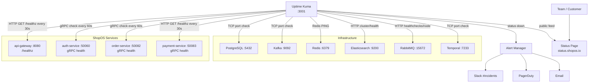

# Uptime Kuma — Service Uptime Monitoring

Uptime Kuma is a self-hosted uptime monitoring tool that provides real-time availability tracking, status pages, and alerting for all 130 ShopOS services and underlying infrastructure components.

## Role in ShopOS

- Real-time uptime monitoring — polls every service's health endpoint at configurable intervals (30–60s), tracking availability percentage and response time over time
- Multi-protocol support — monitors HTTP/HTTPS endpoints (`/healthz`), TCP/UDP ports, gRPC health checks, Redis `PING`, DNS resolution, and database port reachability — covering all ShopOS service types (REST, gRPC, Kafka, databases)
- Public status pages — generates branded status pages (e.g., `status.shopos.io`) that can be shared with customers and partners, showing real-time and historical uptime per service group
- Alerting — integrates with Slack, PagerDuty, email, Microsoft Teams, Discord, and 90+ notification providers; sends alerts on state transitions (up→down, down→up) with configurable retry thresholds
- Incident timeline — maintains a full history of downtime incidents with duration and timestamps, used for SLA reporting and post-mortems

## Monitoring Architecture



## Monitor Groups

Monitors in `monitors.json` are organized by domain concern:

| Group | Monitors | Check Interval |
|---|---|---|
| Edge / API | API Gateway | 30s |
| Core Services | Auth, Order, Payment | 30–60s |
| Databases | PostgreSQL, Redis, Elasticsearch | 30–60s |
| Messaging | Kafka, RabbitMQ | 60s |
| Workflow | Temporal | 60s |

## Alerting Configuration

Configure notification channels via the Uptime Kuma web UI (`http://uptime-kuma:3001`) or via the REST API. Recommended channels for ShopOS:

```
Slack  → #platform-alerts  (all services)
Slack  → #payments-alerts   (payment-service, fraud-detection-service)
PagerDuty                   (payment-service, auth-service — P1 incidents)
Email                       (weekly SLA digest)
```

## Status Page Setup

1. Open Uptime Kuma at `http://localhost:3001`
2. Navigate to Status Pages → New Status Page
3. Group monitors by domain (Platform, Commerce, Infrastructure)
4. Set custom domain `status.shopos.io` via CNAME to the Uptime Kuma instance
5. Enable Show Tags to display domain labels on the public page

## Files

| File | Purpose |
|---|---|
| `monitors.json` | Seed configuration for all key service monitors |

> Note: `monitors.json` is a reference/seed file. Import it via the Uptime Kuma REST API (`POST /api/v1/monitor`) or use it as documentation for manual setup. Uptime Kuma stores its live configuration in a SQLite database (`kuma.db`).
