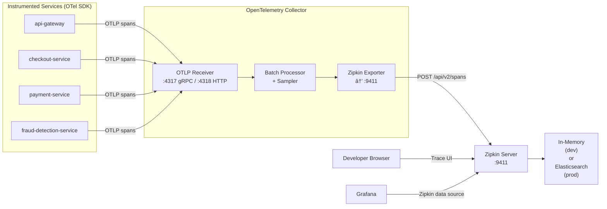

# Zipkin Distributed Tracing

Zipkin is a lightweight distributed tracing system used in ShopOS as a complementary or alternative tracing backend to Jaeger, particularly suited for development environments and services with simpler tracing requirements.

## Role in ShopOS

- Distributed trace collection — captures request spans across microservice boundaries, correlating latency contributions from each service in a request chain (e.g., checkout-service → payment-service → fraud-detection-service)
- Lightweight footprint — Zipkin's in-memory storage mode requires no external database, making it ideal for local development and CI environments where Jaeger's full Elasticsearch backend is too heavy
- OTel-compatible — traces are sent via the OpenTelemetry Collector using the Zipkin exporter, meaning no SDK changes are needed when switching between Zipkin and Jaeger backends
- B3 propagation — natively supports B3 multi-header and single-header propagation, which is compatible with a wide range of service mesh tools (Istio, Linkerd, Envoy)

## Trace Collection Flow



## Zipkin vs Jaeger — When to Use Which

| Concern | Zipkin | Jaeger |
|---|---|---|
| Deployment complexity | Single binary, zero deps | Multiple components (collector, query, storage) |
| Storage options | In-memory, MySQL, Elasticsearch, Cassandra | Elasticsearch, Cassandra, Badger |
| Sampling strategies | Head-based (via OTel Collector) | Head-based + remote adaptive sampling |
| UI features | Simple, focused trace viewer | Richer UI with DAG dependency graphs |
| Protocol support | Zipkin v1/v2, B3, OTel | Jaeger native, OTel, Zipkin (via OTel Collector) |
| Best for | Dev/staging, lightweight setups, B3-heavy environments | Production, complex topologies, adaptive sampling |
| Grafana integration | Native data source | Native data source (Grafana Tempo can front both) |

ShopOS recommendation: Use Zipkin for local `docker-compose` development (zero setup overhead). Use Jaeger (or Grafana Tempo backed by object storage) for staging and production where adaptive sampling and long-term trace storage are needed.

## OTel Collector Zipkin Exporter Config

Add to `observability/otel/otel-collector-config.yaml`:

```yaml
exporters:
  zipkin:
    endpoint: "http://zipkin:9411/api/v2/spans"
    format: proto

service:
  pipelines:
    traces:
      receivers: [otlp]
      processors: [batch]
      exporters: [zipkin]   # swap for jaeger or otlp/tempo in prod
```

## Ports

| Port | Purpose |
|---|---|
| `9411` | HTTP API — trace ingestion (`POST /api/v2/spans`) and query UI |

## Storage Backends

| Backend | Config | Use Case |
|---|---|---|
| `mem` | Default — no config needed | Local dev, CI, ephemeral testing |
| `elasticsearch` | Set `STORAGE_TYPE=elasticsearch` + `ES_HOSTS` | Production — persistent, queryable |
| `mysql` | Set `STORAGE_TYPE=mysql` + connection vars | Small teams, simpler ops |
| `cassandra` | Set `STORAGE_TYPE=cassandra` + contact points | High-volume production (matches analytics domain DB) |
