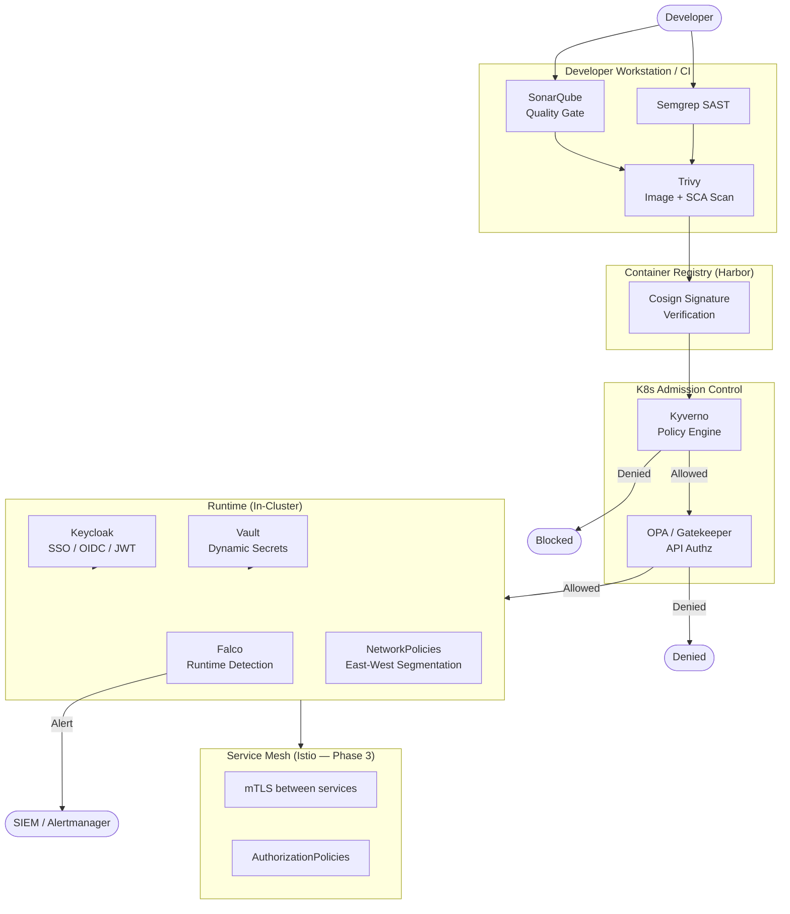

# Security Configuration — ShopOS

ShopOS implements a defence-in-depth security posture with controls at every layer: secret
management, identity, network, runtime, policy enforcement, and static analysis. All tooling
is open source and is applied as configuration-as-code under this directory.

> **Phase note:** The full security stack is provisioned in **Phase 3**. The configurations
> here are ready to apply once the base platform (Phase 1) and CI/CD (Phase 2) are stable.

---

## Directory Structure

```
security/
├── vault/                  ← Secret management (HashiCorp Vault)
├── keycloak/               ← Identity provider / SSO (Keycloak)
├── kyverno/                ← Kubernetes policy engine
├── falco/                  ← Runtime threat detection
├── semgrep/                ← SAST rule sets
├── trivy/                  ← Container and dependency scanning
├── sonarqube/              ← Code quality and security gate
├── opa/                    ← Open Policy Agent (API-level authz)
└── network-policies/       ← Kubernetes NetworkPolicy manifests
```

---

## Security Layers



---

## Tool Reference

### HashiCorp Vault — `vault/`

Vault provides dynamic secrets, PKI certificate issuance, and encrypted key-value storage.

- **Auth methods**: Kubernetes ServiceAccount JWT, OIDC (via Keycloak)
- **Secret engines**: `kv-v2` for static config, `database` for dynamic Postgres credentials,
  `pki` for internal TLS certificates
- **Agent injection**: Vault Agent Injector annotates pods to mount secrets as files or env vars
- **Lease TTL**: database credentials rotate every 1 hour

```bash
# Bootstrap Vault (after Helm install)
vault operator init -key-shares=5 -key-threshold=3
vault operator unseal   # repeat 3 times with different unseal keys
kubectl apply -f security/vault/vault-auth-role.yaml
kubectl apply -f security/vault/vault-policies/
```

### Keycloak — `keycloak/`

Keycloak is the central identity and access management system for ShopOS.

- **Realms**: `shopos-internal` (employees, admins), `shopos-external` (customers, partners)
- **Clients**: `api-gateway`, `admin-portal`, `partner-bff`, `backstage`
- **Flows**: OIDC Authorization Code (web), Client Credentials (service-to-service)
- **MFA**: TOTP enforced for all admin roles via `mfa-service`

```bash
# Port-forward Keycloak admin console
kubectl port-forward svc/keycloak 8080:8080 -n shopos-identity
# http://localhost:8080/admin
```

### Kyverno — `kyverno/`

Kyverno enforces Kubernetes policy as admission webhooks — no Rego required.

Key policies applied:

| Policy | Action | Description |
|---|---|---|
| `require-non-root` | Enforce | All containers must run as non-root |
| `disallow-latest-tag` | Enforce | Image tags must be pinned (no `:latest`) |
| `require-resource-limits` | Enforce | CPU and memory limits mandatory |
| `restrict-host-path` | Enforce | `hostPath` volumes disallowed |
| `require-signed-images` | Enforce | Cosign signature must be present |
| `restrict-privilege-escalation` | Enforce | `allowPrivilegeEscalation: false` required |

```bash
kubectl apply -f security/kyverno/policies/
kubectl get policyreport -A   # view compliance report
```

### Falco — `falco/`

Falco monitors kernel system calls at runtime and alerts on suspicious behaviour.

Notable rules applied:

- Shell spawned inside a container
- Unexpected outbound network connection from a database pod
- Write to `/etc` or `/bin` inside a running container
- Unexpected process execution in `shopos-financial` namespace

Alerts are routed to Alertmanager → Slack `#shopos-security`.

```bash
kubectl logs -n falco -l app=falco -f   # stream Falco alerts
```

### Semgrep — `semgrep/`

Semgrep runs SAST analysis in CI for all language rulesets.

| Language | Ruleset |
|---|---|
| Go | `p/golang` + custom ShopOS rules |
| Java / Kotlin | `p/java` + `p/owasp-top-ten` |
| Python | `p/python` + `p/bandit` |
| Node.js | `p/nodejs` + `p/javascript` |
| Rust | `p/rust` |
| C# | `p/csharp` |

```bash
# Run locally against a service
semgrep --config security/semgrep/rules/ src/commerce/order-service/
```

### Trivy — `trivy/`

Trivy scans container images, filesystems, and Git repositories for CVEs and misconfigurations.

- **Image scan**: every Docker image in CI before push to Harbor
- **SCA**: `go.mod`, `pom.xml`, `package.json`, `requirements.txt`, `Cargo.toml`
- **K8s**: periodic cluster scan via `trivy operator`
- **Severity threshold**: builds fail on `CRITICAL` or `HIGH` unfixed CVEs

```bash
# Scan an image
trivy image enterprise-platform/order-service:latest

# Scan a filesystem
trivy fs src/commerce/order-service/

# Kubernetes cluster scan
trivy k8s --report=summary cluster
```

### SonarQube — `sonarqube/`

SonarQube provides code quality gates, duplication detection, and security hotspot analysis.

- **Quality Gate**: must pass before merge to `main`
- **Coverage threshold**: ≥ 80 % line coverage
- **Security hotspots**: reviewed and resolved before release

```bash
# Port-forward SonarQube
kubectl port-forward svc/sonarqube 9000:9000 -n shopos-infra
# http://localhost:9000
```

### OPA / Gatekeeper — `opa/`

Open Policy Agent enforces fine-grained API-level authorisation policies for the gRPC/HTTP
gateway layer. Rego policies define which `sub` (subject) may call which gRPC method.

### Network Policies — `network-policies/`

Kubernetes `NetworkPolicy` manifests enforce east-west traffic segmentation:

- Pods may only receive ingress from their own namespace or explicitly allowed namespaces
- All cross-domain calls must go via the API Gateway or explicit service-to-service allow rules
- The `shopos-infra` namespace (databases, Kafka, Vault) only accepts traffic from service pods —
  never from `ingress-nginx` or external sources directly

---

## References

- [HashiCorp Vault](https://developer.hashicorp.com/vault)
- [Keycloak Documentation](https://www.keycloak.org/documentation)
- [Kyverno](https://kyverno.io/docs/)
- [Falco](https://falco.org/docs/)
- [Semgrep](https://semgrep.dev/docs/)
- [Trivy](https://aquasecurity.github.io/trivy/)
- [SonarQube](https://docs.sonarqube.org/)
- [OPA/Gatekeeper](https://open-policy-agent.github.io/gatekeeper/)
- [ShopOS CI Pipelines](../ci/README.md)
