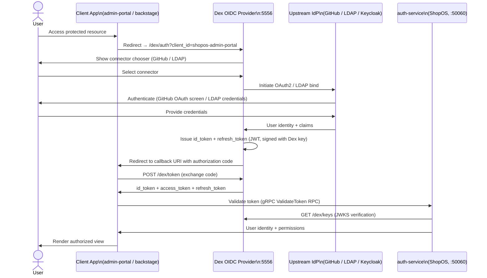

# Dex OIDC Identity Broker

Dex is an OpenID Connect (OIDC) identity provider that acts as a federation layer between ShopOS services and upstream identity sources (GitHub, corporate LDAP, Keycloak). It normalizes heterogeneous identity backends into a single OIDC token interface consumed by downstream applications and Kubernetes.

## Role in ShopOS

- OIDC identity broker — translates logins from GitHub OAuth, corporate LDAP, and Keycloak SAML into standard OIDC `id_token` JWTs, so downstream services only need to trust one issuer (`http://dex:5556/dex`)
- Kubernetes OIDC provider — the K8s API server is configured with `--oidc-issuer-url=http://dex:5556/dex`, enabling `kubectl` logins via `kubelogin` without static service account tokens
- Backstage authentication — the Backstage developer portal uses Dex as its OIDC provider, enabling SSO for engineers accessing the internal developer portal
- Admin portal SSO — the admin-portal static client (`shopos-admin-portal`) receives short-lived access tokens from Dex after LDAP/GitHub authentication
- Token refresh — Dex issues refresh tokens, enabling long-lived sessions without re-authentication while maintaining short-lived access token lifetimes

## OIDC Login Flow



## Integration with Keycloak

When Keycloak is deployed (Phase 3), Dex can delegate to it via the OIDC connector:

```yaml
connectors:
  - type: oidc
    id: keycloak
    name: Keycloak
    config:
      issuer: http://keycloak:8080/realms/shopos
      clientID: dex-client
      clientSecret: $KEYCLOAK_CLIENT_SECRET
      redirectURI: http://dex:5556/dex/callback
      scopes: ["openid", "profile", "email", "groups"]
```

This allows Keycloak to manage user provisioning, group membership, and MFA policies while Dex remains the single OIDC issuer for all ShopOS applications.

## Integration with auth-service

The ShopOS `auth-service` (Rust, port 50060) acts as the token validation layer for all internal gRPC services:

1. Services receive a Bearer token in gRPC metadata
2. They call `auth-service.ValidateToken(token)` via gRPC
3. `auth-service` fetches Dex's JWKS from `http://dex:5556/dex/keys` (cached with TTL)
4. Validates signature, expiry, and audience claims
5. Returns the decoded user identity and permission claims

## Static Clients

| Client ID | Application | Callback URI |
|---|---|---|
| `shopos-admin-portal` | Admin Portal (Java, :8085) | `http://admin-portal:8085/callback` |
| `shopos-backstage` | Backstage Developer Portal (:3000) | `http://backstage:3000/api/auth/oidc/handler/frame` |

## Files

| File | Purpose |
|---|---|
| `config.yaml` | Dex server configuration — storage, connectors, static clients, OAuth2 settings |

> Security note: `clientSecret` values in `config.yaml` are placeholders. In production, inject via environment variables or HashiCorp Vault using the External Secrets Operator.
