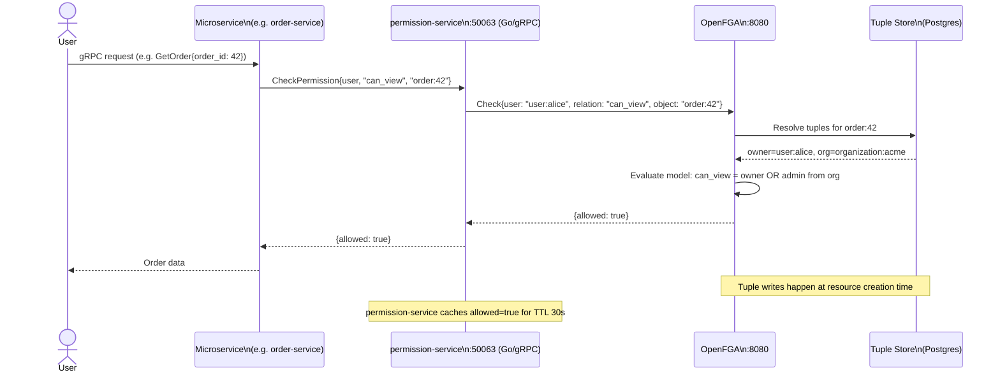

# OpenFGA Fine-Grained Authorization

OpenFGA is a Google Zanzibar-inspired fine-grained authorization (FGA) system that enables relationship-based access control (ReBAC) for ShopOS. It complements the coarse-grained policy enforcement provided by Kyverno and OPA/Gatekeeper with application-level, per-object authorization decisions.

## Role in ShopOS

- Fine-grained, per-object authorization — answers questions like "can user X view order Y?" or "can user X edit product Z in organization W?" with sub-millisecond latency, handling the authorization logic that RBAC roles alone cannot express
- Google Zanzibar model — based on the same relationship-tuple model that powers Google Drive, Docs, and Calendar permissions; scales to billions of relationship tuples
- Complements OPA/Kyverno — OPA/Kyverno enforce infrastructure-level policies (which namespaces can deploy, which images are allowed); OpenFGA enforces application-level data access policies (which user can access which record)
- Centralized authorization — all services delegate permission checks to the `permission-service` (Go, port 50063), which calls OpenFGA's `Check` API; no authorization logic scattered across services
- Audit trail — every `Check` call is logged with the user, relation, object, and decision, feeding into the `audit-service` for compliance and SOC 2 evidence

## Authorization Decision Flow



## Authorization Model (`model.fga`)

The model defines the object types and their relations:

| Type | Key Relations | Notes |
|---|---|---|
| `user` | — | Leaf principal type |
| `organization` | `member`, `admin` | Groups of users; admins have elevated access across all org-owned resources |
| `product` | `can_view`, `can_edit`, `can_delete` | View is open to all org members; edit requires admin; delete requires admin |
| `order` | `owner`, `can_view`, `can_cancel` | Owner = the user who placed the order; org admins can also view |
| `role` | `assignee` | Used to map OIDC groups/roles to FGA principals |

## Comparison: OpenFGA vs OPA vs Kyverno

| Concern | OpenFGA | OPA / Gatekeeper | Kyverno |
|---|---|---|---|
| Model | Relationship-based (ReBAC / Zanzibar) | Policy-based (Rego rules) | Policy-based (YAML rules) |
| Granularity | Per-object (can user X access resource Y?) | Per-request / per-config (is this K8s manifest allowed?) | Per-K8s resource (admission control) |
| Primary use | Application data access control | API authz, K8s admission, infrastructure policy | K8s admission, policy mutation |
| Performance | Sub-ms Check API with caching | Low-ms Rego evaluation | Synchronous admission webhook |
| Audit | Built-in check audit log | OPA decision log | Kyverno policy reports |
| Best for ShopOS | Service-to-data authorization | K8s manifest validation, API gateway authz | K8s admission policies |

## Integration with permission-service

The `permission-service` (Go, port 50063) wraps OpenFGA's gRPC API:

```go
// proto/identity/permission.proto (conceptual)
service PermissionService {
    rpc Check(CheckRequest) returns (CheckResponse);
    rpc WriteRelationship(WriteRequest) returns (WriteResponse);
    rpc DeleteRelationship(DeleteRequest) returns (DeleteResponse);
    rpc ListObjects(ListObjectsRequest) returns (ListObjectsResponse);
}
```

Services call `permission-service` rather than OpenFGA directly, allowing:
- Caching of frequent checks (Redis TTL 30s)
- Audit logging injection
- Circuit breaking if OpenFGA is unavailable

## Writing Relationship Tuples

Tuples are written when resources are created or ownership changes:

```
# When order 42 is placed by alice:
WriteRelationship: user=user:alice, relation=owner, object=order:42

# When alice joins organization acme:
WriteRelationship: user=user:alice, relation=member, object=organization:acme

# When bob is made an admin of acme:
WriteRelationship: user=user:bob, relation=admin, object=organization:acme
```

## Files

| File | Purpose |
|---|---|
| `model.fga` | OpenFGA authorization model — defines types, relations, and computed permissions |
