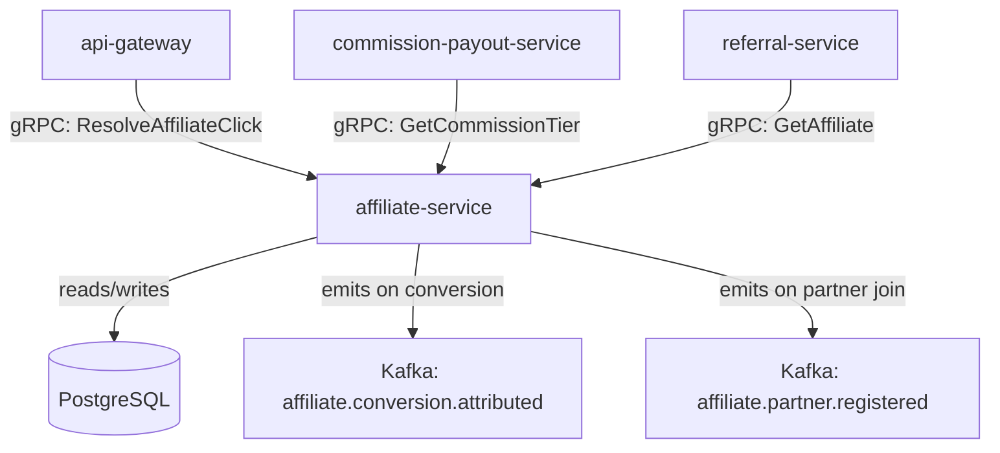

# affiliate-service

> Manages affiliate partner accounts, tracking links, commission tier rules, and click/conversion attribution for the affiliate programme.

## Overview

The affiliate-service is the central registry and attribution engine for the ShopOS affiliate marketing programme. It manages affiliate partner onboarding, generates unique tracking links with embedded affiliate IDs, maintains commission tier rules (flat rate, percentage, tiered by volume), and resolves click-to-conversion attribution. When a customer clicks an affiliate tracking link, the affiliate ID is stored in a cookie; when the customer places an order, the commission-payout-service queries this service to determine the applicable commission and affiliate account.

## Architecture



## Tech Stack

| Component | Technology |
|---|---|
| Language | Go |
| Database | PostgreSQL |
| Protocol | gRPC |
| Migrations | golang-migrate |
| Build Tool | go build |
| Container | Docker (multi-stage, non-root) |

## Responsibilities

- Affiliate partner account CRUD (onboarding, approval, suspension)
- Unique tracking link generation with configurable UTM parameters
- Click recording and attribution window management (last-click, first-click, configurable)
- Commission tier definition: flat rate, percentage of order value, volume-tiered
- Click-to-conversion attribution: match order to affiliate cookie
- Aggregate click, conversion, and earnings reporting per partner

## API / Interface

```protobuf
service AffiliateService {
  rpc RegisterAffiliate(RegisterAffiliateRequest) returns (Affiliate);
  rpc GetAffiliate(GetAffiliateRequest) returns (Affiliate);
  rpc ListAffiliates(ListAffiliatesRequest) returns (ListAffiliatesResponse);
  rpc GenerateTrackingLink(GenerateTrackingLinkRequest) returns (TrackingLink);
  rpc RecordClick(RecordClickRequest) returns (ClickAck);
  rpc AttributeConversion(AttributeConversionRequest) returns (Attribution);
  rpc GetCommissionTier(GetCommissionTierRequest) returns (CommissionTier);
  rpc SetCommissionTier(SetCommissionTierRequest) returns (CommissionTier);
  rpc GetAffiliateStats(GetAffiliateStatsRequest) returns (AffiliateStats);
}
```

## Kafka Topics

| Topic | Direction | Description |
|---|---|---|
| `affiliate.conversion.attributed` | publish | Emitted when an order is attributed to an affiliate |
| `affiliate.partner.registered` | publish | Emitted when a new affiliate partner is approved |

## Dependencies

Upstream (callers)
- `api-gateway` — resolves affiliate tracking links on incoming requests
- `commission-payout-service` — queries commission tier for payout calculation
- `referral-service` — resolves affiliate account for referred customers

Downstream (calls out to)
- None (authoritative source for affiliate data)

## Environment Variables

| Variable | Default | Description |
|---|---|---|
| `GRPC_PORT` | `50200` | Port the gRPC server listens on |
| `DATABASE_URL` | — | PostgreSQL connection string (required) |
| `TRACKING_LINK_BASE_URL` | — | Base URL for generated tracking links |
| `COOKIE_TTL_DAYS` | `30` | Attribution cookie lifetime in days |
| `DEFAULT_COMMISSION_PERCENT` | `5.0` | Default commission rate for new affiliates |
| `KAFKA_BROKERS` | `localhost:9092` | Comma-separated Kafka broker list |
| `LOG_LEVEL` | `info` | Logging level |

## Running Locally

```bash
docker-compose up affiliate-service
```

## Health Check

`GET /healthz` → `{"status":"ok"}`

gRPC health: `grpc.health.v1.Health/Check` → `SERVING`
