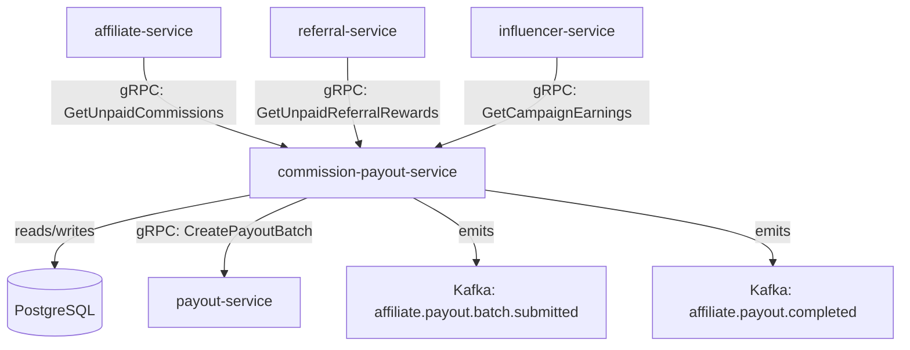

# commission-payout-service

> Automates commission and referral payout processing. Aggregates earned commissions per period, applies tax withholding rules, and submits payout batches to payout-service.

## Overview

The commission-payout-service is the financial settlement engine for ShopOS's affiliate, referral, and influencer programmes. On a configurable schedule (default: monthly), it queries affiliate-service, referral-service, and influencer-service for all unconsolidated earnings in the period, aggregates them per payee, applies configurable tax withholding rules (e.g. IRS 1099 threshold), deducts any chargebacks from returned orders, and submits a payout batch to the financial domain's payout-service for disbursement. All earnings and payout records are stored in PostgreSQL for audit and tax reporting.

## Architecture



## Tech Stack

| Component | Technology |
|---|---|
| Language | Go |
| Database | PostgreSQL |
| Protocol | gRPC |
| Migrations | golang-migrate |
| Build Tool | go build |
| Container | Docker (multi-stage, non-root) |

## Responsibilities

- Aggregate unconsolidated commissions, referral rewards, and influencer earnings per payout period
- Apply minimum payout threshold (hold sub-threshold balances for next period)
- Calculate tax withholding per payee based on annual earnings and jurisdiction rules
- Deduct chargebacks from pending earnings when orders are cancelled/refunded
- Submit payout batch to `payout-service` (financial domain) via gRPC
- Record payout batch state machine: PENDING → SUBMITTED → COMPLETED / FAILED
- Emit `affiliate.payout.batch.submitted` and `affiliate.payout.completed` Kafka events

## API / Interface

```protobuf
service CommissionPayoutService {
  rpc RunPayoutCycle(RunPayoutCycleRequest) returns (PayoutBatch);
  rpc GetPayoutBatch(GetPayoutBatchRequest) returns (PayoutBatch);
  rpc ListPayoutBatches(ListPayoutBatchesRequest) returns (ListPayoutBatchesResponse);
  rpc GetPayeeStatement(GetPayeeStatementRequest) returns (PayeeStatement);
  rpc ApplyChargeback(ChargebackRequest) returns (google.protobuf.Empty);
  rpc GetWithholdingReport(GetWithholdingReportRequest) returns (WithholdingReport);
}
```

## Kafka Topics

| Topic | Direction | Description |
|---|---|---|
| `affiliate.conversion.attributed` | consume | Triggers commission accrual for the attributed affiliate |
| `affiliate.referral.converted` | consume | Triggers referral reward accrual |
| `commerce.order.cancelled` | consume | Triggers chargeback deduction from pending earnings |
| `affiliate.payout.batch.submitted` | publish | Emitted when a payout batch is submitted to payout-service |
| `affiliate.payout.completed` | publish | Emitted when payout-service confirms disbursement |

## Dependencies

Upstream (callers)
- `affiliate-service` — source of affiliate commission earnings
- `referral-service` — source of referral reward earnings
- `influencer-service` — source of campaign earnings

Downstream (calls out to)
- `payout-service` (financial domain) — submits payout batches for disbursement

## Environment Variables

| Variable | Default | Description |
|---|---|---|
| `GRPC_PORT` | `50203` | Port the gRPC server listens on |
| `DATABASE_URL` | — | PostgreSQL connection string (required) |
| `PAYOUT_PERIOD` | `monthly` | Payout cycle: `weekly`, `biweekly`, `monthly` |
| `PAYOUT_DAY_OF_MONTH` | `1` | Day of month to run payout cycle (monthly mode) |
| `MINIMUM_PAYOUT_AMOUNT` | `10.00` | Minimum balance required to trigger payout |
| `CURRENCY` | `USD` | Default payout currency |
| `TAX_WITHHOLDING_PERCENT` | `0.0` | Withholding rate (0 = no withholding) |
| `TAX_THRESHOLD_ANNUAL` | `600.00` | Annual earnings above which withholding applies |
| `KAFKA_BROKERS` | `localhost:9092` | Comma-separated Kafka broker list |
| `LOG_LEVEL` | `info` | Logging level |

## Running Locally

```bash
docker-compose up commission-payout-service
```

## Health Check

`GET /healthz` → `{"status":"ok"}`

gRPC health: `grpc.health.v1.Health/Check` → `SERVING`
