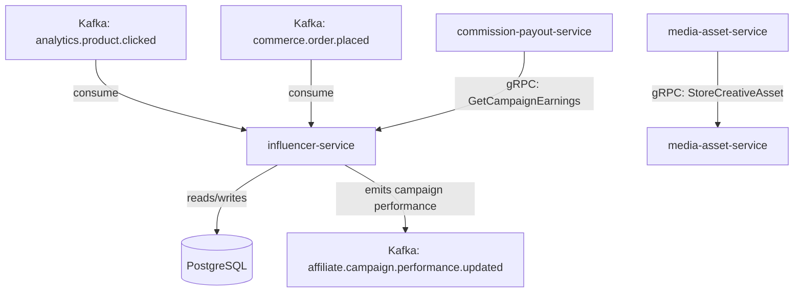

# influencer-service

> Manages influencer marketing campaigns — tracks UTM-tagged links, measures reach and conversion, stores campaign creative assets, and calculates performance-based compensation.

## Overview

The influencer-service is the campaign management backbone for ShopOS's influencer marketing programme. It models influencer profiles, campaigns, and creative briefs. Each influencer is assigned UTM-tagged tracking links per campaign so that click, add-to-cart, and order events from the analytics pipeline can be attributed accurately. Performance metrics (reach, click-through rate, conversion rate, revenue attributed) are aggregated and stored as campaign snapshots, which feed the performance-based compensation calculation submitted to commission-payout-service.

## Architecture



## Tech Stack

| Component | Technology |
|---|---|
| Language | Go |
| Database | PostgreSQL |
| Protocol | gRPC |
| Migrations | golang-migrate |
| Build Tool | go build |
| Container | Docker (multi-stage, non-root) |

## Responsibilities

- Influencer profile CRUD (name, social handles, niche, tier, contact info)
- Campaign management: brief, timeline, deliverables, assigned influencers
- UTM-tagged tracking link generation per influencer per campaign
- Attribution of analytics events (`product.clicked`, `order.placed`) to influencer/campaign
- Aggregation of campaign KPIs: impressions, clicks, CTR, conversions, revenue, ROAS
- Performance-based compensation calculation (CPM, CPC, CPA, hybrid models)
- Campaign creative asset reference storage (delegating binary storage to media-asset-service)

## API / Interface

```protobuf
service InfluencerService {
  rpc RegisterInfluencer(RegisterInfluencerRequest) returns (Influencer);
  rpc GetInfluencer(GetInfluencerRequest) returns (Influencer);
  rpc CreateCampaign(CreateCampaignRequest) returns (Campaign);
  rpc GetCampaign(GetCampaignRequest) returns (Campaign);
  rpc AssignInfluencerToCampaign(AssignRequest) returns (CampaignAssignment);
  rpc GenerateCampaignLink(GenerateLinkRequest) returns (CampaignLink);
  rpc RecordImpression(ImpressionRequest) returns (google.protobuf.Empty);
  rpc GetCampaignStats(GetCampaignStatsRequest) returns (CampaignStats);
  rpc GetCampaignEarnings(GetCampaignEarningsRequest) returns (CampaignEarnings);
}
```

## Kafka Topics

| Topic | Direction | Description |
|---|---|---|
| `analytics.product.clicked` | consume | Tracks click events attributed to influencer links |
| `commerce.order.placed` | consume | Tracks conversion events for campaign attribution |
| `affiliate.campaign.performance.updated` | publish | Emitted when campaign KPIs are recalculated |

## Dependencies

Upstream (callers)
- `commission-payout-service` — queries campaign earnings for payout processing
- Analytics pipeline — feeds click and conversion events via Kafka

Downstream (calls out to)
- `media-asset-service` — stores campaign creative asset references

## Environment Variables

| Variable | Default | Description |
|---|---|---|
| `GRPC_PORT` | `50202` | Port the gRPC server listens on |
| `DATABASE_URL` | — | PostgreSQL connection string (required) |
| `UTM_DEFAULT_SOURCE` | `influencer` | Default UTM source for campaign links |
| `UTM_DEFAULT_MEDIUM` | `social` | Default UTM medium for campaign links |
| `ATTRIBUTION_WINDOW_DAYS` | `7` | Days after click within which a conversion is attributed |
| `KAFKA_BROKERS` | `localhost:9092` | Comma-separated Kafka broker list |
| `LOG_LEVEL` | `info` | Logging level |

## Running Locally

```bash
docker-compose up influencer-service
```

## Health Check

`GET /healthz` → `{"status":"ok"}`

gRPC health: `grpc.health.v1.Health/Check` → `SERVING`
