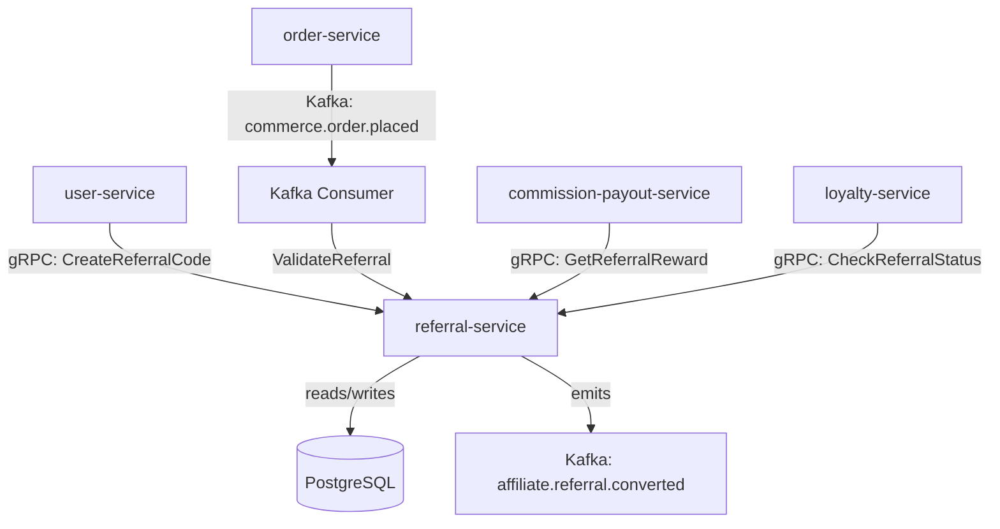

# referral-service

> Customer referral programme — generates unique referral codes, tracks referral conversions, and triggers reward payouts when a referred customer completes their first order.

## Overview

The referral-service powers the customer-to-customer referral programme in ShopOS. Existing customers receive a unique referral code (and shareable link) which they can share with friends. When a new customer signs up via a referral link and completes their first order, the referral-service records the conversion, grants the new customer a welcome discount, and emits a reward event so the commission-payout-service can credit the referrer. All referral state is stored in PostgreSQL with full audit history.

## Architecture



## Tech Stack

| Component | Technology |
|---|---|
| Language | Go |
| Database | PostgreSQL |
| Protocol | gRPC |
| Migrations | golang-migrate |
| Build Tool | go build |
| Container | Docker (multi-stage, non-root) |

## Responsibilities

- Generate cryptographically unique referral codes per customer
- Create shareable referral links with UTM parameters
- Track referral link clicks (new visitor attribution)
- Record new customer sign-ups via referral link
- Detect first-order conversion for a referred customer
- Emit `affiliate.referral.converted` to trigger referrer reward and referee discount
- Enforce referral expiry windows and anti-fraud deduplication rules

## API / Interface

```protobuf
service ReferralService {
  rpc CreateReferralCode(CreateReferralCodeRequest) returns (ReferralCode);
  rpc GetReferralCode(GetReferralCodeRequest) returns (ReferralCode);
  rpc ValidateReferral(ValidateReferralRequest) returns (ReferralValidation);
  rpc RecordReferralSignup(RecordSignupRequest) returns (google.protobuf.Empty);
  rpc RecordFirstOrderConversion(ConversionRequest) returns (ConversionResult);
  rpc GetReferralStats(GetReferralStatsRequest) returns (ReferralStats);
  rpc GetReferralReward(GetReferralRewardRequest) returns (ReferralReward);
}
```

## Kafka Topics

| Topic | Direction | Description |
|---|---|---|
| `commerce.order.placed` | consume | Triggers first-order conversion check |
| `affiliate.referral.converted` | publish | Emitted when a referral successfully converts |

## Dependencies

Upstream (callers)
- `user-service` — requests referral code generation on customer signup
- `order-service` — signals first order placement for conversion tracking
- `commission-payout-service` — queries reward value for payout batch

Downstream (calls out to)
- None (authoritative source for referral data)

## Environment Variables

| Variable | Default | Description |
|---|---|---|
| `GRPC_PORT` | `50201` | Port the gRPC server listens on |
| `DATABASE_URL` | — | PostgreSQL connection string (required) |
| `REFERRAL_CODE_LENGTH` | `8` | Length of generated referral codes |
| `REFERRAL_LINK_BASE_URL` | — | Base URL for shareable referral links |
| `REFERRAL_EXPIRY_DAYS` | `90` | Days before a referral code expires |
| `REFERRER_REWARD_CREDIT` | `10.00` | Store credit awarded to referrer on conversion |
| `REFEREE_DISCOUNT_PERCENT` | `15.0` | Welcome discount granted to referred customer |
| `KAFKA_BROKERS` | `localhost:9092` | Comma-separated Kafka broker list |
| `LOG_LEVEL` | `info` | Logging level |

## Running Locally

```bash
docker-compose up referral-service
```

## Health Check

`GET /healthz` → `{"status":"ok"}`

gRPC health: `grpc.health.v1.Health/Check` → `SERVING`
