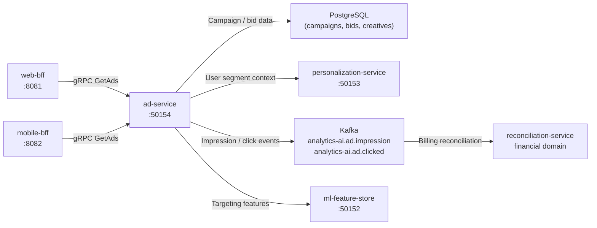

# ad-service

> Ad placement, audience targeting, and impression/click tracking for onsite advertising.

## Overview

The ad-service powers the ShopOS onsite advertising platform, enabling sellers and brands to promote their products through sponsored placements on search results, category pages, and the homepage. It handles ad creative storage, audience targeting rule evaluation, real-time auction logic for slot allocation, and impression/click event tracking for billing and campaign reporting. PostgreSQL stores campaign and bid data; gRPC serves low-latency placement decisions to BFF layers.

## Architecture



## Tech Stack

| Component | Technology |
|---|---|
| Language | Java 21 / Spring Boot 3 |
| Database | PostgreSQL |
| DB Migrations | Flyway |
| Protocol | gRPC (port 50154) |
| Message Broker | Apache Kafka |
| Container Base | eclipse-temurin:21-jre-alpine |

## Responsibilities

- Store and manage ad campaigns, ad groups, creatives, and bid configurations
- Evaluate targeting rules (keyword match, category affinity, audience segment, geographic) for each ad request
- Run a second-price auction to select winning ads for available placement slots
- Serve ranked ad responses to BFFs with creative metadata and tracking tokens
- Record impression and click events to Kafka for billing and campaign analytics
- Enforce daily and lifetime budget caps per campaign
- Provide campaign performance reporting (impressions, clicks, CTR, spend) via gRPC
- Support seller self-service campaign management operations

## API / Interface

```protobuf
service AdService {
  rpc GetAds(GetAdsRequest) returns (GetAdsResponse);
  rpc RecordImpression(RecordImpressionRequest) returns (RecordImpressionResponse);
  rpc RecordClick(RecordClickRequest) returns (RecordClickResponse);
  rpc CreateCampaign(CreateCampaignRequest) returns (Campaign);
  rpc UpdateCampaign(UpdateCampaignRequest) returns (Campaign);
  rpc PauseCampaign(PauseCampaignRequest) returns (Campaign);
  rpc GetCampaignPerformance(GetPerformanceRequest) returns (CampaignPerformance);
  rpc ListCampaigns(ListCampaignsRequest) returns (ListCampaignsResponse);
}
```

## Kafka Topics

| Topic | Role |
|---|---|
| `analytics-ai.ad.impression` | Produced — ad impression event with campaign, slot, user context |
| `analytics-ai.ad.clicked` | Produced — ad click event for billing and CTR tracking |

## Dependencies

**Upstream:** web-bff, mobile-bff (ad slot requests), marketplace-seller-service (campaign management)

**Downstream:** personalization-service (user segment context), ml-feature-store (targeting features), reconciliation-service (spend billing via Kafka)

## Environment Variables

| Variable | Default | Description |
|---|---|---|
| `GRPC_PORT` | `50154` | gRPC server port |
| `SPRING_DATASOURCE_URL` | — | PostgreSQL JDBC URL |
| `SPRING_DATASOURCE_USERNAME` | — | PostgreSQL username |
| `SPRING_DATASOURCE_PASSWORD` | — | PostgreSQL password |
| `KAFKA_BROKERS` | `kafka:9092` | Kafka broker addresses |
| `PERSONALIZATION_SERVICE_ADDR` | `personalization-service:50153` | Personalization service address |
| `ML_FEATURE_STORE_ADDR` | `ml-feature-store:50152` | Feature store address |
| `AUCTION_TIMEOUT_MS` | `20` | Maximum auction evaluation time |
| `DEFAULT_AD_SLOTS` | `4` | Default number of ad slots per request |
| `BUDGET_CHECK_INTERVAL_SECONDS` | `60` | Budget cap enforcement check frequency |

## Running Locally

```bash
docker-compose up ad-service
```

## Health Check

`GET /healthz` → `{"status":"ok"}`
