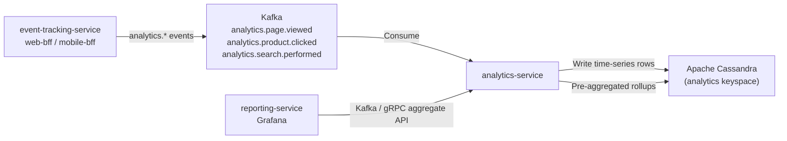

# analytics-service

> Consumes analytics domain events from Kafka, stores time-series data in Cassandra, and exposes aggregate query APIs.

## Overview

The analytics-service is the primary event consumer and aggregation layer for behavioural analytics in ShopOS. It ingests high-volume analytics events from Kafka topics — page views, product clicks, search queries — persists raw and pre-aggregated data into Cassandra's wide-column time-series model, and exposes aggregate read APIs for dashboards, reporting tools, and downstream AI services. It is designed for append-heavy, read-optimised workloads at scale.

## Architecture



## Tech Stack

| Component | Technology |
|---|---|
| Language | Python |
| Message Broker | Apache Kafka |
| Database | Apache Cassandra |
| Kafka Client | confluent-kafka-python |
| Cassandra Driver | cassandra-driver |
| Container Base | python:3.12-slim |

## Responsibilities

- Consume `analytics.page.viewed`, `analytics.product.clicked`, `analytics.search.performed` events
- Persist raw event rows to Cassandra time-series tables partitioned by date and tenant
- Compute rolling pre-aggregations (hourly, daily) for common metrics (page views, CTR, conversion funnel)
- Expose an aggregate query API for metrics such as top products, traffic by source, and funnel drop-off
- Support time-range and dimension-filter queries against Cassandra
- Emit enriched aggregated metrics back to Kafka for downstream consumers (reporting-service)
- Handle backpressure via consumer group lag monitoring

## API / Interface

This service is primarily Kafka-driven. Aggregate queries are served via an internal HTTP API:

| Endpoint | Description |
|---|---|
| `POST /api/v1/query` | Run an aggregate metrics query with filters and time range |
| `GET /api/v1/metrics/top-products` | Top viewed/clicked products in a time window |
| `GET /api/v1/metrics/funnel` | Conversion funnel step analysis |

## Kafka Topics

| Topic | Role |
|---|---|
| `analytics.page.viewed` | Consumed — page view events |
| `analytics.product.clicked` | Consumed — product click events |
| `analytics.search.performed` | Consumed — search query events |
| `analytics.aggregated.hourly` | Produced — hourly rollup metrics for downstream |

## Dependencies

Upstream: event-tracking-service, web-bff, mobile-bff (event producers)

Downstream: reporting-service, personalization-service, recommendation-service (consumers of aggregated data)

## Environment Variables

| Variable | Default | Description |
|---|---|---|
| `KAFKA_BROKERS` | `kafka:9092` | Kafka broker addresses |
| `KAFKA_GROUP_ID` | `analytics-service` | Kafka consumer group ID |
| `CASSANDRA_HOSTS` | `cassandra:9042` | Cassandra contact points |
| `CASSANDRA_KEYSPACE` | `analytics` | Cassandra keyspace |
| `CASSANDRA_REPLICATION_FACTOR` | `3` | Replication factor for keyspace |
| `HTTP_PORT` | `8150` | Internal HTTP API port |
| `ROLLUP_INTERVAL_SECONDS` | `300` | Frequency of pre-aggregation rollup runs |
| `CONSUMER_THREADS` | `4` | Kafka consumer thread pool size |

## Running Locally

```bash
docker-compose up analytics-service
```

## Health Check

`GET /healthz` → `{"status":"ok"}`
