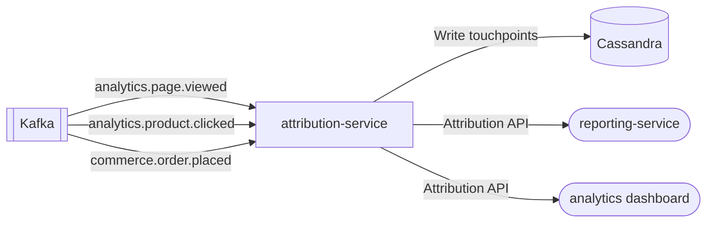

# attribution-service

> Multi-touch marketing attribution for the ShopOS analytics-ai domain.

## Overview

The attribution-service tracks customer journey touchpoints and attributes conversions to marketing channels using four models: first-click, last-click, linear (equal-share), and time-decay (exponential recency weighting). Touchpoint events are consumed from Kafka and stored in Cassandra for replay and reporting.

## Architecture



## Tech Stack

| Component | Technology |
|---|---|
| Language | Python 3.13 |
| Framework | FastAPI + uvicorn |
| Event Storage | Cassandra |
| Messaging | aiokafka (consumer) |
| Containerization | Docker (slim runtime) |

## Attribution Models

| Model | Description |
|---|---|
| `first_click` | 100% credit to first touchpoint |
| `last_click` | 100% credit to last touchpoint |
| `linear` | Equal credit split across all touchpoints |
| `time_decay` | Exponential weighting — recent touchpoints earn more credit |

## API Endpoints

| Endpoint | Method | Description |
|---|---|---|
| `/healthz` | GET | Liveness probe |
| `/attribution/calculate` | POST | Calculate attribution for a conversion |
| `/docs` | GET | Swagger UI |

## Kafka Topics Consumed

| Topic | Description |
|---|---|
| `analytics.page.viewed` | Page view touchpoints |
| `analytics.product.clicked` | Product click touchpoints |
| `commerce.order.placed` | Conversion events |

## Environment Variables

| Variable | Default | Description |
|---|---|---|
| `HTTP_PORT` | `8194` | HTTP port |
| `KAFKA_BROKERS` | `localhost:9092` | Comma-separated Kafka broker list |
| `KAFKA_GROUP_ID` | `attribution-service` | Kafka consumer group |
| `KAFKA_TOPICS` | `analytics.page.viewed,...` | Topics to consume |
| `CASSANDRA_CONTACT_POINTS` | `localhost` | Cassandra contact points |
| `CASSANDRA_KEYSPACE` | `attribution` | Cassandra keyspace |
| `LOG_LEVEL` | `info` | Logging verbosity |

## Running Locally

```bash
docker-compose up attribution-service
```

## Health Check

`GET /healthz` → `{"status":"ok"}`
