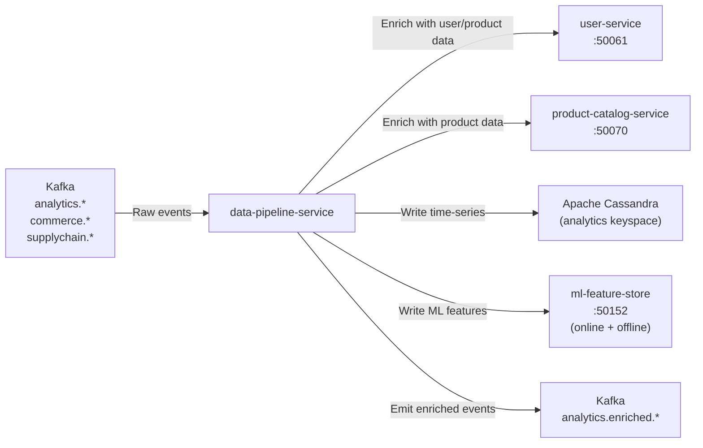

# data-pipeline-service

> ETL pipelines transforming raw Kafka events into enriched and aggregated features stored in Cassandra and the ML feature store.

## Overview

The data-pipeline-service is the backbone of the ShopOS data engineering layer. It runs continuous ETL pipelines that consume raw behavioural and transactional events from Kafka, enrich them with dimensional data from operational services, aggregate them into feature vectors, and write outputs to Cassandra (time-series) and the ml-feature-store (ML features). It is the bridge between the raw event stream and the analytics/AI serving layer.

## Architecture



## Tech Stack

| Component | Technology |
|---|---|
| Language | Python |
| Message Broker | Apache Kafka |
| Time-series Store | Apache Cassandra |
| Feature Store | ml-feature-store (gRPC) |
| Kafka Client | confluent-kafka-python |
| Cassandra Driver | cassandra-driver |
| Container Base | python:3.12-slim |

## Responsibilities

- Consume raw events across analytics, commerce, and supply-chain domains from Kafka
- Validate and deduplicate events using idempotency keys
- Enrich events with dimensional attributes (user segment, product category, price tier) from operational services
- Compute feature engineering transformations (session aggregations, rolling click counts, purchase recency)
- Write enriched time-series rows to Cassandra for analytics-service consumption
- Push computed feature vectors to ml-feature-store (online Redis path + offline Postgres path)
- Emit enriched events back to Kafka for downstream consumers
- Support pipeline replay from a Kafka offset for backfill and recomputation

## API / Interface

This service is primarily Kafka-driven. A minimal internal HTTP API is exposed for operations:

| Endpoint | Description |
|---|---|
| `GET /api/v1/pipelines` | List running pipeline definitions |
| `POST /api/v1/pipelines/{name}/replay` | Trigger a Kafka offset replay for a pipeline |
| `GET /api/v1/lag` | Consumer group lag per topic partition |

## Kafka Topics

| Topic | Role |
|---|---|
| `analytics.page.viewed` | Consumed — raw page view events |
| `analytics.product.clicked` | Consumed — raw product click events |
| `analytics.search.performed` | Consumed — raw search events |
| `commerce.order.placed` | Consumed — purchase events for feature engineering |
| `commerce.cart.abandoned` | Consumed — abandonment signal |
| `analytics.enriched.events` | Produced — enriched, validated event stream |

## Dependencies

**Upstream:** event-tracking-service, commerce domain (raw event producers)

**Downstream:** ml-feature-store, Cassandra (analytics-service), analytics-service, recommendation-service (via feature store)

## Environment Variables

| Variable | Default | Description |
|---|---|---|
| `KAFKA_BROKERS` | `kafka:9092` | Kafka broker addresses |
| `KAFKA_GROUP_ID` | `data-pipeline-service` | Kafka consumer group |
| `CASSANDRA_HOSTS` | `cassandra:9042` | Cassandra contact points |
| `CASSANDRA_KEYSPACE` | `analytics` | Cassandra keyspace |
| `ML_FEATURE_STORE_ADDR` | `ml-feature-store:50152` | Feature store gRPC address |
| `USER_SERVICE_ADDR` | `user-service:50061` | User enrichment service |
| `PRODUCT_CATALOG_ADDR` | `product-catalog-service:50070` | Product enrichment service |
| `HTTP_PORT` | `8157` | Internal HTTP operations API port |
| `CONSUMER_THREADS` | `8` | Kafka consumer thread pool size |
| `ENRICHMENT_TIMEOUT_MS` | `100` | Max time for enrichment lookups |

## Running Locally

```bash
docker-compose up data-pipeline-service
```

## Health Check

`GET /healthz` → `{"status":"ok"}`
