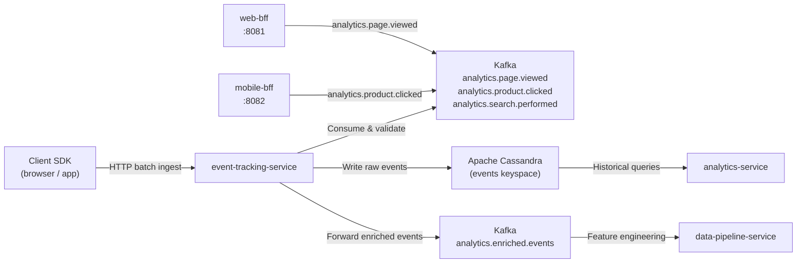

# event-tracking-service

> High-throughput behavioural event ingestion pipeline consuming analytics events and persisting to Cassandra.

## Overview

The event-tracking-service is the entry point for all behavioural telemetry in ShopOS. It ingests high-volume events — page views, product clicks, search queries, and custom tracking calls — from BFF layers and client SDKs, validates and enriches them, and writes them to Cassandra for durable time-series storage. It acts as a multiplexer, also forwarding events to Kafka so downstream services (analytics-service, data-pipeline-service) can consume them independently.

## Architecture



## Tech Stack

| Component | Technology |
|---|---|
| Language | Python |
| Message Broker | Apache Kafka |
| Database | Apache Cassandra |
| Kafka Client | confluent-kafka-python |
| Cassandra Driver | cassandra-driver |
| Container Base | python:3.12-slim |

## Responsibilities

- Accept high-frequency event batches from BFFs and client SDKs via an HTTP ingest endpoint
- Consume `analytics.*` Kafka topics produced by other services
- Validate event schemas and discard or quarantine malformed events
- Enrich events with server-side metadata (server timestamp, IP geolocation, user agent parsing)
- Write validated raw events to Cassandra partitioned by date and event type for efficient time-range reads
- Forward enriched events to Kafka for downstream analytics and ML pipelines
- Provide idempotent event ingestion using event IDs to prevent duplicate writes
- Support replay of quarantined events after schema fixes

## API / Interface

This service is primarily Kafka-driven. An HTTP ingest endpoint is also provided for client-side SDK use:

| Endpoint | Description |
|---|---|
| `POST /v1/events` | Batch event ingestion from client SDK (JSON array) |
| `GET /v1/status` | Ingestion throughput and consumer lag stats |

## Kafka Topics

| Topic | Role |
|---|---|
| `analytics.page.viewed` | Consumed — page view events from BFFs |
| `analytics.product.clicked` | Consumed — product click events |
| `analytics.search.performed` | Consumed — search query events |
| `analytics.enriched.events` | Produced — validated and enriched event stream |

## Dependencies

Upstream: web-bff, mobile-bff, client SDKs (event producers)

Downstream: analytics-service (Cassandra reads), data-pipeline-service (enriched Kafka consumer), personalization-service (behaviour signals)

## Environment Variables

| Variable | Default | Description |
|---|---|---|
| `HTTP_PORT` | `8158` | HTTP ingest endpoint port |
| `KAFKA_BROKERS` | `kafka:9092` | Kafka broker addresses |
| `KAFKA_GROUP_ID` | `event-tracking-service` | Kafka consumer group |
| `CASSANDRA_HOSTS` | `cassandra:9042` | Cassandra contact points |
| `CASSANDRA_KEYSPACE` | `events` | Cassandra keyspace for raw events |
| `CASSANDRA_REPLICATION_FACTOR` | `3` | Replication factor |
| `BATCH_FLUSH_SIZE` | `500` | Number of events per Cassandra batch write |
| `BATCH_FLUSH_INTERVAL_MS` | `1000` | Maximum flush interval in milliseconds |
| `CONSUMER_THREADS` | `8` | Kafka consumer thread count |
| `QUARANTINE_TOPIC` | `analytics.events.quarantine` | Kafka topic for malformed events |
| `MAX_BATCH_SIZE` | `1000` | Maximum events per HTTP ingest request |

## Running Locally

```bash
docker-compose up event-tracking-service
```

## Health Check

`GET /healthz` → `{"status":"ok"}`
