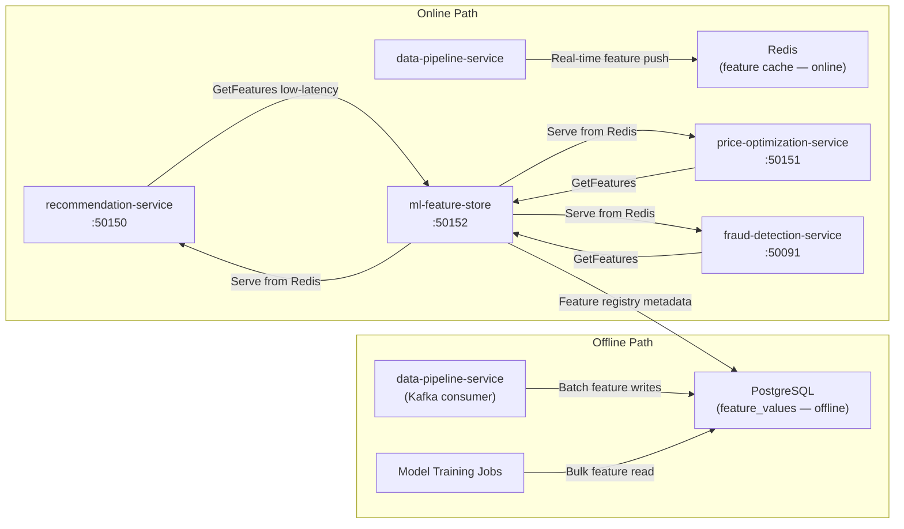

# ml-feature-store

> Centralised ML feature registry with online (low-latency) and offline (batch) feature serving.

## Overview

The ml-feature-store is the single source of truth for all machine learning features across the ShopOS AI layer. It maintains a registry of named feature definitions and serves pre-computed feature values both online (sub-millisecond, Redis-backed) for real-time inference and offline (batch, Postgres-backed) for model training pipelines. All ML services — recommendation, price optimisation, fraud detection, personalisation — retrieve features through this service rather than computing them independently.

## Architecture



## Tech Stack

| Component | Technology |
|---|---|
| Language | Python |
| Online Store | Redis |
| Offline Store | PostgreSQL |
| Protocol | gRPC (port 50152) |
| Container Base | python:3.12-slim |

## Responsibilities

- Maintain a versioned registry of feature definitions (name, type, description, owner service)
- Serve online features from Redis with sub-millisecond P99 latency
- Serve offline feature snapshots from PostgreSQL for training dataset construction
- Accept feature write calls from data-pipeline-service and other producers
- Support point-in-time correct feature retrieval for reproducible training
- Enforce feature access scopes — services only read features they are registered to consume
- Track feature freshness and expose staleness metrics
- Support feature backfill jobs for new feature definitions

## API / Interface

```protobuf
service MLFeatureStore {
  rpc GetOnlineFeatures(GetOnlineFeaturesRequest) returns (FeatureVector);
  rpc GetOfflineFeatures(GetOfflineFeaturesRequest) returns (stream FeatureRow);
  rpc WriteFeatures(WriteFeaturesRequest) returns (WriteFeaturesResponse);
  rpc RegisterFeature(RegisterFeatureRequest) returns (FeatureDefinition);
  rpc GetFeatureDefinition(GetFeatureDefinitionRequest) returns (FeatureDefinition);
  rpc ListFeatureDefinitions(ListFeaturesRequest) returns (ListFeaturesResponse);
  rpc GetFeatureFreshness(GetFreshnessRequest) returns (FreshnessResponse);
}
```

## Kafka Topics

| Topic | Role |
|---|---|
| `analytics-ai.features.updated` | Produced — emitted when a feature group is refreshed |

## Dependencies

**Upstream:** data-pipeline-service (feature writes), event-tracking-service (raw signals)

**Downstream:** recommendation-service, price-optimization-service, fraud-detection-service, personalization-service (feature consumers)

## Environment Variables

| Variable | Default | Description |
|---|---|---|
| `GRPC_PORT` | `50152` | gRPC server port |
| `REDIS_URL` | `redis://redis:6379` | Redis connection URL for online store |
| `REDIS_FEATURE_TTL_SECONDS` | `3600` | Default online feature TTL |
| `POSTGRES_DSN` | — | PostgreSQL connection string |
| `KAFKA_BROKERS` | `kafka:9092` | Kafka broker addresses |
| `ONLINE_READ_TIMEOUT_MS` | `10` | Max latency for online feature reads |
| `FEATURE_STALENESS_THRESHOLD_MINUTES` | `30` | Alert threshold for stale features |

## Running Locally

```bash
docker-compose up ml-feature-store
```

## Health Check

`GET /healthz` → `{"status":"ok"}`
