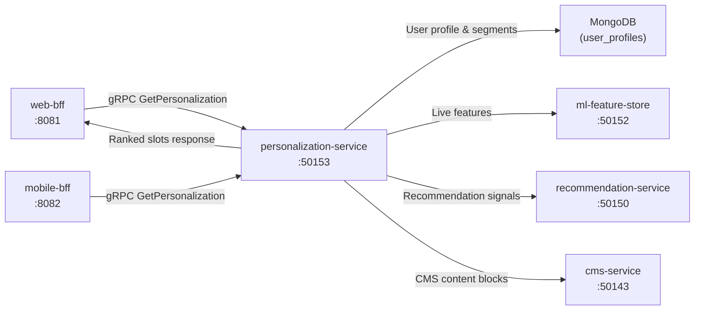

# personalization-service

> Personalised homepage layouts, search ranking boosts, and content selection tailored per user.

## Overview

The personalization-service assembles personalised experiences for individual users across the ShopOS storefront. Drawing on user behavioural history, preference signals, and segment memberships stored in MongoDB and the ml-feature-store, it returns ranked content slots, personalised category orderings, and search ranking adjustments. BFF services call this service before rendering a page to inject personalised components without embedding personalisation logic in each consumer.

## Architecture



## Tech Stack

| Component | Technology |
|---|---|
| Language | Python |
| Database | MongoDB |
| Feature Store | ml-feature-store (gRPC) |
| Protocol | gRPC (port 50153) |
| Container Base | python:3.12-slim |

## Responsibilities

- Build and maintain per-user interest profiles and segment memberships in MongoDB
- Return ranked homepage content slot configurations (hero, category tiles, product carousels)
| - Provide search ranking boost vectors for the search-service based on user preferences
- Coordinate with recommendation-service for product carousel populations
- Coordinate with cms-service for variant content block selection per segment
- Consume order and click events to keep user profiles fresh
- Apply business rules (e.g., do not promote out-of-stock, respect consent flags from consent-management-service)
- Support cold-start for new/anonymous users via segment-level defaults

## API / Interface

```protobuf
service PersonalizationService {
  rpc GetHomepagePersonalization(GetHomepageRequest) returns (PersonalizationResponse);
  rpc GetSearchRankingBoosts(GetSearchBoostRequest) returns (SearchBoostResponse);
  rpc GetContentSlots(GetContentSlotsRequest) returns (ContentSlotsResponse);
  rpc UpdateUserProfile(UpdateUserProfileRequest) returns (UserProfile);
  rpc GetUserProfile(GetUserProfileRequest) returns (UserProfile);
}
```

## Kafka Topics

| Topic | Role |
|---|---|
| `analytics.product.clicked` | Consumed — updates user interest signals |
| `commerce.order.placed` | Consumed — updates purchase history profile |
| `analytics.page.viewed` | Consumed — updates browsing affinity signals |

## Dependencies

Upstream: web-bff, mobile-bff (real-time callers), event-tracking-service (profile update events)

Downstream: ml-feature-store (feature reads), recommendation-service, cms-service, search-service

## Environment Variables

| Variable | Default | Description |
|---|---|---|
| `GRPC_PORT` | `50153` | gRPC server port |
| `MONGODB_URI` | — | MongoDB connection string |
| `MONGODB_DB` | `personalization` | MongoDB database name |
| `ML_FEATURE_STORE_ADDR` | `ml-feature-store:50152` | Feature store address |
| `RECOMMENDATION_SERVICE_ADDR` | `recommendation-service:50150` | Recommendation service address |
| `CMS_SERVICE_ADDR` | `cms-service:50143` | CMS service address |
| `KAFKA_BROKERS` | `kafka:9092` | Kafka broker addresses |
| `KAFKA_GROUP_ID` | `personalization-service` | Kafka consumer group |
| `PROFILE_TTL_DAYS` | `90` | Days before an inactive user profile is archived |
| `ANONYMOUS_SEGMENT` | `default` | Segment used for unauthenticated users |

## Running Locally

```bash
docker-compose up personalization-service
```

## Health Check

`GET /healthz` → `{"status":"ok"}`
