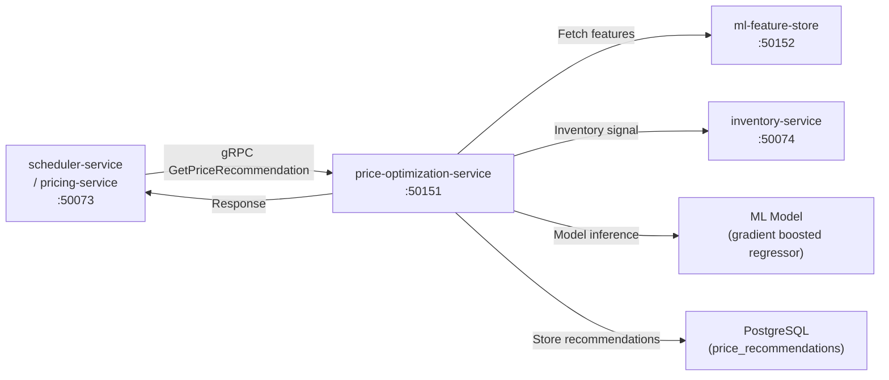

# price-optimization-service

> Dynamic pricing recommendations using ML models trained on demand signals, competitor data, and inventory levels.

## Overview

The price-optimization-service generates data-driven pricing recommendations for products across the ShopOS catalog. It consumes demand signals, inventory status, and competitive pricing inputs, runs trained ML models, and exposes recommended price points and discount floor/ceiling boundaries via gRPC. The pricing-service consults this service when computing real-time prices for high-value SKUs or during promotional planning.

## Architecture



## Tech Stack

| Component | Technology |
|---|---|
| Language | Python |
| ML Framework | scikit-learn, XGBoost, MLflow (model registry) |
| Database | PostgreSQL |
| Feature Store | ml-feature-store (gRPC) |
| Protocol | gRPC (port 50151) |
| Container Base | python:3.12-slim |

## Responsibilities

- Generate price recommendations for individual SKUs or bulk product sets
- Factor in demand elasticity, inventory levels, seasonality, competitor pricing, and margin floors
- Support multiple pricing strategies: revenue maximisation, margin optimisation, clearance/markdown
- Store recommendation history with model version metadata for auditability
- Trigger automatic re-recommendations when inventory drops below reorder threshold
- Expose confidence intervals alongside point estimates so human reviewers can assess risk
- Log model inputs and outputs to PostgreSQL for future retraining datasets

## API / Interface

```protobuf
service PriceOptimizationService {
  rpc GetPriceRecommendation(GetPriceRecommendationRequest) returns (PriceRecommendation);
  rpc BatchGetPriceRecommendations(BatchRequest) returns (BatchPriceRecommendationsResponse);
  rpc GetRecommendationHistory(GetHistoryRequest) returns (RecommendationHistoryResponse);
  rpc GetModelInfo(Empty) returns (ModelInfoResponse);
}
```

## Kafka Topics

| Topic | Role |
|---|---|
| `analytics-ai.price.recommendation.generated` | Produced — emitted when a new recommendation batch is computed |
| `supplychain.inventory.low` | Consumed — triggers clearance pricing recommendations |

## Dependencies

Upstream: pricing-service, scheduler-service (triggers), inventory-service (stock signals)

Downstream: pricing-service (consumes recommendations), ml-feature-store (feature retrieval)

## Environment Variables

| Variable | Default | Description |
|---|---|---|
| `GRPC_PORT` | `50151` | gRPC server port |
| `POSTGRES_DSN` | — | PostgreSQL connection string |
| `ML_FEATURE_STORE_ADDR` | `ml-feature-store:50152` | Feature store address |
| `INVENTORY_SERVICE_ADDR` | `inventory-service:50074` | Inventory service address |
| `KAFKA_BROKERS` | `kafka:9092` | Kafka broker addresses |
| `MINIO_ENDPOINT` | `minio:9000` | MinIO for model artefact storage |
| `MINIO_ACCESS_KEY` | — | MinIO access key |
| `MINIO_SECRET_KEY` | — | MinIO secret key |
| `MINIO_MODEL_BUCKET` | `ml-models` | Bucket for trained models |
| `DEFAULT_STRATEGY` | `margin_optimisation` | Default pricing strategy |
| `MIN_MARGIN_PCT` | `0.10` | Absolute minimum margin floor |

## Running Locally

```bash
docker-compose up price-optimization-service
```

## Health Check

`GET /healthz` → `{"status":"ok"}`
