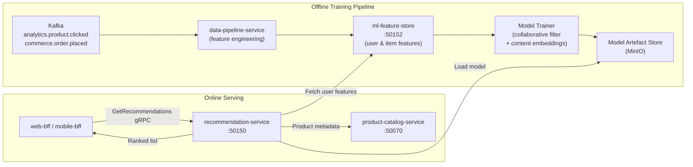

# recommendation-service

> Collaborative filtering and content-based product recommendations served via gRPC.

## Overview

The recommendation-service delivers personalised product recommendations throughout the ShopOS storefront — "You may also like", "Frequently bought together", and "Trending in your category" widgets. It combines collaborative filtering (user-item interaction signals) with content-based similarity (product attributes and embeddings) to generate ranked recommendation lists. Models are trained offline and served online through a low-latency gRPC API backed by a feature store.

## Architecture



## Tech Stack

| Component | Technology |
|---|---|
| Language | Python |
| ML Frameworks | scikit-learn, implicit (ALS), sentence-transformers |
| Feature Store | ml-feature-store (gRPC) |
| Model Storage | MinIO |
| Protocol | gRPC (port 50150) |
| Container Base | python:3.12-slim |

## Responsibilities

- Serve ranked product recommendation lists for a given user and context (homepage, PDP, cart)
- Support multiple recommendation strategies: collaborative filtering, content similarity, trending, cold-start
- Fetch live user and item features from ml-feature-store at inference time
- Apply business rules as post-ranking filters (exclude out-of-stock, exclude already-purchased)
- Log recommendation impressions and clicks for model feedback loops
- Support A/B test variant model serving via ab-testing-service context headers
- Expose batch recommendation endpoint for email campaigns

## API / Interface

```protobuf
service RecommendationService {
  rpc GetRecommendations(GetRecommendationsRequest) returns (RecommendationsResponse);
  rpc GetSimilarProducts(GetSimilarProductsRequest) returns (RecommendationsResponse);
  rpc GetFrequentlyBoughtTogether(FBTRequest) returns (RecommendationsResponse);
  rpc GetTrending(GetTrendingRequest) returns (RecommendationsResponse);
  rpc BatchGetRecommendations(BatchGetRecommendationsRequest) returns (BatchRecommendationsResponse);
}
```

## Kafka Topics

| Topic | Role |
|---|---|
| `analytics.product.clicked` | Consumed (via data-pipeline) — click signal for model training |
| `commerce.order.placed` | Consumed (via data-pipeline) — purchase signal for collaborative filter |

## Dependencies

Upstream: ml-feature-store (features), data-pipeline-service (training signals), product-catalog-service (item metadata)

Downstream: web-bff, mobile-bff, notification-orchestrator (email campaign batch recommendations)

## Environment Variables

| Variable | Default | Description |
|---|---|---|
| `GRPC_PORT` | `50150` | gRPC server port |
| `ML_FEATURE_STORE_ADDR` | `ml-feature-store:50152` | Feature store address |
| `PRODUCT_CATALOG_ADDR` | `product-catalog-service:50070` | Product catalog address |
| `MINIO_ENDPOINT` | `minio:9000` | MinIO for model artefact storage |
| `MINIO_ACCESS_KEY` | — | MinIO access key |
| `MINIO_SECRET_KEY` | — | MinIO secret key |
| `MINIO_MODEL_BUCKET` | `ml-models` | Bucket for trained model artefacts |
| `DEFAULT_RECOMMENDATION_COUNT` | `20` | Default number of recommendations returned |
| `MODEL_REFRESH_INTERVAL_HOURS` | `6` | How often to reload model artefacts from MinIO |
| `COLD_START_STRATEGY` | `trending` | Strategy for users with no interaction history |

## Running Locally

```bash
docker-compose up recommendation-service
```

## Health Check

`GET /healthz` → `{"status":"ok"}`
