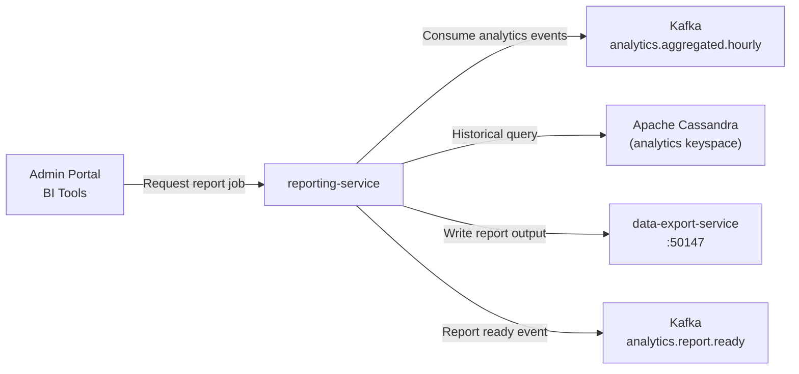

# reporting-service

> Complex report generation using Spark-style aggregations over Cassandra for business intelligence.

## Overview

The reporting-service powers the business intelligence layer of ShopOS, executing complex multi-dimensional aggregations over historical event data stored in Cassandra. Built with Scala, it leverages Spark-compatible computation patterns for large-scale report generation, including revenue summaries, cohort analyses, geographic breakdowns, and merchandising performance reports. Reports are generated asynchronously and delivered via file export or streaming result sets.

## Architecture



## Tech Stack

| Component | Technology |
|---|---|
| Language | Scala |
| Build Tool | sbt |
| Database | Apache Cassandra |
| Message Broker | Apache Kafka |
| Cassandra Driver | DataStax Java Driver (Scala wrapper) |
| Kafka Client | Apache Kafka Scala client |
| Container Base | eclipse-temurin:21-jre-alpine |

## Responsibilities

- Generate scheduled and on-demand business reports (daily revenue, GMV, cohort retention, seller performance)
- Execute large aggregation queries over Cassandra analytics tables with configurable parallelism
- Support multi-dimensional slicing: by date range, SKU, category, geography, marketing channel
- Stream report results back to callers for large datasets to avoid memory exhaustion
- Coordinate with data-export-service to store completed reports as downloadable CSV/Parquet files
- Consume `analytics.aggregated.hourly` events from Kafka for near-real-time report refreshes
- Provide report scheduling (daily, weekly, monthly, custom cron)

## API / Interface

```scala
// Primary gRPC service definition (Scala/ScalaPB)
service ReportingService {
  rpc CreateReportJob(CreateReportJobRequest) returns (ReportJob);
  rpc GetReportJobStatus(GetReportJobRequest) returns (ReportJob);
  rpc StreamReportResults(StreamReportRequest) returns (stream ReportRow);
  rpc ListAvailableReports(Empty) returns (AvailableReportsResponse);
  rpc ScheduleReport(ScheduleReportRequest) returns (ScheduledReport);
}
```

## Kafka Topics

| Topic | Role |
|---|---|
| `analytics.aggregated.hourly` | Consumed — hourly rollup metrics from analytics-service |
| `analytics.report.ready` | Produced — emitted when a report job completes |

## Dependencies

Upstream: analytics-service (aggregated event data), Cassandra (historical data)

Downstream: data-export-service (file delivery), admin-portal, BI dashboards

## Environment Variables

| Variable | Default | Description |
|---|---|---|
| `GRPC_PORT` | `8155` | gRPC server port |
| `KAFKA_BROKERS` | `kafka:9092` | Kafka broker addresses |
| `KAFKA_GROUP_ID` | `reporting-service` | Kafka consumer group |
| `CASSANDRA_HOSTS` | `cassandra:9042` | Cassandra contact points |
| `CASSANDRA_KEYSPACE` | `analytics` | Cassandra keyspace |
| `DATA_EXPORT_SERVICE_ADDR` | `data-export-service:50147` | Export service address |
| `MAX_QUERY_TIMEOUT_SECONDS` | `300` | Maximum single query execution time |
| `REPORT_CONCURRENCY` | `5` | Concurrent report job limit |

## Running Locally

```bash
docker-compose up reporting-service
```

## Health Check

`GET /healthz` → `{"status":"ok"}`
