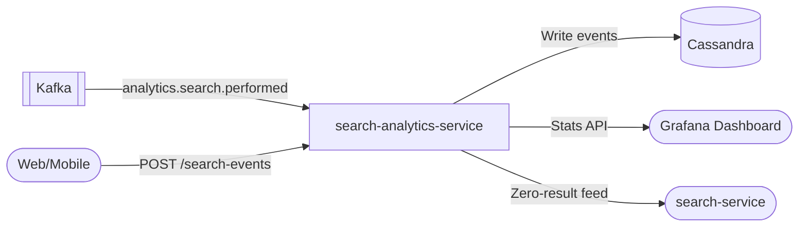

# search-analytics-service

> Search quality analytics for the ShopOS analytics-ai domain.

## Overview

The search-analytics-service tracks search terms, zero-result searches, click-through rates, and search-to-purchase conversion. It consumes `analytics.search.performed` Kafka events and stores them in Cassandra. Aggregated metrics power search quality dashboards and inform auto-complete tuning and synonym configuration.

## Architecture



## Tech Stack

| Component | Technology |
|---|---|
| Language | Python 3.13 |
| Framework | FastAPI + uvicorn |
| Event Storage | Cassandra |
| Messaging | aiokafka (consumer) |
| Containerization | Docker (slim runtime) |

## Metrics Tracked

- Total searches over time window
- Zero-result search rate and top zero-result queries
- Click-through rate (CTR) per query
- Search-to-purchase conversion rate
- Top 20 search queries by volume

## API Endpoints

| Endpoint | Method | Description |
|---|---|---|
| `/healthz` | GET | Liveness probe |
| `/search-events` | POST | Ingest a search event |
| `/search-analytics/stats` | GET | Aggregate search quality metrics |
| `/search-analytics/zero-results` | GET | Top zero-result queries |
| `/docs` | GET | Swagger UI |

## Kafka Topics Consumed

| Topic | Description |
|---|---|
| `analytics.search.performed` | Search execution events from search-service |

## Environment Variables

| Variable | Default | Description |
|---|---|---|
| `HTTP_PORT` | `8196` | HTTP port |
| `KAFKA_BROKERS` | `localhost:9092` | Comma-separated Kafka broker list |
| `KAFKA_GROUP_ID` | `search-analytics-service` | Kafka consumer group |
| `KAFKA_TOPICS` | `analytics.search.performed` | Topics to consume |
| `CASSANDRA_CONTACT_POINTS` | `localhost` | Cassandra contact points |
| `CASSANDRA_KEYSPACE` | `search_analytics` | Cassandra keyspace |
| `LOG_LEVEL` | `info` | Logging verbosity |

## Running Locally

```bash
docker-compose up search-analytics-service
```

## Health Check

`GET /healthz` → `{"status":"ok"}`
