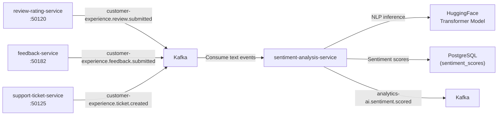

# sentiment-analysis-service

> NLP-powered sentiment scoring on customer reviews and feedback events consumed from Kafka.

## Overview

The sentiment-analysis-service processes customer-generated text — product reviews, support ticket messages, and survey responses — to produce sentiment scores and emotional category labels. It consumes relevant events from Kafka, runs inference using a pre-trained transformer model, persists results to PostgreSQL, and emits scored events so downstream services (review-rating-service, analytics-service) can react to sentiment signals without embedding NLP logic themselves.

## Architecture



## Tech Stack

| Component | Technology |
|---|---|
| Language | Python |
| NLP Framework | HuggingFace Transformers, PyTorch |
| Database | PostgreSQL |
| Message Broker | Apache Kafka |
| Kafka Client | confluent-kafka-python |
| Container Base | python:3.12-slim |

## Responsibilities

- Consume review, feedback, and support ticket text events from Kafka
- Run sentiment classification (positive, neutral, negative) using a pre-trained transformer
- Produce fine-grained scores: sentiment polarity (−1.0 to +1.0) and emotion labels (joy, frustration, etc.)
- Persist scores and raw text embeddings to PostgreSQL for downstream querying
- Emit `analytics-ai.sentiment.scored` events so dashboards and reporting tools can react
- Support batch reprocessing of historical records when the model is updated
- Expose a synchronous gRPC endpoint for real-time sentiment scoring of arbitrary text

## API / Interface

```protobuf
service SentimentAnalysisService {
  rpc ScoreText(ScoreTextRequest) returns (SentimentScore);
  rpc BatchScoreText(BatchScoreTextRequest) returns (BatchSentimentScoreResponse);
  rpc GetSentimentSummary(GetSentimentSummaryRequest) returns (SentimentSummary);
}
```

## Kafka Topics

| Topic | Role |
|---|---|
| `customer-experience.review.submitted` | Consumed — new product review text |
| `customer-experience.feedback.submitted` | Consumed — customer feedback text |
| `customer-experience.ticket.created` | Consumed — new support ticket description |
| `analytics-ai.sentiment.scored` | Produced — sentiment score result for each processed item |

## Dependencies

Upstream: review-rating-service, feedback-service, support-ticket-service (event producers)

Downstream: analytics-service, reporting-service, admin dashboards (sentiment trend consumers)

## Environment Variables

| Variable | Default | Description |
|---|---|---|
| `GRPC_PORT` | `8156` | gRPC server port (internal) |
| `KAFKA_BROKERS` | `kafka:9092` | Kafka broker addresses |
| `KAFKA_GROUP_ID` | `sentiment-analysis-service` | Kafka consumer group |
| `POSTGRES_DSN` | — | PostgreSQL connection string |
| `MODEL_NAME` | `cardiffnlp/twitter-roberta-base-sentiment` | HuggingFace model identifier |
| `MODEL_CACHE_DIR` | `/models` | Local model cache directory |
| `BATCH_SIZE` | `32` | Inference batch size |
| `CONSUMER_THREADS` | `2` | Kafka consumer thread count |

## Running Locally

```bash
docker-compose up sentiment-analysis-service
```

## Health Check

`GET /healthz` → `{"status":"ok"}`
