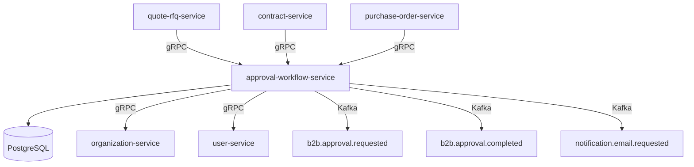

# approval-workflow-service

> Orchestrates multi-step approval chains for purchase orders, quotes, expense reports, and contracts.

## Overview

The approval-workflow-service provides a generic, rule-driven approval engine for all B2B entities that require human sign-off before proceeding. Callers submit an approval request with an entity type, ID, and metadata; the service resolves the correct approval chain based on organization rules (e.g., POs above $10,000 need two director-level approvals), notifies approvers, tracks decisions, and emits a final approved or rejected outcome event. Approval chains are configurable per organization and entity type without code changes.

## Architecture



## Tech Stack

| Component | Technology |
|---|---|
| Language | Go 1.23 |
| Database | PostgreSQL 16 |
| Protocol | gRPC |
| Migration | golang-migrate |
| Build | `go build` |
| Container | Docker (multi-stage, non-root) |

## Responsibilities

- Accept approval requests from any B2B service with a pluggable entity type
- Resolve the correct sequential or parallel approval chain for each request
- Notify approvers via Kafka events consumed by notification-orchestrator
- Record each approver's decision (approve / reject / delegate) with timestamps
- Advance or short-circuit the chain based on policy rules (e.g., any rejection cancels the chain)
- Emit a final `b2b.approval.completed` event with outcome so the originating service can proceed
- Support delegation: an approver can reassign a step to a colleague
- Provide an audit trail of all approval decisions

## API / Interface

| Method | Request | Response | Description |
|---|---|---|---|
| `SubmitApproval` | `SubmitRequest` | `ApprovalWorkflow` | Start a new approval workflow |
| `GetWorkflow` | `GetWorkflowRequest` | `ApprovalWorkflow` | Fetch workflow status by ID |
| `ListPendingForUser` | `PendingRequest` | `WorkflowList` | All items awaiting a given user's approval |
| `Approve` | `DecisionRequest` | `ApprovalWorkflow` | Record an approve decision |
| `Reject` | `DecisionRequest` | `ApprovalWorkflow` | Record a reject decision |
| `Delegate` | `DelegateRequest` | `ApprovalWorkflow` | Reassign a step to another user |
| `CancelWorkflow` | `CancelRequest` | `Empty` | Cancel a pending workflow |
| `ConfigureChain` | `ChainConfigRequest` | `ChainConfig` | Set approval rules for an org/entity type |

## Kafka Topics

| Topic | Role | Description |
|---|---|---|
| `b2b.approval.requested` | Producer | Fired when a new workflow is started |
| `b2b.approval.step.completed` | Producer | Fired after each individual step decision |
| `b2b.approval.completed` | Producer | Fired with final approved/rejected outcome |
| `b2b.approval.delegated` | Producer | Fired when a step is delegated |
| `notification.email.requested` | Producer | Triggers email notification to next approver |

## Dependencies

Upstream (calls this service)
- `quote-rfq-service` — routes high-value quotes for approval
- `contract-service` — routes new/amended contracts for approval
- `purchase-order-service` — routes POs above threshold for approval

Downstream (this service calls)
- `organization-service` — resolves org membership and approval chain members
- `user-service` — validates approver user identity

## Environment Variables

| Variable | Default | Description |
|---|---|---|
| `SERVER_PORT` | `50163` | gRPC server port |
| `DB_HOST` | `localhost` | PostgreSQL host |
| `DB_PORT` | `5432` | PostgreSQL port |
| `DB_NAME` | `approval_db` | Database name |
| `DB_USER` | `approval_user` | Database username |
| `DB_PASSWORD` | — | Database password (required) |
| `KAFKA_BOOTSTRAP_SERVERS` | `localhost:9092` | Kafka broker addresses |
| `ORGANIZATION_SERVICE_ADDR` | `organization-service:50160` | Address of organization-service |
| `USER_SERVICE_ADDR` | `user-service:50061` | Address of user-service |
| `STEP_TIMEOUT_HOURS` | `48` | Hours before an unanswered step is escalated |
| `LOG_LEVEL` | `info` | Logging level |

## Running Locally

```bash
docker-compose up approval-workflow-service
```

## Health Check

`GET /healthz` → `{"status":"ok"}`

gRPC health: `grpc.health.v1.Health/Check` → `SERVING`
