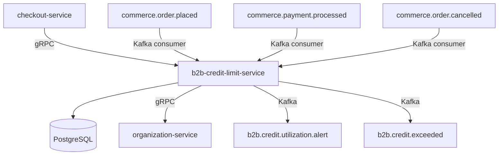

# b2b-credit-limit-service

> Manages credit limits per B2B organization, tracks utilization in real time, and alerts when thresholds are approached or breached.

## Overview

The b2b-credit-limit-service is the financial guardrail for enterprise buyer accounts. It maintains an assigned credit ceiling for each organization, tracks outstanding balances by consuming payment and order events, and enforces credit checks at checkout time. When utilization crosses configurable warning or hard-limit thresholds, it emits alert events that downstream services and notification pipelines can act on. It also supports temporary credit overrides with an expiry for one-time exceptions.

## Architecture



## Tech Stack

| Component | Technology |
|---|---|
| Language | Go 1.23 |
| Database | PostgreSQL 16 |
| Protocol | gRPC |
| Migration | golang-migrate |
| Build | `go build` |
| Container | Docker (multi-stage, non-root) |

## Responsibilities

- Assign and update credit limits for B2B organizations
- Maintain a real-time outstanding balance by consuming order and payment events
- Perform synchronous credit-check calls during the checkout flow
- Enforce hard-stop when an order would exceed the available credit
- Emit utilization alerts at configurable warning percentages (e.g., 75%, 90%, 100%)
- Support temporary credit overrides with a defined expiry date and audit reason
- Expose credit utilization reports for the partner portal

## API / Interface

| Method | Request | Response | Description |
|---|---|---|---|
| `SetCreditLimit` | `SetLimitRequest` | `CreditLimit` | Assign or update org credit ceiling |
| `GetCreditLimit` | `GetLimitRequest` | `CreditLimit` | Fetch current limit and utilization |
| `CheckCredit` | `CheckCreditRequest` | `CreditCheckResponse` | Synchronous check: can org place this order? |
| `ApplyTemporaryOverride` | `OverrideRequest` | `CreditLimit` | Grant a time-bound credit exception |
| `RevokeOverride` | `RevokeRequest` | `CreditLimit` | Remove an active override |
| `GetUtilizationHistory` | `HistoryRequest` | `UtilizationHistory` | Time-series of balance changes |
| `ListOrgsNearLimit` | `NearLimitRequest` | `OrgList` | Orgs above warning threshold |

## Kafka Topics

| Topic | Role | Description |
|---|---|---|
| `b2b.credit.utilization.alert` | Producer | Fired when utilization crosses a warning threshold |
| `b2b.credit.exceeded` | Producer | Fired when a credit hard limit is breached |
| `b2b.credit.limit.updated` | Producer | Fired when a limit is set or modified |
| `commerce.order.placed` | Consumer | Increases outstanding balance on new order |
| `commerce.order.cancelled` | Consumer | Releases credit when order is cancelled |
| `commerce.payment.processed` | Consumer | Reduces outstanding balance on payment |

## Dependencies

Upstream (calls this service)
- `checkout-service` — synchronous credit check before order placement

Downstream (this service calls)
- `organization-service` — validates organization identity and fetches org metadata

## Environment Variables

| Variable | Default | Description |
|---|---|---|
| `SERVER_PORT` | `50164` | gRPC server port |
| `DB_HOST` | `localhost` | PostgreSQL host |
| `DB_PORT` | `5432` | PostgreSQL port |
| `DB_NAME` | `credit_limit_db` | Database name |
| `DB_USER` | `credit_user` | Database username |
| `DB_PASSWORD` | — | Database password (required) |
| `KAFKA_BOOTSTRAP_SERVERS` | `localhost:9092` | Kafka broker addresses |
| `ORGANIZATION_SERVICE_ADDR` | `organization-service:50160` | Address of organization-service |
| `ALERT_THRESHOLD_WARNING` | `75` | Utilization % that triggers a warning alert |
| `ALERT_THRESHOLD_CRITICAL` | `90` | Utilization % that triggers a critical alert |
| `LOG_LEVEL` | `info` | Logging level |

## Running Locally

```bash
docker-compose up b2b-credit-limit-service
```

## Health Check

`GET /healthz` → `{"status":"ok"}`

gRPC health: `grpc.health.v1.Health/Check` → `SERVING`
