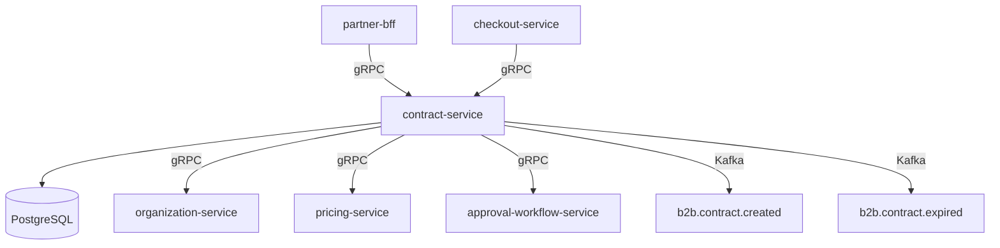

# contract-service

> Manages B2B contracts, negotiated pricing agreements, and contract validity lifecycles.

## Overview

The contract-service stores and enforces B2B commercial agreements between ShopOS and its buyer organizations. It supports versioned contract documents, custom pricing tiers, volume-discount schedules, and validity windows. The pricing-service and checkout-service consult contract-service to apply negotiated rates at order time, ensuring enterprise buyers always receive their contracted prices.

## Architecture



## Tech Stack

| Component | Technology |
|---|---|
| Language | Kotlin / Spring Boot 3 |
| Database | PostgreSQL 16 |
| Protocol | gRPC |
| Migration | Flyway |
| Build | Gradle (Kotlin DSL) |
| Container | Docker (multi-stage, non-root) |

## Responsibilities

- Create and version B2B contracts tied to an organization
- Store negotiated pricing rules, discount schedules, and payment terms
- Enforce contract validity windows (start date, end date, renewal)
- Route new or amended contracts through approval workflows
- Expose contract lookup APIs for pricing and checkout services
- Emit lifecycle events (created, activated, expiring-soon, expired)
- Archive expired contracts while keeping them auditable

## API / Interface

| Method | Request | Response | Description |
|---|---|---|---|
| `CreateContract` | `CreateContractRequest` | `Contract` | Draft a new B2B contract |
| `GetContract` | `GetContractRequest` | `Contract` | Fetch contract by ID |
| `ListContractsByOrg` | `ListByOrgRequest` | `ContractList` | All contracts for an org |
| `UpdateContract` | `UpdateContractRequest` | `Contract` | Amend a draft contract |
| `ActivateContract` | `ActivateRequest` | `Contract` | Move contract to active state |
| `TerminateContract` | `TerminateRequest` | `Contract` | Early-terminate an active contract |
| `GetActiveContract` | `GetActiveRequest` | `Contract` | Fetch the active contract for an org |
| `GetPricingTerms` | `PricingTermsRequest` | `PricingTerms` | Return negotiated pricing for checkout |

## Kafka Topics

| Topic | Role | Description |
|---|---|---|
| `b2b.contract.created` | Producer | Fired when a contract draft is created |
| `b2b.contract.activated` | Producer | Fired when a contract becomes active |
| `b2b.contract.expiring` | Producer | Fired 30 days before expiry |
| `b2b.contract.expired` | Producer | Fired when a contract passes its end date |
| `b2b.contract.terminated` | Producer | Fired on early termination |

## Dependencies

**Upstream (calls this service)**
- `partner-bff` — contract management UI
- `checkout-service` — fetches active pricing terms at order time
- `pricing-service` — resolves contracted unit prices

**Downstream (this service calls)**
- `organization-service` — validates the buyer organization
- `pricing-service` — validates price list references in the contract
- `approval-workflow-service` — submits new/amended contracts for approval

## Environment Variables

| Variable | Default | Description |
|---|---|---|
| `SERVER_PORT` | `50161` | gRPC server port |
| `DB_HOST` | `localhost` | PostgreSQL host |
| `DB_PORT` | `5432` | PostgreSQL port |
| `DB_NAME` | `contract_db` | Database name |
| `DB_USER` | `contract_user` | Database username |
| `DB_PASSWORD` | — | Database password (required) |
| `KAFKA_BOOTSTRAP_SERVERS` | `localhost:9092` | Kafka broker addresses |
| `ORGANIZATION_SERVICE_ADDR` | `organization-service:50160` | Address of organization-service |
| `PRICING_SERVICE_ADDR` | `pricing-service:50073` | Address of pricing-service |
| `APPROVAL_SERVICE_ADDR` | `approval-workflow-service:50163` | Address of approval-workflow-service |
| `EXPIRY_ALERT_DAYS` | `30` | Days before expiry to emit warning event |
| `LOG_LEVEL` | `INFO` | Logging level |

## Running Locally

```bash
docker-compose up contract-service
```

## Health Check

`GET /healthz` → `{"status":"ok"}`

gRPC health: `grpc.health.v1.Health/Check` → `SERVING`
