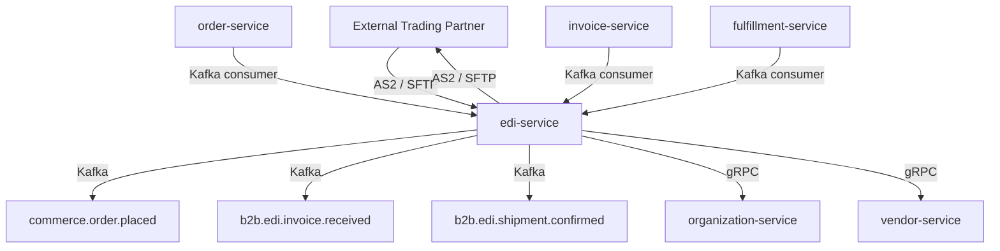

# edi-service

> Translates EDI 850/810/856 documents to and from internal domain events, and manages trading partner configurations.

## Overview

The edi-service acts as the EDI gateway between ShopOS and external trading partners that communicate via the ANSI X12 or EDIFACT standards. It receives raw EDI files (via SFTP or AS2), parses and validates them against the configured transaction set, maps them to internal Kafka events or gRPC calls, and produces outbound EDI documents from internal order/invoice/shipment data. Trading partner profiles (ISA identifiers, acknowledgement preferences, document versions) are stored and managed here.

## Architecture



## Tech Stack

| Component | Technology |
|---|---|
| Language | Java 21 / Spring Boot 3 |
| Protocol | gRPC (internal), AS2 / SFTP (external) |
| EDI Parser | smooks / babelway (open source) |
| Migration | Flyway |
| Build | Maven |
| Container | Docker (multi-stage, non-root) |

## Responsibilities

- Receive inbound EDI 850 (Purchase Order), 810 (Invoice), and 856 (Ship Notice) documents
- Validate EDI structure against configured transaction set and trading partner rules
- Map inbound EDI documents to internal domain events and publish to Kafka
- Generate outbound EDI 855 (PO Acknowledgement), 810, and 856 documents from internal events
- Deliver outbound documents to trading partners via AS2 or SFTP
- Manage trading partner profiles: ISA/GS IDs, transport settings, document version preferences
- Generate EDI 997 (Functional Acknowledgement) for every received document
- Maintain inbound/outbound document audit log

## API / Interface

| Method | Request | Response | Description |
|---|---|---|---|
| `GetTradingPartner` | `GetPartnerRequest` | `TradingPartner` | Fetch partner profile by ID |
| `CreateTradingPartner` | `CreatePartnerRequest` | `TradingPartner` | Register a new trading partner |
| `UpdateTradingPartner` | `UpdatePartnerRequest` | `TradingPartner` | Modify partner configuration |
| `ListTradingPartners` | `ListPartnersRequest` | `PartnerList` | List all registered partners |
| `GetDocumentStatus` | `DocStatusRequest` | `DocumentStatus` | Check status of an EDI document |
| `ResendDocument` | `ResendRequest` | `Empty` | Retry delivery of a failed outbound doc |
| `ListDocumentHistory` | `HistoryRequest` | `DocumentList` | Audit log of inbound/outbound documents |

## Kafka Topics

| Topic | Role | Description |
|---|---|---|
| `b2b.edi.po.received` | Producer | Inbound EDI 850 mapped to internal PO event |
| `b2b.edi.invoice.received` | Producer | Inbound EDI 810 mapped to invoice event |
| `b2b.edi.shipment.confirmed` | Producer | Inbound EDI 856 mapped to shipment event |
| `b2b.edi.document.failed` | Producer | Fired when an EDI document fails validation |
| `commerce.order.placed` | Consumer | Triggers outbound EDI 855 acknowledgement |
| `supplychain.shipment.created` | Consumer | Triggers outbound EDI 856 Ship Notice |
| `financial.invoice.created` | Consumer | Triggers outbound EDI 810 Invoice |

## Dependencies

Upstream (calls this service)
- External trading partners — inbound EDI via AS2/SFTP

Downstream (this service calls)
- `organization-service` — maps ISA sender ID to internal org
- `vendor-service` — maps trading partner to internal vendor record

## Environment Variables

| Variable | Default | Description |
|---|---|---|
| `SERVER_PORT` | `50165` | gRPC server port |
| `SFTP_HOST` | `localhost` | SFTP server host |
| `SFTP_PORT` | `22` | SFTP server port |
| `SFTP_USER` | — | SFTP username (required) |
| `SFTP_PASSWORD` | — | SFTP password (required) |
| `AS2_LISTEN_PORT` | `4080` | AS2 receiver port |
| `AS2_SIGNING_KEY_PATH` | — | Path to AS2 signing private key |
| `KAFKA_BOOTSTRAP_SERVERS` | `localhost:9092` | Kafka broker addresses |
| `ORGANIZATION_SERVICE_ADDR` | `organization-service:50160` | Address of organization-service |
| `VENDOR_SERVICE_ADDR` | `vendor-service:50100` | Address of vendor-service |
| `DOCUMENT_ARCHIVE_DAYS` | `2555` | Days to retain EDI document archive (7 years) |
| `LOG_LEVEL` | `INFO` | Logging level |

## Running Locally

```bash
docker-compose up edi-service
```

## Health Check

`GET /healthz` → `{"status":"ok"}`

gRPC health: `grpc.health.v1.Health/Check` → `SERVING`
