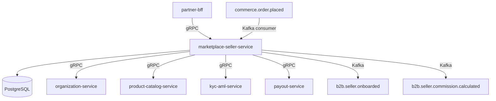

# marketplace-seller-service

> Manages marketplace seller onboarding, product listing approvals, and commission tracking.

## Overview

The marketplace-seller-service powers the third-party seller layer of the ShopOS marketplace. It handles the full seller lifecycle from application and KYC submission through listing approval to payout reconciliation. Sellers can manage their own product catalog listings (which are validated against the core catalog), and the service computes and records commission earned on every sale for downstream payout processing by the financial domain.

## Architecture



## Tech Stack

| Component | Technology |
|---|---|
| Language | Java 21 / Spring Boot 3 |
| Database | PostgreSQL 16 |
| Protocol | gRPC |
| Migration | Flyway |
| Build | Maven |
| Container | Docker (multi-stage, non-root) |

## Responsibilities

- Accept and process seller onboarding applications
- Coordinate KYC/AML checks via kyc-aml-service before activation
- Manage seller product listings: submission, review, approval, and suspension
- Link seller listings to master catalog products
- Configure per-seller commission rates (flat or tiered)
- Calculate commission on every fulfilled order and record for payout
- Suspend or terminate sellers for policy violations
- Expose seller performance dashboards (sales volume, commission earned, returns rate)

## API / Interface

| Method | Request | Response | Description |
|---|---|---|---|
| `ApplySeller` | `SellerApplicationRequest` | `Seller` | Submit a new seller application |
| `GetSeller` | `GetSellerRequest` | `Seller` | Fetch seller profile by ID |
| `ApproveSeller` | `ApproveRequest` | `Seller` | Activate a seller after KYC clearance |
| `SuspendSeller` | `SuspendRequest` | `Seller` | Temporarily suspend a seller |
| `CreateListing` | `ListingRequest` | `Listing` | Submit a product listing for review |
| `ApproveListing` | `ApproveListing` | `Listing` | Approve a pending listing |
| `RejectListing` | `RejectListing` | `Listing` | Reject a listing with reason |
| `GetCommissionStatement` | `StatementRequest` | `CommissionStatement` | Fetch commission earned in a period |
| `SetCommissionRate` | `CommissionRateRequest` | `Seller` | Configure commission rate for a seller |

## Kafka Topics

| Topic | Role | Description |
|---|---|---|
| `b2b.seller.applied` | Producer | Fired when a new seller application is submitted |
| `b2b.seller.onboarded` | Producer | Fired when seller is activated |
| `b2b.seller.suspended` | Producer | Fired on seller suspension |
| `b2b.seller.listing.approved` | Producer | Fired when a product listing is approved |
| `b2b.seller.commission.calculated` | Producer | Fired with commission data after each sale |
| `commerce.order.placed` | Consumer | Triggers commission calculation for seller products |

## Dependencies

**Upstream (calls this service)**
- `partner-bff` — seller portal UI
- `admin-portal` — admin review and listing approval

**Downstream (this service calls)**
- `organization-service` — links seller to a B2B organization
- `product-catalog-service` — validates product references in listings
- `kyc-aml-service` — performs identity and compliance checks during onboarding
- `payout-service` — submits commission statements for payout

## Environment Variables

| Variable | Default | Description |
|---|---|---|
| `SERVER_PORT` | `50166` | gRPC server port |
| `DB_HOST` | `localhost` | PostgreSQL host |
| `DB_PORT` | `5432` | PostgreSQL port |
| `DB_NAME` | `marketplace_seller_db` | Database name |
| `DB_USER` | `seller_user` | Database username |
| `DB_PASSWORD` | — | Database password (required) |
| `KAFKA_BOOTSTRAP_SERVERS` | `localhost:9092` | Kafka broker addresses |
| `ORGANIZATION_SERVICE_ADDR` | `organization-service:50160` | Address of organization-service |
| `CATALOG_SERVICE_ADDR` | `product-catalog-service:50070` | Address of product-catalog-service |
| `KYC_SERVICE_ADDR` | `kyc-aml-service:50116` | Address of kyc-aml-service |
| `PAYOUT_SERVICE_ADDR` | `payout-service:50112` | Address of payout-service |
| `DEFAULT_COMMISSION_RATE` | `0.12` | Default commission rate (12%) |
| `LOG_LEVEL` | `INFO` | Logging level |

## Running Locally

```bash
docker-compose up marketplace-seller-service
```

## Health Check

`GET /healthz` → `{"status":"ok"}`

gRPC health: `grpc.health.v1.Health/Check` → `SERVING`
