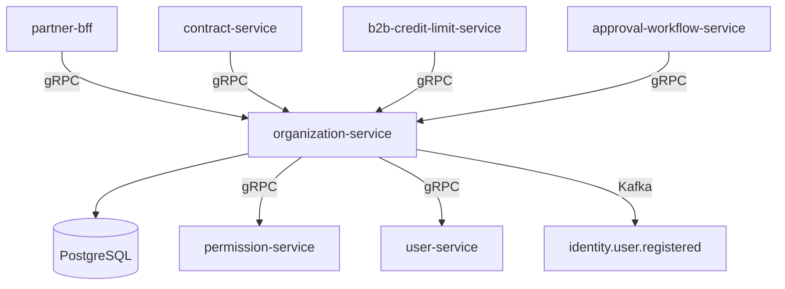

# organization-service

> Manages B2B organization profiles, company hierarchies, and member invitations.

## Overview

The organization-service is the authoritative source for B2B company accounts within ShopOS. It stores and manages company profiles, parent-child organizational hierarchies (e.g., subsidiaries and departments), and controls the invitation and role-assignment lifecycle for organization members. All other B2B services resolve organizational identity through this service.

## Architecture



## Tech Stack

| Component | Technology |
|---|---|
| Language | Java 21 / Spring Boot 3 |
| Database | PostgreSQL 16 |
| Protocol | gRPC |
| Migration | Flyway |
| Build | Maven |
| Container | Docker (multi-stage, non-root) |

## Responsibilities

- Create, update, and deactivate B2B organization profiles
- Manage multi-level organizational hierarchies (parent/subsidiary/department)
- Handle member invitation flows: generate invite tokens, accept/reject, revoke
- Assign organization-level roles (admin, buyer, approver, viewer)
- Expose organization lookup APIs consumed by downstream B2B services
- Emit domain events when organizations are created or members change

## API / Interface

| Method | Request | Response | Description |
|---|---|---|---|
| `CreateOrganization` | `CreateOrgRequest` | `Organization` | Register a new B2B company |
| `GetOrganization` | `GetOrgRequest` | `Organization` | Fetch org by ID |
| `UpdateOrganization` | `UpdateOrgRequest` | `Organization` | Update profile fields |
| `ListChildOrganizations` | `ListChildrenRequest` | `OrgList` | Fetch subsidiary orgs |
| `InviteMember` | `InviteRequest` | `Invitation` | Send member invitation |
| `AcceptInvitation` | `AcceptInviteRequest` | `Membership` | Accept an invitation token |
| `RemoveMember` | `RemoveMemberRequest` | `Empty` | Revoke membership |
| `ListMembers` | `ListMembersRequest` | `MemberList` | List all org members |

## Kafka Topics

| Topic | Role | Description |
|---|---|---|
| `b2b.organization.created` | Producer | Fired when a new organization is registered |
| `b2b.organization.updated` | Producer | Fired when org profile is updated |
| `b2b.member.invited` | Producer | Fired when an invitation is issued |
| `b2b.member.joined` | Producer | Fired when an invitation is accepted |
| `identity.user.registered` | Consumer | Triggers auto-linking of user to org invitation |

## Dependencies

Upstream (calls this service)
- `partner-bff` — org profile and member management
- `contract-service` — resolves org identity for contracts
- `b2b-credit-limit-service` — fetches org for credit assignment
- `approval-workflow-service` — fetches members for approval chain resolution

Downstream (this service calls)
- `user-service` — validates user existence before membership assignment
- `permission-service` — grants org-scoped roles upon member acceptance

## Environment Variables

| Variable | Default | Description |
|---|---|---|
| `SERVER_PORT` | `50160` | gRPC server port |
| `DB_HOST` | `localhost` | PostgreSQL host |
| `DB_PORT` | `5432` | PostgreSQL port |
| `DB_NAME` | `organization_db` | Database name |
| `DB_USER` | `org_user` | Database username |
| `DB_PASSWORD` | — | Database password (required) |
| `KAFKA_BOOTSTRAP_SERVERS` | `localhost:9092` | Kafka broker addresses |
| `USER_SERVICE_ADDR` | `user-service:50061` | Address of user-service |
| `PERMISSION_SERVICE_ADDR` | `permission-service:50063` | Address of permission-service |
| `INVITE_TOKEN_TTL_HOURS` | `72` | Hours before invitation token expires |
| `LOG_LEVEL` | `INFO` | Logging level |

## Running Locally

```bash
docker-compose up organization-service
```

## Health Check

`GET /healthz` → `{"status":"ok"}`

gRPC health: `grpc.health.v1.Health/Check` → `SERVING`
