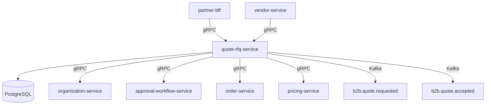

# quote-rfq-service

> Handles Request-for-Quote creation, vendor responses, and quote-to-order conversion for B2B buyers.

## Overview

The quote-rfq-service manages the full RFQ (Request for Quote) lifecycle for enterprise buyers. Buyers submit RFQ documents specifying required products and quantities; the service routes them to relevant vendors or internal pricing teams, collects responses, and tracks quote versions. Once a buyer accepts a quote, the service triggers quote-to-order conversion by handing off to the order-service, preserving all agreed pricing and terms.

## Architecture



## Tech Stack

| Component | Technology |
|---|---|
| Language | Go 1.23 |
| Database | PostgreSQL 16 |
| Protocol | gRPC |
| Migration | golang-migrate |
| Build | `go build` |
| Container | Docker (multi-stage, non-root) |

## Responsibilities

- Create RFQ documents on behalf of buyer organizations
- Distribute RFQ requests to registered vendors or internal pricing teams
- Accept and version quote responses from vendors
- Track quote status through the full lifecycle: draft → submitted → responded → negotiating → accepted → converted
- Route high-value quotes through approval workflows before acceptance
- Convert accepted quotes into orders, passing negotiated line items to order-service
- Expire unanswered or outdated quotes automatically

## API / Interface

| Method | Request | Response | Description |
|---|---|---|---|
| `CreateRFQ` | `CreateRFQRequest` | `RFQ` | Submit a new request for quote |
| `GetRFQ` | `GetRFQRequest` | `RFQ` | Fetch RFQ by ID |
| `ListRFQsByOrg` | `ListRFQsRequest` | `RFQList` | All RFQs for an organization |
| `SubmitQuoteResponse` | `QuoteResponseRequest` | `Quote` | Vendor submits a quote |
| `NegotiateQuote` | `NegotiateRequest` | `Quote` | Buyer counters a quote |
| `AcceptQuote` | `AcceptQuoteRequest` | `Quote` | Buyer accepts a quote |
| `RejectQuote` | `RejectQuoteRequest` | `Quote` | Buyer rejects all quotes |
| `ConvertToOrder` | `ConvertRequest` | `OrderRef` | Converts accepted quote to order |

## Kafka Topics

| Topic | Role | Description |
|---|---|---|
| `b2b.rfq.created` | Producer | Fired when a new RFQ is submitted |
| `b2b.quote.received` | Producer | Fired when a vendor submits a quote |
| `b2b.quote.accepted` | Producer | Fired when buyer accepts a quote |
| `b2b.quote.rejected` | Producer | Fired when all quotes are rejected |
| `b2b.quote.expired` | Producer | Fired when an RFQ passes its deadline |
| `b2b.quote.converted` | Producer | Fired on successful order conversion |

## Dependencies

Upstream (calls this service)
- `partner-bff` — buyer and vendor RFQ management UI
- `vendor-service` — submits quote responses on behalf of vendors

Downstream (this service calls)
- `organization-service` — validates buyer organization
- `pricing-service` — validates product references and base prices
- `approval-workflow-service` — routes large quotes for approval
- `order-service` — creates order from an accepted quote

## Environment Variables

| Variable | Default | Description |
|---|---|---|
| `SERVER_PORT` | `50162` | gRPC server port |
| `DB_HOST` | `localhost` | PostgreSQL host |
| `DB_PORT` | `5432` | PostgreSQL port |
| `DB_NAME` | `quote_rfq_db` | Database name |
| `DB_USER` | `quote_user` | Database username |
| `DB_PASSWORD` | — | Database password (required) |
| `KAFKA_BOOTSTRAP_SERVERS` | `localhost:9092` | Kafka broker addresses |
| `ORGANIZATION_SERVICE_ADDR` | `organization-service:50160` | Address of organization-service |
| `APPROVAL_SERVICE_ADDR` | `approval-workflow-service:50163` | Address of approval-workflow-service |
| `ORDER_SERVICE_ADDR` | `order-service:50082` | Address of order-service |
| `PRICING_SERVICE_ADDR` | `pricing-service:50073` | Address of pricing-service |
| `QUOTE_EXPIRY_DAYS` | `14` | Days before an unanswered RFQ expires |
| `LOG_LEVEL` | `info` | Logging level |

## Running Locally

```bash
docker-compose up quote-rfq-service
```

## Health Check

`GET /healthz` → `{"status":"ok"}`

gRPC health: `grpc.health.v1.Health/Check` → `SERVING`
