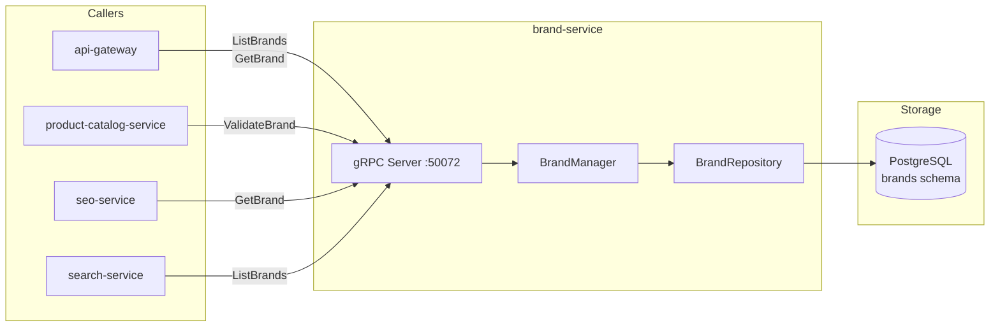

# brand-service

> Brand profiles, logos, and product-brand associations.

## Overview

The brand-service manages the brand entities on the ShopOS platform. Each brand record
includes its canonical name, slug, description, logo media reference, and country of
origin. The service provides brand validation for the product-catalog-service and powers
brand-filtered browsing, brand pages, and brand-level SEO metadata. Brands are stored in
PostgreSQL as relatively small, infrequently changing reference data.

## Architecture



## Tech Stack

| Component | Technology |
|---|---|
| Language | Go 1.22 |
| Database | PostgreSQL |
| Protocol | gRPC |
| Port | 50072 |
| gRPC Framework | google.golang.org/grpc |
| DB Driver | pgx/v5 |
| DB Migrations | golang-migrate |

## Responsibilities

- Store and serve brand profiles (name, slug, description, country, website URL)
- Validate brand existence for product-catalog-service during product creation
- Store references to brand logo assets (resolved by media-asset-service)
- Manage brand status (active, inactive, pending-review)
- Support brand search by name prefix for admin autocomplete
- Maintain SEO fields (meta description, canonical URL) per brand page

## API / Interface

```protobuf
service BrandService {
  rpc CreateBrand(CreateBrandRequest) returns (CreateBrandResponse);
  rpc GetBrand(GetBrandRequest) returns (BrandResponse);
  rpc UpdateBrand(UpdateBrandRequest) returns (BrandResponse);
  rpc DeleteBrand(DeleteBrandRequest) returns (DeleteBrandResponse);
  rpc ListBrands(ListBrandsRequest) returns (ListBrandsResponse);
  rpc SearchBrands(SearchBrandsRequest) returns (SearchBrandsResponse);
}
```

| Method | Description |
|---|---|
| `CreateBrand` | Register a new brand with name, slug, and logo |
| `GetBrand` | Fetch brand by ID or slug |
| `UpdateBrand` | Modify brand profile fields |
| `DeleteBrand` | Soft-delete brand (blocked if active products are assigned) |
| `ListBrands` | Paginated brand list with status filter |
| `SearchBrands` | Prefix search by brand name (for autocomplete) |

## Kafka Topics

Not applicable — brand-service is gRPC-only.

## Dependencies

**Upstream** (calls these):
- `media-asset-service` — resolves logo asset IDs to URLs (optional enrichment)

**Downstream** (called by these):
- `product-catalog-service` — validates brand assignment on product create/update
- `search-service` — `ListBrands` for facet indexing
- `seo-service` — `GetBrand` for brand page meta tags
- `api-gateway` — brand listing and brand page data

## Environment Variables

| Variable | Default | Description |
|---|---|---|
| `DATABASE_URL` | — | PostgreSQL connection string |
| `GRPC_PORT` | `50072` | gRPC listening port |
| `MEDIA_ASSET_SERVICE_ADDR` | `media-asset-service:50140` | Media asset service address |

## Running Locally

```bash
docker-compose up brand-service
```

## Health Check

`GET /healthz` — `{"status":"ok"}`

gRPC health protocol: `grpc.health.v1.Health/Check` on port `50072`
