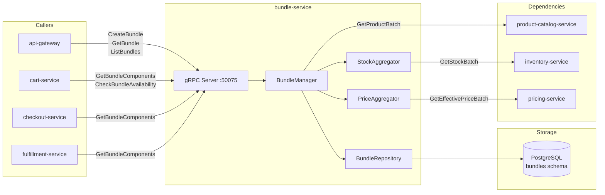

# bundle-service

> Product bundles, kit configurations, and bundle pricing.

## Overview

The bundle-service enables merchants to group individual products into bundles or kits,
sold as a single purchasable unit. It handles bundle composition, price roll-up with
optional bundle discount, and stock availability aggregation across all component SKUs. When
a bundle is added to the cart, the cart-service treats it as a single line item, and the
bundle-service resolves its components for inventory reservation and fulfillment purposes.

## Architecture



## Tech Stack

| Component | Technology |
|---|---|
| Language | Go 1.22 |
| Database | PostgreSQL |
| Protocol | gRPC |
| Port | 50075 |
| gRPC Framework | google.golang.org/grpc |
| DB Driver | pgx/v5 |
| DB Migrations | golang-migrate |

## Responsibilities

- Define and manage bundle compositions (parent bundle → component SKUs + quantities)
- Calculate bundle price as sum of component prices minus optional bundle discount
- Check bundle availability by aggregating component stock levels
- Validate that all component products exist and are in ACTIVE status
- Expose component breakdown for cart display and fulfillment routing
- Support fixed-price bundles (override computed price) and percentage-discount bundles
- Soft-delete bundles without affecting historical order data

## API / Interface

```protobuf
service BundleService {
  rpc CreateBundle(CreateBundleRequest) returns (CreateBundleResponse);
  rpc GetBundle(GetBundleRequest) returns (BundleResponse);
  rpc UpdateBundle(UpdateBundleRequest) returns (BundleResponse);
  rpc DeleteBundle(DeleteBundleRequest) returns (DeleteBundleResponse);
  rpc ListBundles(ListBundlesRequest) returns (ListBundlesResponse);
  rpc GetBundleComponents(GetBundleComponentsRequest) returns (GetBundleComponentsResponse);
  rpc CheckBundleAvailability(CheckBundleAvailabilityRequest) returns (CheckBundleAvailabilityResponse);
}
```

| Method | Description |
|---|---|
| `CreateBundle` | Define a new bundle with component list and pricing strategy |
| `GetBundle` | Fetch bundle metadata and component list |
| `UpdateBundle` | Modify components, discount, or status |
| `DeleteBundle` | Soft-delete a bundle |
| `ListBundles` | Paginated bundle list with status filter |
| `GetBundleComponents` | Return component SKUs and quantities for cart/fulfillment |
| `CheckBundleAvailability` | Aggregate availability across all component SKUs |

## Kafka Topics

Not applicable — bundle-service is gRPC-only.

## Dependencies

**Upstream** (calls these):
- `product-catalog-service` — `GetProductBatch` to validate component products
- `inventory-service` — `GetStockBatch` for bundle availability check
- `pricing-service` — `GetEffectivePriceBatch` to compute bundle price

**Downstream** (called by these):
- `cart-service` — get components when bundle is added to cart
- `checkout-service` — get component breakdown for order line items
- `fulfillment-service` — get components to create individual pick tasks

## Environment Variables

| Variable | Default | Description |
|---|---|---|
| `DATABASE_URL` | — | PostgreSQL connection string |
| `GRPC_PORT` | `50075` | gRPC listening port |
| `PRODUCT_CATALOG_SERVICE_ADDR` | `product-catalog-service:50070` | Product catalog address |
| `INVENTORY_SERVICE_ADDR` | `inventory-service:50074` | Inventory service address |
| `PRICING_SERVICE_ADDR` | `pricing-service:50073` | Pricing service address |

## Running Locally

```bash
docker-compose up bundle-service
```

## Health Check

`GET /healthz` — `{"status":"ok"}`

gRPC health protocol: `grpc.health.v1.Health/Check` on port `50075`
