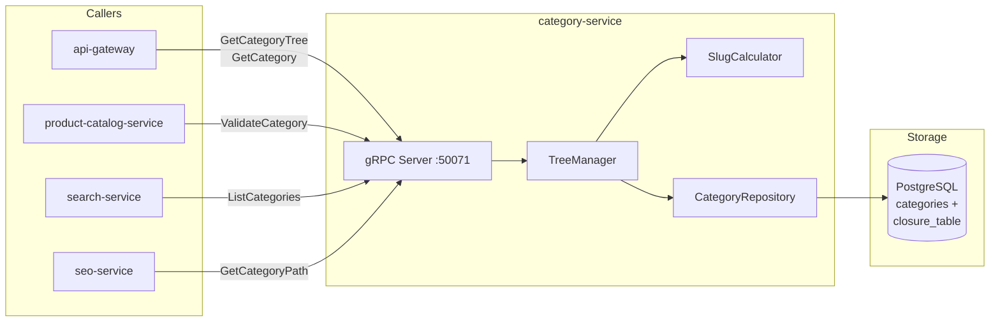

# category-service

> Hierarchical category tree management for product classification.

## Overview

The category-service maintains the taxonomy tree that organizes all products on the
platform. It supports an unlimited-depth hierarchy (root → department → category →
sub-category) using a closure-table pattern in PostgreSQL for efficient ancestor and
descendant queries. Category slugs are used to build SEO-friendly URL paths, and the
tree structure is cached for fast storefront navigation rendering.

## Architecture



## Tech Stack

| Component | Technology |
|---|---|
| Language | Go 1.22 |
| Database | PostgreSQL |
| Protocol | gRPC |
| Port | 50071 |
| gRPC Framework | google.golang.org/grpc |
| DB Driver | pgx/v5 |
| DB Migrations | golang-migrate |

## Responsibilities

- Create, update, and delete category nodes in the hierarchy tree
- Maintain a closure table for O(1) ancestor/descendant lookups
- Generate and enforce unique, URL-safe slugs per category
- Compute full breadcrumb paths (e.g., `Electronics / Laptops / Gaming`)
- Move subtrees when a category is re-parented (updates closure table)
- Expose the full category tree for storefront navigation menus
- Soft-delete categories (prevents orphaning of assigned products)

## API / Interface

```protobuf
service CategoryService {
  rpc CreateCategory(CreateCategoryRequest) returns (CreateCategoryResponse);
  rpc GetCategory(GetCategoryRequest) returns (CategoryResponse);
  rpc UpdateCategory(UpdateCategoryRequest) returns (CategoryResponse);
  rpc DeleteCategory(DeleteCategoryRequest) returns (DeleteCategoryResponse);
  rpc GetCategoryTree(GetCategoryTreeRequest) returns (CategoryTreeResponse);
  rpc GetAncestors(GetAncestorsRequest) returns (GetAncestorsResponse);
  rpc GetDescendants(GetDescendantsRequest) returns (GetDescendantsResponse);
  rpc MoveCategory(MoveCategoryRequest) returns (MoveCategoryResponse);
  rpc GetCategoryPath(GetCategoryPathRequest) returns (GetCategoryPathResponse);
}
```

| Method | Description |
|---|---|
| `CreateCategory` | Add a new node in the tree under a given parent |
| `GetCategory` | Fetch single category by ID or slug |
| `UpdateCategory` | Update name, description, metadata |
| `DeleteCategory` | Soft-delete (blocks if products are assigned) |
| `GetCategoryTree` | Return full tree rooted at a given node |
| `GetAncestors` | Return all ancestor nodes of a category |
| `GetDescendants` | Return all descendant nodes (subtree) |
| `MoveCategory` | Re-parent a category node |
| `GetCategoryPath` | Return breadcrumb path list for a leaf category |

## Kafka Topics

Not applicable — category-service is gRPC-only.

## Dependencies

**Upstream** (calls these):
- None — category-service has no outbound service calls

**Downstream** (called by these):
- `product-catalog-service` — validates category assignment on product create/update
- `search-service` — `ListCategories` for facet indexing
- `seo-service` — `GetCategoryPath` for canonical URL generation
- `api-gateway` — category tree for storefront navigation

## Environment Variables

| Variable | Default | Description |
|---|---|---|
| `DATABASE_URL` | — | PostgreSQL connection string |
| `GRPC_PORT` | `50071` | gRPC listening port |
| `MAX_TREE_DEPTH` | `10` | Maximum allowed category hierarchy depth |
| `SLUG_SEPARATOR` | `-` | Character used between words in slugs |

## Running Locally

```bash
docker-compose up category-service
```

## Health Check

`GET /healthz` — `{"status":"ok"}`

gRPC health protocol: `grpc.health.v1.Health/Check` on port `50071`
