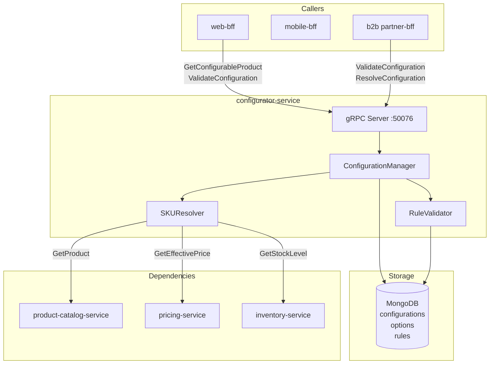

# configurator-service

> Configurable product builder (CPQ-lite) for products with complex option matrices.

## Overview

The configurator-service powers Configure-Price-Quote (CPQ) experiences for products that
require customer selection before a final SKU can be determined — for example, a laptop
where the customer chooses CPU, RAM, storage, and color. It stores configuration rules,
option dependencies, and constraint logic in MongoDB, then validates customer-selected
options and resolves the resulting SKU, price delta, and availability. This is particularly
important for B2B buyers assembling custom hardware or software packages.

## Architecture



## Tech Stack

| Component | Technology |
|---|---|
| Language | Node.js 20 (TypeScript) |
| Database | MongoDB 7 |
| Protocol | gRPC |
| Port | 50076 |
| gRPC Framework | @grpc/grpc-js |
| MongoDB Driver | mongodb (official Node.js driver) |

## Responsibilities

- Store product configuration schemas: option groups, option values, and constraints
- Express configuration rules: required options, mutual exclusions, dependencies
- Validate a customer's selected option set against the rule graph
- Resolve the final SKU (or virtual SKU) from a complete option selection
- Compute price adjustments introduced by selected options
- Check availability of the resolved configuration
- Save in-progress configurations (draft sessions) for return visits

## API / Interface

```protobuf
service ConfiguratorService {
  rpc GetConfigurableProduct(GetConfigurableProductRequest) returns (GetConfigurableProductResponse);
  rpc ValidateConfiguration(ValidateConfigurationRequest) returns (ValidateConfigurationResponse);
  rpc ResolveConfiguration(ResolveConfigurationRequest) returns (ResolveConfigurationResponse);
  rpc SaveConfigurationDraft(SaveConfigurationDraftRequest) returns (SaveConfigurationDraftResponse);
  rpc GetConfigurationDraft(GetConfigurationDraftRequest) returns (GetConfigurationDraftResponse);
}
```

| Method | Description |
|---|---|
| `GetConfigurableProduct` | Return option groups, values, and rules for a product |
| `ValidateConfiguration` | Check selected options satisfy all constraint rules |
| `ResolveConfiguration` | Validate, resolve SKU, return price delta and availability |
| `SaveConfigurationDraft` | Persist incomplete configuration for a user session |
| `GetConfigurationDraft` | Retrieve previously saved draft configuration |

## Kafka Topics

Not applicable — configurator-service is gRPC-only.

## Dependencies

Upstream (calls these):
- `product-catalog-service` — `GetProduct` to load the base product record
- `pricing-service` — `GetEffectivePrice` for option-level price adjustments
- `inventory-service` — `GetStockLevel` to check resolved configuration availability

Downstream (called by these):
- `web-bff` / `mobile-bff` — drive the interactive product configuration UI
- `cart-service` — `ResolveConfiguration` before adding a configured item to cart

## Environment Variables

| Variable | Default | Description |
|---|---|---|
| `MONGODB_URI` | — | MongoDB connection URI |
| `MONGODB_DATABASE` | `configurator` | MongoDB database name |
| `GRPC_PORT` | `50076` | gRPC listening port |
| `PRODUCT_CATALOG_SERVICE_ADDR` | `product-catalog-service:50070` | Product catalog address |
| `PRICING_SERVICE_ADDR` | `pricing-service:50073` | Pricing service address |
| `INVENTORY_SERVICE_ADDR` | `inventory-service:50074` | Inventory service address |
| `DRAFT_TTL_HOURS` | `72` | How long configuration drafts are retained |

## Running Locally

```bash
docker-compose up configurator-service
```

## Health Check

`GET /healthz` — `{"status":"ok"}`

gRPC health protocol: `grpc.health.v1.Health/Check` on port `50076`
