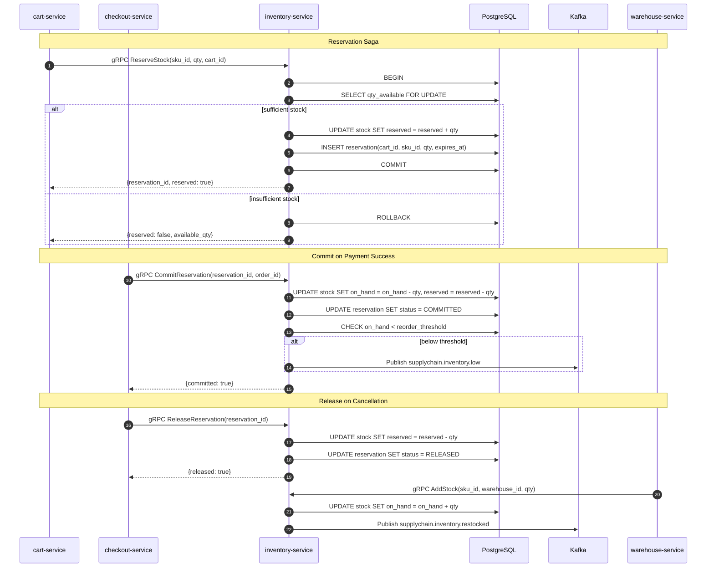

# inventory-service

> Stock levels, reservations, warehouse allocation, and low-stock event publishing.

## Overview

The inventory-service manages real-time stock availability across all warehouses. It
implements a reservation pattern — stock is first soft-reserved when a cart item is added
or a checkout begins, then committed when payment succeeds, and released if the order is
cancelled or the reservation expires. When stock falls below a configured threshold, it
publishes a `supplychain.inventory.low` Kafka event to trigger reorder workflows in the
supply-chain domain.

## Architecture



## Tech Stack

| Component | Technology |
|---|---|
| Language | Go 1.22 |
| Database | PostgreSQL |
| Protocol | gRPC |
| Port | 50074 |
| gRPC Framework | google.golang.org/grpc |
| DB Driver | pgx/v5 |
| DB Migrations | golang-migrate |

## Responsibilities

- Maintain on-hand, reserved, and available stock quantities per SKU per warehouse
- Process stock reservations with configurable expiry (cart timeout)
- Commit reservations to actual stock deductions on successful payment
- Release reservations on cart expiry, checkout cancellation, or order cancellation
- Track stock movements (receipts, adjustments, sales) for audit
- Publish `supplychain.inventory.low` when available stock crosses the reorder threshold
- Publish `supplychain.inventory.restocked` when new stock is received
- Support multi-warehouse allocation and preferred warehouse routing

## API / Interface

```protobuf
service InventoryService {
  rpc GetStockLevel(GetStockLevelRequest) returns (GetStockLevelResponse);
  rpc GetStockBatch(GetStockBatchRequest) returns (GetStockBatchResponse);
  rpc ReserveStock(ReserveStockRequest) returns (ReserveStockResponse);
  rpc CommitReservation(CommitReservationRequest) returns (CommitReservationResponse);
  rpc ReleaseReservation(ReleaseReservationRequest) returns (ReleaseReservationResponse);
  rpc AddStock(AddStockRequest) returns (AddStockResponse);
  rpc AdjustStock(AdjustStockRequest) returns (AdjustStockResponse);
  rpc ListStockMovements(ListStockMovementsRequest) returns (ListStockMovementsResponse);
}
```

| Method | Description |
|---|---|
| `GetStockLevel` | Return available/reserved/on-hand quantities for a SKU |
| `GetStockBatch` | Batch stock lookup for multiple SKUs (cart display) |
| `ReserveStock` | Soft-reserve stock for a cart or checkout |
| `CommitReservation` | Deduct reserved stock on order placement |
| `ReleaseReservation` | Return reserved stock to available pool |
| `AddStock` | Record stock receipt from warehouse |
| `AdjustStock` | Manual stock correction with reason code |
| `ListStockMovements` | Paginated audit log of stock changes |

## Kafka Topics

| Topic | Direction | Description |
|---|---|---|
| `supplychain.inventory.low` | Publish | Stock fell below reorder threshold |
| `supplychain.inventory.restocked` | Publish | New stock received |
| `commerce.order.cancelled` | Subscribe | Trigger reservation release |

## Dependencies

**Upstream** (calls these):
- None — inventory-service has no outbound gRPC calls to other services

**Downstream** (called by these):
- `cart-service` — `ReserveStock` / `GetStockBatch` for cart management
- `checkout-service` — `CommitReservation` / `ReleaseReservation` during order flow
- `warehouse-service` — `AddStock` when goods are received
- `fulfillment-service` — reads stock levels for warehouse routing

## Environment Variables

| Variable | Default | Description |
|---|---|---|
| `DATABASE_URL` | — | PostgreSQL connection string |
| `GRPC_PORT` | `50074` | gRPC listening port |
| `KAFKA_BROKERS` | `kafka:9092` | Kafka broker list |
| `RESERVATION_EXPIRY_MINUTES` | `30` | TTL for cart-level stock reservations |
| `LOW_STOCK_THRESHOLD_DEFAULT` | `10` | Default units before low-stock event fires |

## Running Locally

```bash
docker-compose up inventory-service
```

## Health Check

`GET /healthz` — `{"status":"ok"}`

gRPC health protocol: `grpc.health.v1.Health/Check` on port `50074`
