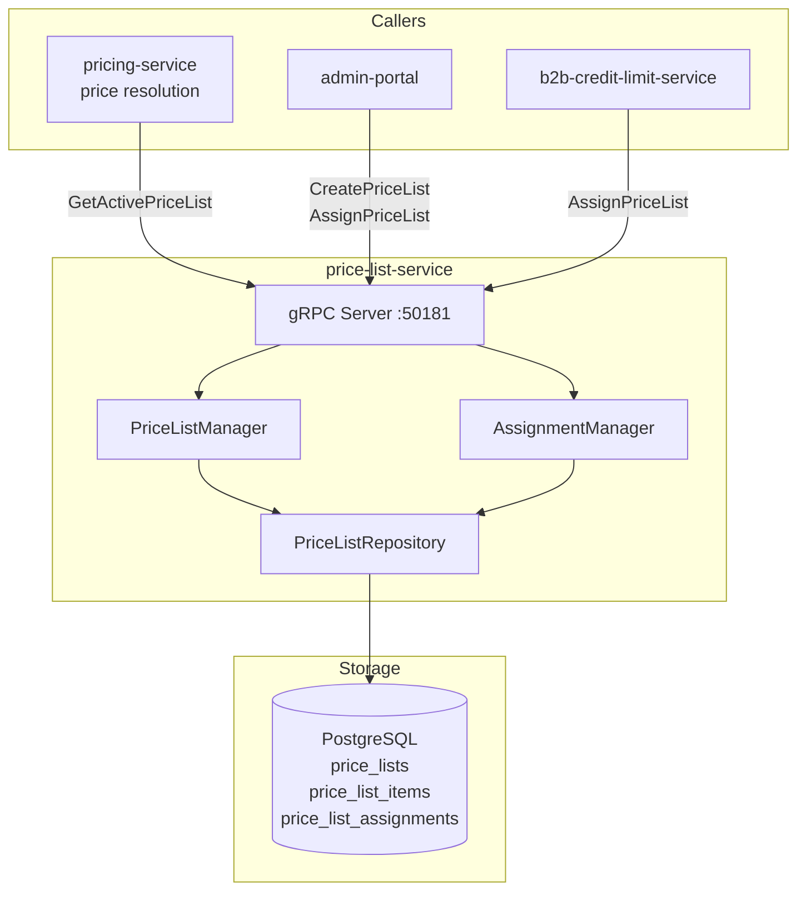

# price-list-service

> Customer-specific and channel-specific price lists for B2B and multi-channel commerce.

## Overview

The price-list-service manages named price lists that override the default pricing for
specific customer segments or sales channels. A price list contains SKU-level price entries
and is associated with one or more customers, customer groups, or channels (e.g., wholesale
portal, mobile app, specific regional storefront). The pricing-service calls this service
during price resolution to check whether a customer-channel combination has an active price
list before falling back to standard pricing rules.

## Architecture



## Tech Stack

| Component | Technology |
|---|---|
| Language | Java 21 (Spring Boot 3) |
| Database | PostgreSQL |
| Protocol | gRPC |
| Port | 50181 |
| gRPC Framework | grpc-spring-boot-starter |
| DB Migrations | Flyway |
| ORM | Spring Data JPA |

## Responsibilities

- Create and manage named price lists containing SKU-level price entries
- Support price list effective date ranges (scheduled activation and expiry)
- Assign price lists to individual customers, customer groups, or channels
- Resolve the highest-priority active price list for a given customer + channel context
- Return the price list entry for a SKU, or a signal that no override exists
- Support bulk price list entry import (CSV upload via product-import-service pattern)
- Track price list assignment history for audit purposes

## API / Interface

```protobuf
service PriceListService {
  rpc CreatePriceList(CreatePriceListRequest) returns (CreatePriceListResponse);
  rpc GetPriceList(GetPriceListRequest) returns (PriceListResponse);
  rpc UpdatePriceList(UpdatePriceListRequest) returns (PriceListResponse);
  rpc DeletePriceList(DeletePriceListRequest) returns (DeletePriceListResponse);
  rpc AddPriceListItems(AddPriceListItemsRequest) returns (AddPriceListItemsResponse);
  rpc GetActivePriceList(GetActivePriceListRequest) returns (GetActivePriceListResponse);
  rpc AssignPriceList(AssignPriceListRequest) returns (AssignPriceListResponse);
  rpc UnassignPriceList(UnassignPriceListRequest) returns (UnassignPriceListResponse);
  rpc GetPriceForSku(GetPriceForSkuRequest) returns (GetPriceForSkuResponse);
}
```

| Method | Description |
|---|---|
| `CreatePriceList` | Define a new price list with metadata and effective dates |
| `GetPriceList` | Fetch price list with all SKU entries |
| `UpdatePriceList` | Modify metadata or effective date range |
| `DeletePriceList` | Remove price list (unassigns from all customers first) |
| `AddPriceListItems` | Bulk insert SKU price entries into a price list |
| `GetActivePriceList` | Resolve the active price list for a customer + channel |
| `AssignPriceList` | Bind a price list to a customer, group, or channel |
| `UnassignPriceList` | Remove a price list assignment |
| `GetPriceForSku` | Return the price list entry for a specific SKU |

## Kafka Topics

Not applicable — price-list-service is gRPC-only.

## Dependencies

**Upstream** (calls these):
- None — price-list-service has no outbound service calls

**Downstream** (called by these):
- `pricing-service` — `GetActivePriceList` / `GetPriceForSku` during price resolution
- `admin-portal` — price list management UI
- `b2b-credit-limit-service` — assigns customer-specific price lists to B2B accounts

## Environment Variables

| Variable | Default | Description |
|---|---|---|
| `SPRING_DATASOURCE_URL` | — | PostgreSQL JDBC URL |
| `SPRING_DATASOURCE_USERNAME` | — | DB username |
| `SPRING_DATASOURCE_PASSWORD` | — | DB password |
| `GRPC_PORT` | `50181` | gRPC server port |
| `MAX_ITEMS_PER_LIST` | `100000` | Maximum SKU entries per price list |

## Running Locally

```bash
docker-compose up price-list-service
```

## Health Check

`GET /healthz` — `{"status":"ok"}`

gRPC health protocol: `grpc.health.v1.Health/Check` on port `50181`
