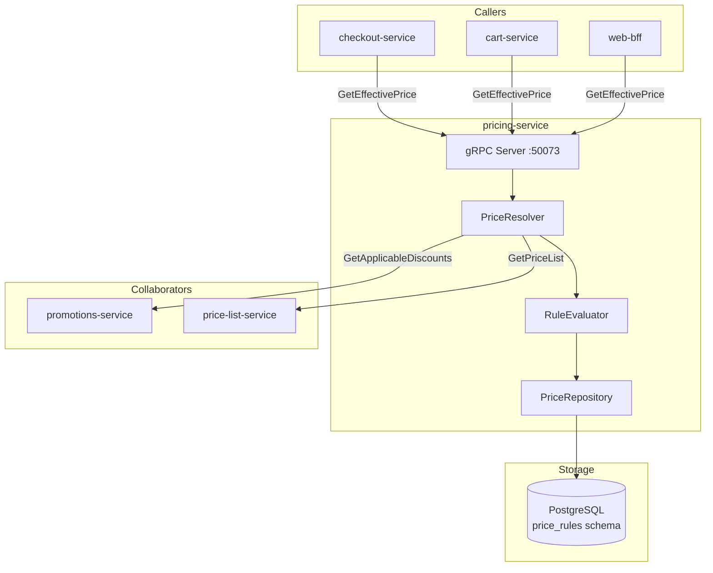

# pricing-service

> Price rules, customer-group pricing, and tiered volume pricing.

## Overview

The pricing-service resolves the effective price for any product/SKU given a buyer context
(customer group, channel, currency, and quantity). It evaluates a priority-ordered stack of
price rules — base price, customer-group overrides, volume tiers, promotional adjustments —
and returns the final unit price along with the applied rule chain for transparency. This
service works closely with the promotions-service for discount stacking and the
price-list-service for channel-specific pricing.

## Architecture



## Tech Stack

| Component | Technology |
|---|---|
| Language | Java 21 (Spring Boot 3) |
| Database | PostgreSQL |
| Protocol | gRPC |
| Port | 50073 |
| gRPC Framework | grpc-spring-boot-starter |
| DB Migrations | Flyway |
| ORM | Spring Data JPA |

## Responsibilities

- Store base prices per SKU and currency
- Manage customer-group price overrides (wholesale, VIP, B2B)
- Manage tiered/volume pricing rules (e.g., buy 10+ get 5% off)
- Resolve the effective price for a given (SKU, quantity, customer group, currency) tuple
- Return the full rule-application chain for price breakdown display at checkout
- Support price scheduling (future effective date / expiry date)
- Maintain price history for analytics and compliance

## API / Interface

```protobuf
service PricingService {
  rpc GetEffectivePrice(GetEffectivePriceRequest) returns (GetEffectivePriceResponse);
  rpc GetEffectivePriceBatch(GetEffectivePriceBatchRequest) returns (GetEffectivePriceBatchResponse);
  rpc SetBasePrice(SetBasePriceRequest) returns (SetBasePriceResponse);
  rpc CreatePriceRule(CreatePriceRuleRequest) returns (CreatePriceRuleResponse);
  rpc UpdatePriceRule(UpdatePriceRuleRequest) returns (UpdatePriceRuleResponse);
  rpc DeletePriceRule(DeletePriceRuleRequest) returns (DeletePriceRuleResponse);
  rpc ListPriceRules(ListPriceRulesRequest) returns (ListPriceRulesResponse);
}
```

| Method | Description |
|---|---|
| `GetEffectivePrice` | Resolve final unit price for a single SKU + buyer context |
| `GetEffectivePriceBatch` | Batch price resolution for multiple SKUs (cart use case) |
| `SetBasePrice` | Create or replace the base price for a SKU |
| `CreatePriceRule` | Define a new customer-group or volume pricing rule |
| `UpdatePriceRule` | Modify priority, amount, or schedule of a rule |
| `DeletePriceRule` | Remove a pricing rule |
| `ListPriceRules` | List active rules, filtered by SKU or customer group |

## Kafka Topics

| Topic | Direction | Description |
|---|---|---|
| `catalog.product.updated` | Subscribe | Trigger price cache invalidation on product changes |

## Dependencies

Upstream (calls these):
- `promotions-service` — fetch applicable discount rules during price resolution
- `price-list-service` — fetch channel-specific price list overrides
- `currency-service` — convert Money amounts across currencies

Downstream (called by these):
- `cart-service` — `GetEffectivePriceBatch` on every cart update
- `checkout-service` — `GetEffectivePriceBatch` for order total calculation
- `web-bff` — display prices on product listing and detail pages

## Environment Variables

| Variable | Default | Description |
|---|---|---|
| `SPRING_DATASOURCE_URL` | — | PostgreSQL JDBC URL |
| `SPRING_DATASOURCE_USERNAME` | — | DB username |
| `SPRING_DATASOURCE_PASSWORD` | — | DB password |
| `GRPC_PORT` | `50073` | gRPC server port |
| `PROMOTIONS_SERVICE_ADDR` | `promotions-service:50087` | Promotions service address |
| `PRICE_LIST_SERVICE_ADDR` | `price-list-service:50181` | Price list service address |
| `CURRENCY_SERVICE_ADDR` | `currency-service:50085` | Currency service address |
| `KAFKA_BOOTSTRAP_SERVERS` | `kafka:9092` | Kafka broker list |

## Running Locally

```bash
docker-compose up pricing-service
```

## Health Check

`GET /healthz` — `{"status":"ok"}`

gRPC health protocol: `grpc.health.v1.Health/Check` on port `50073`
