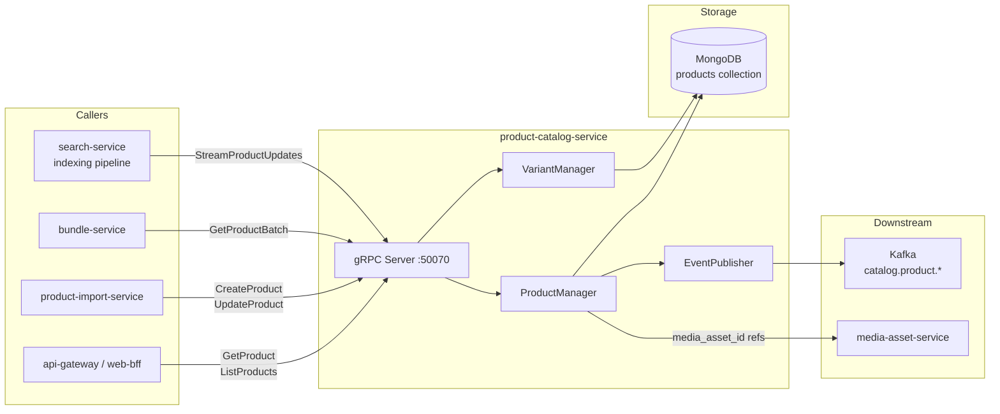

# product-catalog-service

> Master product data store — attributes, variants, media references, and lifecycle management.

## Overview

The product-catalog-service is the authoritative source for all product data on the ShopOS
platform. It manages the complete product lifecycle from draft through active to archived,
storing flexible attribute schemas, variant matrices (size/color/etc.), and references to
media assets. MongoDB's document model is used to accommodate the highly variable attribute
sets that differ across product categories (electronics vs. apparel vs. digital goods).

## Architecture



## Tech Stack

| Component | Technology |
|---|---|
| Language | Go 1.22 |
| Database | MongoDB 7 |
| Protocol | gRPC |
| Port | 50070 |
| gRPC Framework | google.golang.org/grpc |
| MongoDB Driver | mongo-driver/v2 |

## Responsibilities

- Store and serve the canonical product document including: title, description, attributes, tags
- Manage product variants (SKU matrix) with per-variant pricing and inventory references
- Store media asset ID references (resolved by media-asset-service)
- Support flexible attribute schemas per product type via MongoDB document model
- Enforce product status transitions: DRAFT → ACTIVE → ARCHIVED
- Publish change events for search-service indexing and downstream cache invalidation
- Support batch retrieval for bundle-service and cart-service

## API / Interface

```protobuf
service ProductCatalogService {
  rpc CreateProduct(CreateProductRequest) returns (CreateProductResponse);
  rpc GetProduct(GetProductRequest) returns (ProductResponse);
  rpc GetProductBatch(GetProductBatchRequest) returns (GetProductBatchResponse);
  rpc UpdateProduct(UpdateProductRequest) returns (ProductResponse);
  rpc DeleteProduct(DeleteProductRequest) returns (DeleteProductResponse);
  rpc ListProducts(ListProductsRequest) returns (ListProductsResponse);
  rpc StreamProductUpdates(StreamProductUpdatesRequest) returns (stream ProductEvent);
  rpc SetProductStatus(SetProductStatusRequest) returns (ProductResponse);
}
```

| Method | Description |
|---|---|
| `CreateProduct` | Create a new product document with variants |
| `GetProduct` | Fetch full product by ID or slug |
| `GetProductBatch` | Fetch multiple products by ID list (for bundles/cart) |
| `UpdateProduct` | Partial or full product update |
| `DeleteProduct` | Archive and soft-delete a product |
| `ListProducts` | Paginated product list with category/brand/status filters |
| `StreamProductUpdates` | Server-streaming feed of product change events (for search indexing) |
| `SetProductStatus` | Transition product through lifecycle states |

## Kafka Topics

| Topic | Direction | Description |
|---|---|---|
| `catalog.product.created` | Publish | New product added to catalog |
| `catalog.product.updated` | Publish | Product data modified |
| `catalog.product.deleted` | Publish | Product archived |

## Dependencies

Upstream (calls these):
- `media-asset-service` — validates media asset IDs referenced in products
- `category-service` — validates category assignment on create/update
- `brand-service` — validates brand assignment

Downstream (called by these):
- `search-service` — consumes `StreamProductUpdates` to build search index
- `bundle-service` — `GetProductBatch` to assemble bundles
- `cart-service` — `GetProduct` to validate items added to cart
- `product-import-service` — `CreateProduct` / `UpdateProduct` during bulk import
- `pricing-service` — reads product base price reference

## Environment Variables

| Variable | Default | Description |
|---|---|---|
| `MONGODB_URI` | — | MongoDB connection URI |
| `MONGODB_DATABASE` | `catalog` | MongoDB database name |
| `GRPC_PORT` | `50070` | gRPC listening port |
| `KAFKA_BROKERS` | `kafka:9092` | Kafka broker list |
| `CATEGORY_SERVICE_ADDR` | `category-service:50071` | Category service address |
| `BRAND_SERVICE_ADDR` | `brand-service:50072` | Brand service address |
| `MEDIA_ASSET_SERVICE_ADDR` | `media-asset-service:50140` | Media asset service address |

## Running Locally

```bash
docker-compose up product-catalog-service
```

## Health Check

`GET /healthz` — `{"status":"ok"}`

gRPC health protocol: `grpc.health.v1.Health/Check` on port `50070`
