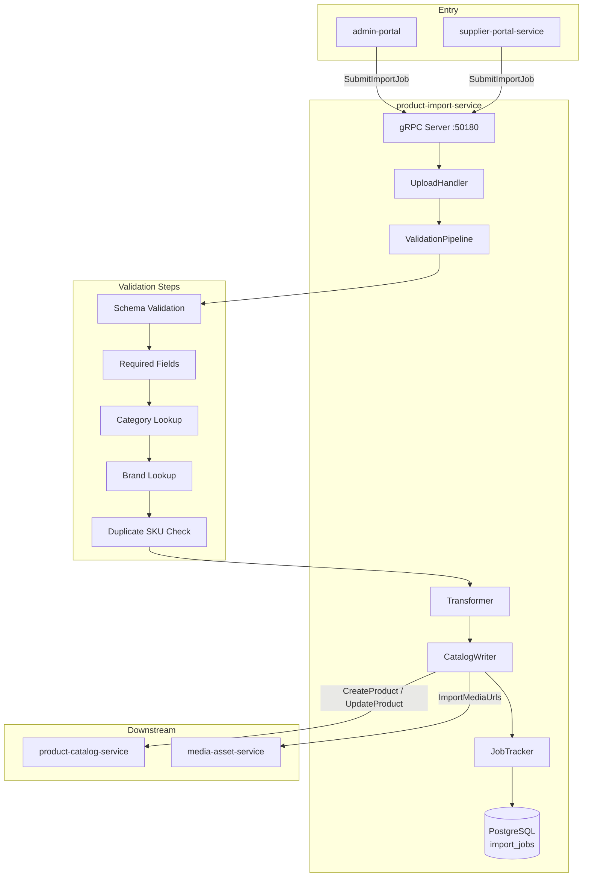

# product-import-service

> Bulk product import from CSV/XML feeds with validation pipeline and error reporting.

## Overview

The product-import-service enables merchants to load large product catalogs via file upload
rather than individual API calls. It accepts CSV and XML (e.g., Google Merchant Center
feed) files, runs them through a multi-stage validation pipeline, and creates or updates
products in the product-catalog-service. Failed rows are reported with field-level error
messages. Import jobs are tracked in PostgreSQL so merchants can monitor progress and
download error reports.

## Architecture



## Tech Stack

| Component | Technology |
|---|---|
| Language | Go 1.22 |
| Database | PostgreSQL |
| Protocol | gRPC |
| Port | 50180 |
| gRPC Framework | google.golang.org/grpc |
| DB Driver | pgx/v5 |
| DB Migrations | golang-migrate |
| CSV Parsing | encoding/csv (stdlib) |
| XML Parsing | encoding/xml (stdlib) |

## Responsibilities

- Accept CSV and XML product feed file uploads (streamed via gRPC client-streaming)
- Parse and normalize records into a canonical import record format
- Validate each record: schema compliance, required fields, category/brand existence, duplicate SKU check
- Create new products or update existing ones in product-catalog-service
- Track import job status (PENDING, PROCESSING, COMPLETED, FAILED) in PostgreSQL
- Generate row-level error reports downloadable by the importer
- Support dry-run mode (validate without writing to catalog)
- Rate-limit writes to product-catalog-service to avoid overwhelming it during large imports

## API / Interface

```protobuf
service ProductImportService {
  rpc SubmitImportJob(stream ImportChunk) returns (SubmitImportJobResponse);
  rpc GetImportJob(GetImportJobRequest) returns (ImportJobResponse);
  rpc ListImportJobs(ListImportJobsRequest) returns (ListImportJobsResponse);
  rpc CancelImportJob(CancelImportJobRequest) returns (CancelImportJobResponse);
  rpc GetErrorReport(GetErrorReportRequest) returns (stream ErrorReportRow);
}
```

| Method | Description |
|---|---|
| `SubmitImportJob` | Client-streaming upload of file chunks; returns job ID |
| `GetImportJob` | Poll job status and progress counters |
| `ListImportJobs` | List jobs for a merchant with status filter |
| `CancelImportJob` | Abort an in-progress import |
| `GetErrorReport` | Server-streaming download of validation error rows |

## Kafka Topics

Not applicable — product-import-service is gRPC-only.

## Dependencies

Upstream (calls these):
- `product-catalog-service` — `CreateProduct` / `UpdateProduct` for catalog writes
- `category-service` — `GetCategory` to validate category assignments
- `brand-service` — `GetBrand` to validate brand assignments
- `media-asset-service` — import product image URLs into the asset store

Downstream (called by these):
- `admin-portal` — merchant-initiated bulk import
- `supplier-portal-service` — supplier-initiated catalog feed uploads

## Environment Variables

| Variable | Default | Description |
|---|---|---|
| `DATABASE_URL` | — | PostgreSQL connection string |
| `GRPC_PORT` | `50180` | gRPC listening port |
| `PRODUCT_CATALOG_SERVICE_ADDR` | `product-catalog-service:50070` | Catalog write target |
| `CATEGORY_SERVICE_ADDR` | `category-service:50071` | Category validation |
| `BRAND_SERVICE_ADDR` | `brand-service:50072` | Brand validation |
| `MEDIA_ASSET_SERVICE_ADDR` | `media-asset-service:50140` | Media import target |
| `MAX_FILE_SIZE_MB` | `100` | Maximum accepted import file size |
| `WRITE_RATE_PER_SECOND` | `50` | Max catalog writes per second during import |
| `DRY_RUN_DEFAULT` | `false` | Default dry-run mode for new jobs |

## Running Locally

```bash
docker-compose up product-import-service
```

## Health Check

`GET /healthz` — `{"status":"ok"}`

gRPC health protocol: `grpc.health.v1.Health/Check` on port `50180`
