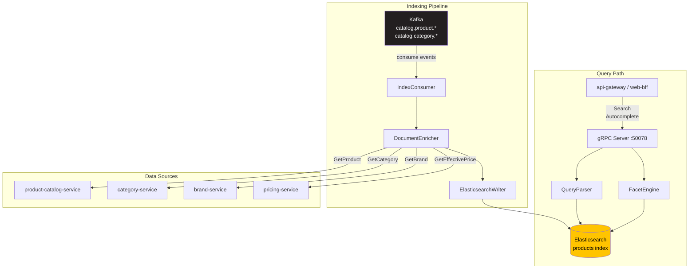

# search-service

> Full-text search, faceted filters, and autocomplete powered by Elasticsearch.

## Overview

The search-service provides the search layer for the ShopOS storefront. It maintains a
denormalized Elasticsearch index built from product, category, brand, and pricing data, and
serves full-text queries with relevance ranking, faceted filtering (price range, category,
brand, attributes), and autocomplete suggestions. The index is kept up-to-date by consuming
product change events from Kafka and re-indexing affected documents in near real time.

## Architecture



## Tech Stack

| Component | Technology |
|---|---|
| Language | Python 3.12 |
| Database | Elasticsearch 8 |
| Protocol | gRPC |
| Port | 50078 |
| gRPC Framework | grpcio / grpcio-tools |
| Kafka Client | confluent-kafka-python |
| ES Client | elasticsearch-py (async) |

## Responsibilities

- Maintain a denormalized search index with product, category, brand, and price data
- Consume `catalog.product.*` Kafka events to trigger incremental re-indexing
- Support full-text search across product title, description, brand, and attributes
- Support faceted filtering: category tree, brand, price range, custom attributes
- Return relevance-ranked results with highlighted snippets
- Serve autocomplete suggestions based on product names, brands, and categories
- Support multi-language analysis chains for internationalized storefronts
- Handle bulk re-indexing on full catalog refresh (admin-triggered)

## API / Interface

```protobuf
service SearchService {
  rpc Search(SearchRequest) returns (SearchResponse);
  rpc Autocomplete(AutocompleteRequest) returns (AutocompleteResponse);
  rpc GetFacets(GetFacetsRequest) returns (GetFacetsResponse);
  rpc IndexProduct(IndexProductRequest) returns (IndexProductResponse);
  rpc DeleteFromIndex(DeleteFromIndexRequest) returns (DeleteFromIndexResponse);
  rpc ReindexAll(ReindexAllRequest) returns (ReindexAllResponse);
}
```

| Method | Description |
|---|---|
| `Search` | Full-text query with optional filters, sorting, and pagination |
| `Autocomplete` | Return top-N name suggestions for a partial query string |
| `GetFacets` | Return aggregated facet counts for a given query context |
| `IndexProduct` | Manually index or re-index a single product document |
| `DeleteFromIndex` | Remove a product from the search index |
| `ReindexAll` | Trigger full catalog re-index from product-catalog-service |

## Kafka Topics

| Topic | Direction | Description |
|---|---|---|
| `catalog.product.created` | Subscribe | Index new product document |
| `catalog.product.updated` | Subscribe | Re-index updated product document |
| `catalog.product.deleted` | Subscribe | Remove product from index |

## Dependencies

Upstream (calls these):
- `product-catalog-service` — `StreamProductUpdates` and `GetProduct` for index enrichment
- `category-service` — `GetCategory` for breadcrumb and facet labels
- `brand-service` — `GetBrand` for brand facet data
- `pricing-service` — `GetEffectivePrice` to index displayable prices

Downstream (called by these):
- `api-gateway` / `web-bff` — all storefront search and autocomplete queries
- `mobile-bff` — mobile search endpoints

## Environment Variables

| Variable | Default | Description |
|---|---|---|
| `ELASTICSEARCH_URL` | `http://elasticsearch:9200` | Elasticsearch connection URL |
| `ELASTICSEARCH_INDEX` | `products` | Target index name |
| `GRPC_PORT` | `50078` | gRPC listening port |
| `KAFKA_BROKERS` | `kafka:9092` | Kafka broker list |
| `KAFKA_CONSUMER_GROUP` | `search-service` | Consumer group ID |
| `PRODUCT_CATALOG_SERVICE_ADDR` | `product-catalog-service:50070` | Product catalog address |
| `PRICING_SERVICE_ADDR` | `pricing-service:50073` | Pricing service address |
| `INDEX_BATCH_SIZE` | `100` | Documents per Elasticsearch bulk request |
| `AUTOCOMPLETE_MAX_RESULTS` | `10` | Max autocomplete suggestions returned |

## Running Locally

```bash
docker-compose up search-service
```

## Health Check

`GET /healthz` — `{"status":"ok"}`

gRPC health protocol: `grpc.health.v1.Health/Check` on port `50078`
