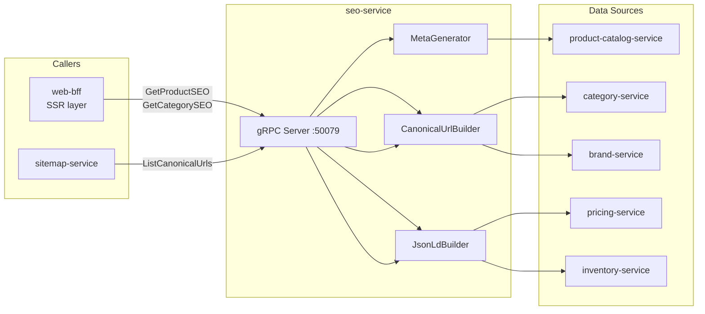

# seo-service

> Meta tags, canonical URLs, structured data (JSON-LD), and sitemap generation.

## Overview

The seo-service generates and manages all SEO metadata for the ShopOS storefront. Given a
page context (product, category, brand, or CMS page), it produces the HTML meta tags,
Open Graph tags, Twitter Card tags, and JSON-LD structured data (Schema.org Product,
BreadcrumbList, Organization) that search engines and social platforms consume. It also
drives the sitemap-service with a list of canonical URLs to include in XML sitemaps.

## Architecture



## Tech Stack

| Component | Technology |
|---|---|
| Language | Node.js 20 (TypeScript) |
| Database | None (stateless — reads from upstream services) |
| Protocol | gRPC |
| Port | 50079 |
| gRPC Framework | @grpc/grpc-js |

## Responsibilities

- Generate `<title>`, `<meta description>`, and `<link rel="canonical">` for product, category, and brand pages
- Generate Open Graph (`og:*`) and Twitter Card (`twitter:*`) tags for social sharing
- Generate JSON-LD structured data: `Product`, `Offer`, `BreadcrumbList`, `Organization`
- Build canonical URLs with configurable base domain and slug patterns
- Prevent duplicate content by generating correct canonical tags for paginated and filtered pages
- Serve a list of all canonical URLs to the sitemap-service for XML sitemap generation
- Respect product status — archived products get `<meta name="robots" content="noindex">`

## API / Interface

```protobuf
service SEOService {
  rpc GetProductSEO(GetProductSEORequest) returns (SEOResponse);
  rpc GetCategorySEO(GetCategorySEORequest) returns (SEOResponse);
  rpc GetBrandSEO(GetBrandSEORequest) returns (SEOResponse);
  rpc GetPageSEO(GetPageSEORequest) returns (SEOResponse);
  rpc ListCanonicalUrls(ListCanonicalUrlsRequest) returns (stream CanonicalUrl);
}
```

| Method | Description |
|---|---|
| `GetProductSEO` | Return full SEO metadata for a product page |
| `GetCategorySEO` | Return SEO metadata for a category listing page |
| `GetBrandSEO` | Return SEO metadata for a brand page |
| `GetPageSEO` | Return SEO metadata for a CMS content page |
| `ListCanonicalUrls` | Server-streaming list of all canonical URLs (for sitemap) |

## Kafka Topics

Not applicable — seo-service is stateless and gRPC-only.

## Dependencies

**Upstream** (calls these):
- `product-catalog-service` — product name, description, images
- `category-service` — `GetCategoryPath` for breadcrumb JSON-LD
- `brand-service` — brand name and logo for Organization schema
- `pricing-service` — current price for `Offer` JSON-LD
- `inventory-service` — availability for `Offer.availability` JSON-LD

**Downstream** (called by these):
- `web-bff` — injects SEO tags into server-side-rendered HTML
- `sitemap-service` — `ListCanonicalUrls` to build XML sitemaps

## Environment Variables

| Variable | Default | Description |
|---|---|---|
| `GRPC_PORT` | `50079` | gRPC listening port |
| `STOREFRONT_BASE_URL` | `https://shop.example.com` | Base URL for canonical link generation |
| `PRODUCT_CATALOG_SERVICE_ADDR` | `product-catalog-service:50070` | Product catalog address |
| `CATEGORY_SERVICE_ADDR` | `category-service:50071` | Category service address |
| `BRAND_SERVICE_ADDR` | `brand-service:50072` | Brand service address |
| `PRICING_SERVICE_ADDR` | `pricing-service:50073` | Pricing service address |
| `INVENTORY_SERVICE_ADDR` | `inventory-service:50074` | Inventory service address |
| `DEFAULT_LOCALE` | `en-US` | Locale for hreflang default |

## Running Locally

```bash
docker-compose up seo-service
```

## Health Check

`GET /healthz` — `{"status":"ok"}`

gRPC health protocol: `grpc.health.v1.Health/Check` on port `50079`
